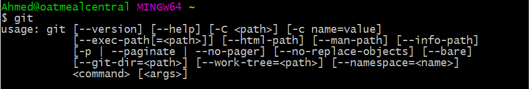
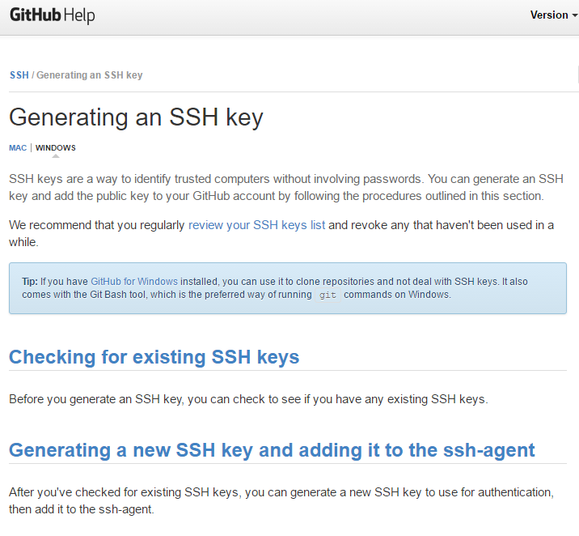

# 1.1 Lesson Plan - Intro to HTML

## Overview

In today's lesson, we will be working with the very basics of Terminal/Console and starting students down the path of HTML.

## Instructor Notes

* Today's class is all about making students feel comfortable. Make sure they know that you are there for them from day one and that they can succeed if they persist through the challenges.

* Use the slide deck [01.1 Intro to HTML](https://docs.google.com/presentation/d/1bVwosLLIFv12kaXCv3J4qPVp5oZFIszQ2GHL0QAbBGA/edit?usp=sharing) provided as an initial guide for today's class. During the first few weeks of class, we'll be using slide decks more extensively to give students a sense of structure. As we move further into the course, slide decks will be used less frequently as we dive into a more code-centric approach. Feel free to modify the slides to your own style, but be sure to cover the same activities.

* The other main focus of today's class is in making sure that all students have all their prework (software/tools prerequisites) installed and ready to go. Many of your students will be coming to class with "partially" installed tools but will have gotten lost along the installation process. By the end of class, make sure EVERY one of your students has Git (with SSH Authentication), Visual Studio Code, and Slack installed. **Note:** You may need to run through this lesson plan to confirm that you have all the necessary tools installed yourself!

### Learning Objectives

By the end of the lesson today students will be able to:

* Prove they have completed all required prework (software and tools installation).
* Utilize basic Terminal/Bash commands.
* Create a basic HTML page.

### Time Tracker

| Start  | #   | Activity Name                     | Duration |
| ------ | --- | --------------------------------- | -------- |
| 5:30PM | 0   | Office Hours                      | 0:30     |
| 6:00PM | 1   | Prework Check                     | 0:40     |
| 6:40PM | 2   | BREAK                             | 0:15     |
| 6:55PM | 3   | Console                           | 0:35     |
| 7:30PM | 4   | Webpages                          | 0:25     |
| 7:55PM | 5   | HTML                              | 1:05     |
| 9:00PM | 6   | Recap                             | 0:00     |
| 9:00PM | 7   | Office Hours                      | 0:30     |
| 9:30PM | 8   | END                               | 0:00     |

## Slides

* [01.1 Intro to HTML](https://docs.google.com/presentation/d/1bVwosLLIFv12kaXCv3J4qPVp5oZFIszQ2GHL0QAbBGA/edit?usp=sharing)

* **Note:** Editing access is not available for this document. If you wish to modify the slides, please create a copy by navigating to File > "Make a copy."

## Sample Class Video (Highly Recommended)

* To view an example class lecture, visit [Class video](https://codingbootcamp.hosted.panopto.com/Panopto/Pages/Viewer.aspx?id=d6394b94-a0ce-4f63-8f9c-3b84f8715088). (Note that the video may not reflect latest lesson plan.)

---

## 1. Prework Check (40 mins)

### 1.1 Instructor Do: Begin Slide Deck (5 minutes)

* Open the slide deck [01.1 Intro to HTML](https://docs.google.com/presentation/d/1bVwosLLIFv12kaXCv3J4qPVp5oZFIszQ2GHL0QAbBGA/edit?usp=sharing). Use it as a guide for the remaining sections but keep a close eye on your TAs to make sure you are keeping track of time. Time Tracker: <https://docs.google.com/spreadsheets/d/1PUvTKnAwQxB_iYGQAFY0xzfVMDaC7nRCphqrOPQB44U/edit#gid=1196133682>
* Be concise when you can!

### 1.2 Instructor Do: Prework (5 minutes)

* Then walk through the slides on "Prework." Let students know that they should have all the tools, the software applications, and the accounts shown on their machines but that, if they ran into any snags, we will work with them over the next 35 minutes to confirm that everything is set up.

### 1.3 Instructor Do: Confirm Prework Installed (30 minutes)

* TAs get ready to make your rounds!

* Instructor: Walk through each of the following "test" processes to confirm whether students have successfully installed the right software. Have them follow along with you in class and have them raise their hands for a TA if they are missing something.

  * **Slack:**

    * Easy to show. Just open Slack. But make sure students have it installed locally and are not using the web client.

  * **Visual Studio Code:**

    * Easy to show. Just open Visual Studio Code. Make sure they can do so as well.

  * **Terminal/Bash:**

    * For Mac users: Have them open their launcher and search for `Terminal`.

    * For Windows users: Have them open the program called `Git Bash`.

  * **GitHub:**

    * Confirm that students all have an account on GitHub through a show of hands.

    * Those that do not have an account should immediately create one.

  * **Git:**

    * Now we're getting to the harder stuff.

    * While still in Terminal or Bash, type `git` and hit enter. If Git is installed, it should trigger a series of lines about Git.

      

    * Now, to confirm that students have their GitHub accounts tied to their local Git using SSH authentication, have them type the following: `ssh -T git@github.com`. It should then ask for a passphrase (tied to your local account). Provide it (letters will not appear) and hit enter. If you are authenticated, it should provide a welcome message.

      

    * Ask, via a show of hands, how many students did/did not get the welcome message (be expecting a lot of students who did not). If it seems that many students are missing this step, point them to the following link: [Generating an SSH Key - GitHub](https://help.github.com/articles/generating-an-ssh-key/).

      

    * Walk around and help students as necessary, but keep track of time!

  * **All others:**

    * There are a few other items in the prework like Stack Overflow that are less critical at this juncture. Students will also install some of their tools right before they reach that topic in the class.

---

## 2. BREAK (15 minutes)

* There may be some students who decide to stay behind during break to troubleshoot problems they may have had with the above material or to ask questions about the course. Try to assist those who are in need of help first so as to help them catch up with those students who did not face any issues.

---

## 3. Console (35 mins)

### 3.1 Instructor Do: Let's Get Crackin'—Introduction to Console/Bash (15 minutes)

* Open Terminal/Console. Then walk and explain to students what each of the following commands does:

  * `cd` (changes directory)

  * `cd ~` (changes to home directory)

  * `cd ..` (moves up one directory)

  * `ls` (lists files in folder)

  * `pwd` (shows current directory)

  * `mkdir <FOLDERNAME>` (creates new directory)

  * `touch <FILENAME>` (creates a file)

  * `rm <FILENAME>` (deletes file)

  * `rm -r <FOLDERNAME>` (deletes a folder, note the -r)

  * `open .` (opens the current folder—MAC SPECIFIC)

  * `open <FILENAME>` (opens a specific file—MAC SPECIFIC)

  * `explorer <FILENAME>` (opens the specific file—BASH SPECIFIC)

  * `explorer .` (opens the current folder—BASH SPECIFIC)

* Tabbing

  * Pressing the `tab` key after typing "cd fol" will autocomplete to "cd foldername," assuming foldername is unique. (Folder/Filename Autocomplete: Show students what happens when there are unique and multiple options based on what they typed.)

### 3.2 Student Do: Console Commands (15 minutes)

* Then slack out the following instructions to students (or show them the instructions via the slide):

* **Instructions:**

  * From the Terminal/Console and using only the command line, create the following:
    * A new folder with the name of `first_day_stuff`
    * A new HTML file with the name of `first-day.html`

  * Open the current folder containing the new HTML file.

  * BONUS:
    * Create multiple directories/folders with the names `one_folder` and `second_folder` in one command.
    * Create multiple files with the names `one.html` and `two.html` in one command in the first_day_stuff directory.

### 3.3 Student Do: Discuss with Neighbors (5 minutes)

* Have students use Slack to discuss with the process of creating files, removing files, etc.

* Also have students explain to one another a high-level definition of "front end development."

* Briefly have students explain the answers back to you.

---

## 4. Webpages (25 mins)

### 4.1 Instructor Do: What Webpages Really Look Like (15 minutes)

* Webpages may not initially look complex when viewed through a browser, but in actuality, everything on the web is written in code. More specifically, the majority of webpages are written using a combination of three major "coding" languages: *HTML, CSS, and JavaScript.*

* Thankfully for developers, it is pretty easy to pull back the curtain on webpages and view the languages that created them using a tool called an Inspector.

  * These inspectors generally come pre-built into every web browser on the market. To use them, one simply needs to know that they are there and hit a couple buttons.

* Go through the process of explaining to students how to use the Chrome Inspector and encourage them to follow along.

  * Visit www.google.com. Then right-click on the screen and hit "Inspect."

      

  * Explain to the class that what they are now viewing is the HTML and CSS framework of Google.
    * In other words, they are viewing the languages that determine both the content and styling of the page.

* HTML stands for *Hypertext Markup Language*. While not technically a coding language, it determines what content and elements are displayed on a webpage.

* CSS, on the other hand, stands for *Cascading Style Sheets* and describes how HTML elements are to be displayed on screen, paper, or in other media formats.

* Point out that there is also JavaScript running on this page, which allows for the implementation of more complex features on the webpage.
  * JavaScript is involved every time a webpage does more than just sit there and display static information for users to look at. We will be learning more about JavaScript a bit later in our program!

* Click on the "Element Selector" button within the Chrome Inspector and begin clicking on elements on the page.
  * Show students how this highlights the relevant HTML/CSS.

* Then show them that you can change any element on the page.
  * As an example, try to change the HTML text inside of the `Google Search` button to something else.
  * Point out to the class that making changes like this is obviously not hacking.
    * The page displayed on one user's browser is actually an independent rendering of the original HTML/CSS.
    * This means that making changes through the Inspector only changes the local version of the webpage, not the master version stored on external servers.
    * Show them that you can also change the CSS by using the style pane.

* Let them know that the Inspector is a powerful tool for developing your own websites and for understanding how other websites work.
  * They will be using the Chrome Inspector throughout our program and will get a better understanding of this tool as they get more familiar with front-end code.

* Check if there any questions before moving onto the next section.

### 4.2 Student Do: Examining Wikipedia (5 minutes)

In this activity, you'll take a moment to examine/modify a Wikipedia page using Chrome's Inspector tool.

**Instructions:**

  1. Navigate to any page on Wikipedia and open up the Chrome Inspector tool.
  2. Using Inspector, locate the *header* for the article.
  3. Change the header! You can edit it and write something else (please keep it clean).
  4. Attempt to find some of the written content on the page and change it around.

> Don't worry; these changes aren't permanent!

### 4.3 Everyone Do: Examining Wikipedia Review (5 minutes)

* Ask everyone to refresh the pages that they were working on and then ask the class what happened.

  * Upon the page refreshing, *all the changes that have been made are reset.*
  * This is because the content shown on the browser is only a local copy of the original HTML that is stored on Wikipedia's servers.
  * In order to actually change the HTML content on Wikipedia, we would need to have access to their servers (or use Wikipedia's community editing process).

* Point out that the Inspector is incredibly useful when it comes to testing changes in HTML/CSS but that nothing is permanent.

* This is why it is important to understand how to write HTML and CSS *from scratch*—which is what we'll be doing this week!

---

## 5. HTML (65 mins)

### 5.1 Instructor Do: Hello, HTML (15 minutes)

* Start this section off by opening up Visual Studio Code and explain that this program is called an *integrated development environment*, or IDE.
  * These kinds of applications enable programmers to edit source code, build executables, and perform debugging all in one consolidated environment.
  * It is through this application that we will be creating our webpages.

* Create a new HTML file in Visual Studio Code.
  * Have students follow along if they can but tell them not to get too bogged down if they are having trouble keeping up. They will have a chance to work on an example of their own a little later.

* Use the code in [`HelloHTML`](./activities/03-Ins-HelloHTML/HelloHTML.html) as a guide.
  * Don't just display this file or copy and paste the code onto your screen.
  * Type it out and let your students follow along.
  * Be sure to point out the prominent elements (you can also see the session slide deck for example talking points):

    * `<!DOCTYPE html>` - All HTML documents must start with a declaration.
      * Unlike other elements, this line of text is not actually an HTML tag.
      * Instead, it lets the browser know what document type to expect so that it renders properly.

    * `<html>` - The html tag operates in much the same way as the `!DOCTYPE` declaration does.
      * It tells the browser that the contents of this file are written in HTML.
      * Unlike the `!DOCTYPE` declaration, however, the HTML tag has both a start point—`<html>`—as well as an end point—`</html>`—with all other HTML content contained within.
      * *Most HTML elements function in this way, acting as containers for the content written between their start tag and their end tag.*

    * `<head>` - This element operates as the container for metadata (data about data) and is always placed between the HTML and body tags.
      * This metadata contains information about that HTML document that is not displayed by the browser, including the document's title, styles, scripts, and search engine information.

    * `<title>` - Placed within the `<head>` element, the title element defines the title of the document and is required in all HTML documents.
      * This element defines a title in the browser tab, provides a title for the page when it is added to favorites, and displays a title for the page in search engine results.

    * `<body>` - This element contains the actual content that will be displayed when the webpage is rendered.

> Run a demo page and show students how the elements in the file compare with those rendered in the browser.

* Another important HTML element that students will be seeing a lot of this week is *comment tags*.
  * Comments are not displayed in the browser! They are written just for other developers.
  * We can use comments to help explain and document our HTML code. In some activity files we also use comments to provide additional student instructions.

    * HTML comments are written like this: `<!-- Write comments here -->`.

    * Comment tags can hold a short sentence or multiple lines of text. Just make sure to open with `<!--` and close with `-->`.

* Ask if there are any questions before proceeding to the student exercise.

### 5.2 Student Do: My First HTML Page (10 minutes)

Time to put these new skills to the test! In this activity, you'll create a new HTML page from scratch.

**Instructions:**

  1. Create a new HTML document called `FirstHTML.html`.  
  2. Give your HTML page the title "My First HTML Page."
  3. Add some text so that your HTML page renders the words "Woohoo! I just created my first web page!" to the browser.

> Bonus: Feeling fancy? Add a line break and another sentence saying, "Hello, world!"

### 5.3 Everyone Do: My First HTML Page Review (5 minutes)

* Open up the [solved version](./activities/04-Stu-FirstHTML/solved/FirstHTML.html) of the previous activity and go over its contents with the class, taking time to answer whatever questions students may have.
  * Students may wonder how they were supposed to know about the Line Break tag. This is a good opportunity to explain to the class that a large part of being a developer is discovering answers on your own!

### 5.4 Instructor Do: A Body of Content (15 minutes)

* OK—pit stop. It's actually possible to create some VERY basic webpages with nothing but the tags we've learned so far!
  * However, HTML includes a pretty wide variety of element tags that allow us to create detailed and impressive webpages.

> Open up the `01-HelloHTML` file from earlier and create new content on the page using the following elements, explaining each new tag in detail as you go along.

* Let's look at some additional tags that we can use to structure the `<body>` text of our webpage:

  * `<h1>` - The `<h1>` to `<h6>` tags are used to define HTML headings, with `<h1>` defining the most important (largest), while `<h6>` is the least important (smallest).

      ```html
      <h1>WELCOME TO MY PAGE</h1>
      ```

  * `<p>`- The `<p>` tag defines a paragraph. Browsers automatically add some space (margins) before and after each paragraph element. These margins can then be modified using CSS, but this will be covered on another day.

      ```html
      <p>This text is stored inside of a paragraph.</p>
      ```

  * `<ul>` - The `<ul>` tag defines an unordered (bulleted) list of items. This tag must be used together with the `<li>` tag to create individual items on the list.

      ```html
      <ul>
          <li>Sushi</li>
          <li>Ramen</li>
      </ul>
      ```

  * `<ol>` - The `<ol>` tag defines an unordered (numbered) list of items. This tag must be used together with the `<li>` tag to create individual items on the list.

      ```html
      <ol>
          <li>Red Dead Redemption</li>
          <li>Animal Crossing</li>
      </ol>
      ```

  * `<a>` - The `<a>` tag is used to define a hyperlink, which is used to link users from one page to another. The most important attribute of the `<a>` element is the "href" attribute, which indicates the link's destination. The text contained within the `<a>` tags is that which, when clicked, will link the user to a new page.

      ```html
      <a href='www.youtube.com'>YouTube</a>
      ```

  * `<br>` - The `<br>` tag inserts a single line break into the document.
    * This is an empty element, meaning that it has no end tag

    ```html
    <br>
    ```

* `` - The `` tag defines an image on an HTML page. This element has two required attributes: "src"—which points to the position where the image is stored, locally or online—and "alt"—which specifies an alternate text for an image. This is another empty element like the `<br>` element, meaning it has no end tag.

  Example:

  ```html
  
  ```

* **JPEG**: The JPEG file format is a type of image compression that works best with photographs and complex images. JPEGs are great multipurpose files, although designers can run into issues when working with different browser screen sizes. We'll primarily be using JPEGs in our program.

* **PNG**: PNGs support variable transparency. In other words, users can control the degree to which the image is transparent. These can be useful when planning or designing website and application interfaces. But they are less common.

* **SVG**: SVG files allow you to create very high-quality graphics and animations that do not lose detail as their size increases. This means that, with an SVG file, you could create *one* graphic that looked great on a tiny mobile phone screen or on a 60-inch computer monitor. On the downside, these files can be very large.

* **GIF**: You know what these are! GIFs have the unique ability to display a sequence of images, similar to videos. These are called animated GIFs, in which a series of separate GIF images are linked together to create motion (animation).
  
* Run the page and point out to students how the elements in the program compare with those on the web page.

  

* Answer whatever questions the class may have before moving on to the next activity.

### 5.5 Student Do: Building Up HTML (15 minutes)

* Keep your HTML code from the previous exercise available for them to see while they work, but don't send them the code just yet.

**Instructions:**

* In a new HTML file, create the basic structure of an HTML document and include the following in it:

  * DOCTYPE declaration
  * Head tag with a title tag
  * H1 tag with a title of your choice
  * Embedded image
  * Three links that you will create:
    * Make the first link `target="_blank"` so that it opens a new tab when clicked on.
    * Make the second link bold.
    * Make the third link a placeholder, so it goes nowhere.

* **Hint:** You should be looking up at the screen pretty often. :P

* Bonus:
  * Create an ordered list of steps to make a sandwich.
  * Create an unordered list of five bands/musicians you like.
  * Create a table with two columns (animal class and animal name) and four rows of animals.
  * Use an alternate way of separating links without line breaks.
  * Embed a YouTube video of your favorite band/musician.

### 5.6 Instructor Do: Review HTML Solution (5 minutes)

* Open the [solution file](./activities/05-Stu-SecondHTML/solved/SecondHTML.html) and walk students through the solution. As you discuss the solution, be sure to point out the following:

  * Key elements like `<!DOCTYPE html>`, `<html>`, `<head>`, `<h1>`, and links.
  
  * Specifically, we haven't taught them how to use `target="_blank"`, so be sure to explain how this modifies the link target.

  * Also make sure to explain how they can separate links using `<p>` tags! (We'll teach `<divs>` in a later lesson.)

* Here are some cool HTML tips that you can pass along if you have time:

  * **Good indentation practices:** In fact, if you have time, un-indent everything by highlighting everything and hitting `ctrl-j` and then re-running the code. Show students that the code will still work but ask them to try to read it. Explain that unformatted code is awful to maintain—because no one can read it!

  * Next, try showing students how to easily format an HTML document. Simply select all of the content on the page using `ctrl+A`, right-click, and select `format`! Such an easy thing, but it makes a huge difference!

  * Finally, you'll notice we haven't covered *tables* yet. Building HTML tables is a pain (just like in markdown). We've omitted this topic but recommend demonstrating it and asking students to build one as an *extension* topic if you have time.

---

## 6. Recap

Give students a few moments to ask questions and quickly recap the subject matter for the session.

* Confirm that students have completed all required prework (software and tools installation).
* Basic Terminal/Bash commands.
* Basic HTML page structure and elements.

## 7. Instructor Do: Office Hours (30 minutes)

## 8. END (0 min)

How did today’s lesson go? Your feedback is important. Please take five minutes to complete this anonymous survey.

[Class Survey](https://forms.gle/nYLbt6NZUNJMJ1h38)

---

© 2022 edX Boot Camps LLC. Confidential and Proprietary. All Rights Reserved.
