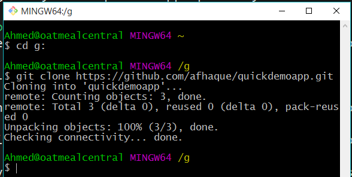
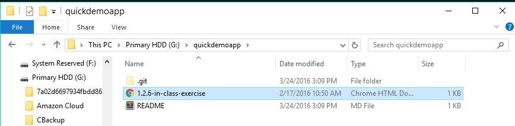
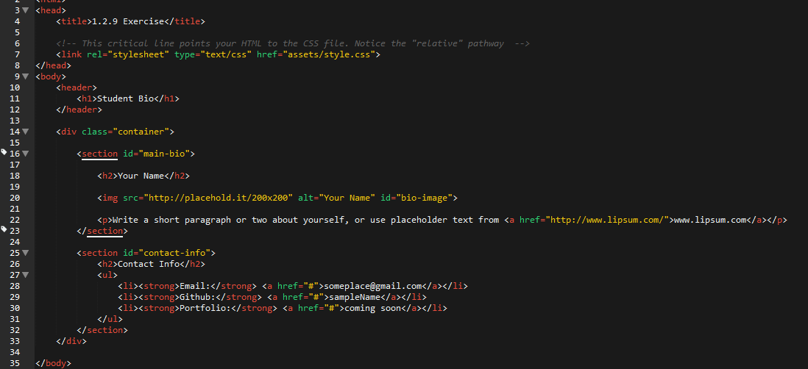

# 1.2 Lesson Plan - Git'n Pro with HTML/CSS

## Overview

In this class, we will be introducing students to Git version control and the basics of HTML/CSS.

## Instructor Notes

* As with the last class, you should use the slide deck [01.2 Git'n Pro with HTML/CSS](https://docs.google.com/presentation/d/1hVJs78yCTbNQugsd6kTJCWXrtSQmR9dBkxrANdnXwuY/edit?usp=sharing) provided as the primary guide for today's class. The slide deck includes an extended "group project" analogy to explain the utility of Git. Familiarize yourself with the example in advance of the class.

* When talking about repository creation, make sure to remind students they should be creating **public** repositories. This is necessary for the use of GitHub Pages in the future.

* **Feel free to add in details after the "Admin Items" slide where relevant to your class:**
  * Links to in-class repo and video of last session
  * Links to homework repo

* Much of your class's struggle today will be in getting Git to work. When cued via the slideshow, send out the supplemental [GitHub Help Guide](./activities/04-HTML_Git/Steps%20To%20Upload%20to%20Github.pdf) (`Steps to Upload to GitHub`). Encourage students to practice using this guide at home. (This guide alone will dramatically reduce the number of Git issues students experience. Make sure they use it!)

* There may still be confusion among students about Canvas, and GitHub. It is advised that you clarify the purpose of each tool before the first lesson.

* Remember to create Zoom breakout rooms for student activities before class starts

* **Before class starts**, open up a tab for Canvas in your browser. Be prepared to demonstrate how to navigate to the activities page and download the necessary files

* **Before class starts**, open up a tab for GitHub in your browser. Be sure to clarify where students can locate a link to their repo.

* There's a ton of material to cover here, but adjust it as necessary. Just make sure you leave enough time for the critical activities, as this is essential for keeping classes in sync across sections.

## Learning Objectives

By the end of the lesson today students will be able to:

* Explain the importance of Git version control.

* Utilize git for "adding, committing, and pushing" code to GitHub.

* Link HTML/CSS using element selectors.

## Slides

* [01.2 Git'n Pro with HTML/CSS](https://docs.google.com/presentation/d/1hVJs78yCTbNQugsd6kTJCWXrtSQmR9dBkxrANdnXwuY/edit?usp=sharing)

> **Note:** Editing access is not available for this document. If you wish to modify the slides, please create a copy by navigating to File > "Make a copy."

## Time Tracker

| Start  | #   | Activity Name                     | Duration |
| ------ | --- | --------------------------------- | -------- |
| 5:30PM | 0   | Office Hours                      | 0:30     |
| 6:00PM | 1   | Git and GitHub                    | 1:05     |
| 7:05PM | 2   | HTML Review                       | 0:50     |
| 7:55PM | 3   | BREAK                             | 0:15     |
| 8:05PM | 4   | CSS                               | 0:55     |
| 9:00PM | 5   | Office Hours                      | 0:30     |
| 9:30PM | 6   | END                               | 0:00     |

## Sample Class Video (Highly Recommended)

* [Sample Class Video](https://codingbootcamp.hosted.panopto.com/Panopto/Pages/Viewer.aspx?id=a58da010-fbac-48c5-8d22-907532418158)

---

## 1. Git and GitHub (65 mins)

### 1.1 Instructor Do: Stoke Curiosity (10 mins)

* Take the first minute of class to welcome students back and to open up the slide deck [01-2 Git'n Pro with HTML/CSS](https://docs.google.com/presentation/d/1hVJs78yCTbNQugsd6kTJCWXrtSQmR9dBkxrANdnXwuY/edit?usp=sharing).

* Reassure students that it's okay if things start to feel like they're moving quickly. Throughout their experience as developers, they will constantly need to refer back to old materials. The rush and looking back is part of the programming trade.

* Flip through the slides on "Where to get Help." Specifically, when it comes to in-class material, point students (in browser) to where they can access help resources. Emphasize the importance of practicing code vs. simply reading or watching videos.

* Have students read the objectives of the day.

* Then offer end-of-day targets for students depending on where they fall. If a student is completely new, they should feel like the main target is to simply understand at a conceptual level and understand Git. For students who have a bit of HTML/CSS knowledge, they should aim to know how to apply the HTML/CSS a bit more comfortably after today.

* Walk students through the use cases of Git.

* The basic premise of these slides is that, in group collaboration, situations arise where code conflicts occur or where damaging code is pushed up. With version control, you have a way of preventing both from becoming issues.

* Don't get into the specifics of merging, branches, or pull requests yet. The important takeaway is that the students will understand that Git makes it much easier to collaborate with a group.

### 1.2 Student Do: Quick Activity - Explain Git (10 minutes)

* Create Zoom breakout rooms prior to activity and send links via Slack.

* Give students a few minutes to explain to one another what Git version control is for.

* Have students return and explain their answers back to you. Correct any mistaken answers you hear. Encourage students when they get the right answer.

### 1.3 Instructor Do: Explain GitHub (Slides) and GitHub Examples (10 minutes)

* Spend just a few brief minutes explaining the relationship between Git and GitHub. Keep it concise. You may want to use the following:

  > GitHub offers a centralized location where all developers can push and pull (upload and download) their code. This means that GitHub always holds the most up-to-date code, handling everyone's updates appropriately.
  > GitHub also serves as a social network for developers and their code. Developers can find each other, discuss project features and issues, and contribute to open source projects for free.
  > GitHub is also a great way to showcase your work. Employers can view a prospective team member's code and previous projects to see if they would be a good fit for the team.

* Take a few minutes to show the class some of your favorite GitHub repositories.

* If you need some ideas, here are some popular ones:

  * [https://github.com/freeCodeCamp/freeCodeCamp](https://github.com/freeCodeCamp/freeCodeCamp)

  * [https://github.com/getify/You-Dont-Know-JS](https://github.com/getify/You-Dont-Know-JS)

  * [https://github.com/twbs/bootstrap](https://github.com/twbs/bootstrap)

  * [https://github.com/nodejs/node](https://github.com/nodejs/node)

* Every library and framework used in this course has an open source repository on GitHub.

### 1.4 Instructor Do: Get Started with Git - Demo Git Add, Commit, Push (10 minutes)

* As an instructor, create your own GitHub repo. Be sure to stress the importance of the repository being **public**. Without a public repository, students will not be able to use GitHub Pages in the future. Then walk students through the process of adding a file to GitHub.

* Have students try to follow along on their own accounts if they can.

* **Important note:** We teach the process of cloning existing repos for consistency with students. So use the steps below as a guide:

  * Navigate to GitHub in your browser and click to create a new repository.

      

  * Call your repository whatever you like, but make sure to set it as public. Initialize it with a README. Stress that, although we’re breezing through this README for the sake of time, your READMEs are really important to users and recruiters because it helps them see why your project is helpful, how it works, and the process you took to get it working.

      

  * Then copy the `ssh` or `https` link associated with this GitHub repo. (The difference has to do with whether you need to authenticate each time. `ssh` is preferred, but if it's not working for you, switch to `https`.)

      

  * Then open up Terminal or Bash and navigate to a folder where you would like to clone the repo. Then type the command `git clone <PASTE THE REPO>`.

    * Git Bash uses SHIFT+INSERT as the shortcut to paste.

    * Terminal uses COMMAND+OPTION+SHIFT+V as the shortcut to paste.

        

  * Point out to students using Explorer or Finder that this action created a new folder on your machine with the same name as the repository on GitHub. Also point out that this file is directly attached to GitHub and that it includes the README found in GitHub.

      

  * Next, if you haven't already, navigate into this folder in Terminal or Bash.

  * Now add a new file into the folder in Finder or Explorer. This can be any file you want, but in my case, I will add an HTML file.

      

      

  * Now go back to Terminal/Bash and type each of the following commands:

    * `git add -A` (This will tell Git to track any changes in the current repo.)

    * `git commit -m "Added a new file"` (This will tell Git to commit the changes and to include the comment "Added a new file.")

    * `git push origin main` (This will tell Git to upload the code to GitHub.)

      

  * Navigate back to GitHub in the browser and show students that the file you uploaded now exists in GitHub.

      

* Take a moment gauge student understanding here. Reassure them that this will become second nature to them with a little time.

* At this point, slack the [GitHub guide](./activities/01-Stu-Git/Steps%20To%20Upload%20to%20Github.pdf). Let them know that this guide will be their best resource for completing their own GitHub pushes.

### 1.5 Student Do: Git Add, Commit, Push (15 minutes)

* Then slack out the following activity (or show them the instructions on the slide and the bonus goals on the following slide):

  * **Instructions:**

    * Using GitHub and the command line, do the following:

      * Create a new public GitHub repository and name it whatever you like. Be sure to check the box for “Initialize this repository with a README.”

      * Next, clone the repo to your local directory.

      * Then create an HTML file inside the local directory.

      * Add, commit, and push the code to GitHub.

    * BONUS:

      * Create a new public GitHub repository, and name it `zen-garden`. Be sure to check the box for “initialize this repository with a README.”

      * Clone the repo to your local directory.

      * Go to [CSS Zen Garden](http://www.csszengarden.com/). Navigate to a few of the examples and choose a page that you like.

      * Download the HTML and CSS. Each page has a link to download the code, normally near the top of the page.

      * Move the HTML and CSS into your newly cloned repo and open the HTML in Chrome.

      * Use inspect element to identify a page element you would like to change in some way.

      * Change the CSS in any way you'd like.

      * Add, commit, and push the code to GitHub.

* **Instructor:**

  * Once the time is complete, recap the activity with everyone. Have them explain it back to you. Some students will be confused or will struggle with this activity (especially the BONUS), so once again, reassure the class that this process will become second nature over time.

### 1.6 Instructor Do: Git Workflow (Slides) (10 minutes)

* Walk students through the Git Workflow slides.

* The main objective of these slides is to start getting students familiar with the process of data flow with Git. Don't worry if some students aren't fully grasping the purpose of each conceptual area.

* The important takeaway is that `git clone`, `git add`, `git commit`, and `git push` all bring your files into the next stage in Git Workflow.

## 2. HTML Review (50 mins)

### 2.1 Instructor Do: What HTML Have We Learned So Far? (10 minutes)

* Quiz students on concepts learned so far:
  * What kind of code are we learning in this course? _Front-end development_
  * Can you name a role, job, or industry that uses this kind of code? _Answers vary_ (Just make sure they aren't incorrect.)
  * What three "languages" do we use to create websites? _HTML, CSS, JavaScript_

* If needed, quiz them again on basic HTML tags:
  * `!DOCTYPE html`: The `!DOCTYPE html` tag defines the document to be an HTML page to the internet browser.
  * `HTML`: The `HTML` tag is the root element of an HTML page. It wraps all other tags except the `!DOCTYPE html` tag.
  * `head`:  The `head` tag defines the head of a document and contains metadata. Metadata contain additional information about your document. Here are some common tags that are contained inside your document:
    * `title`: The `title` tag specifies the title of your webpage. It is the text you see displayed in the tabs of your internet browser.
    * `link`: The `link` tag will be used to import CSS files into your:
      * `body`: `body` tags wrap all elements that are used to define the structure of your HTML document. In other words, they contains tags that are used to display page content.
      * `h1`: `h1` stands for header 1. Headers are used to introduce bodies of text and catch users' attention. Headers range from `h1` to `h6`, with `h1` being the largest and `h6` being the smallest.
      * `p`: `p` tags are used to define paragraphs on a webpage. You can, however, just write text between containing elements such as `div` tags.
      * `a`: `a` tags (anchor tags) are used to tag you to other places on the web. They can reference local files and URLs on the web.

### 2.2 Instructor Do: Divs (10 minutes)

* There is another important HTML tag that we haven't covered yet: the `div`. We will be using `divs` today to tell our CSS which parts of our HTML to style.

  * **Divs:** `div` tags are used to group elements into _visually_ related segments. When you create a `div`, you create a section in your content. You can then use CSS to define how you'd like that section to be styled (e.g., what you want it to look like). In our program, we will be using `divs` to section our content.
  
  ```html
  <div class="Div">
   <h2>This is a heading for our div element</h2>
   <p>This is some text within our div element.</p>
  </div>
  ```

* There's another tag we can use to group our content called a **`section`** tag, introduced in HTML5. `Section` tags are used to group elements into _thematically_ related segments. They are very similar to `div` tags.

  * **Div vs. section:** `div` and `section` tags behave identically. Both are _block-level_ (we'll define this term in tomorrow's session) tags used to demarcate _sections_ of a site.

    * The difference between `div` and `section` tags requires an understanding of HTML5 site layout, but one way to think about it is to consider how we want to use our code: Do we want to communicate primarily to a web browser or other developers? `div` creates neutral segments that require CSS to style, whereas `section` creates a specific type of content that HTML5 web browsers can interpret and style.
    * For more information, check out the [HTML5 Doctor Flowchart](http://html5doctor.com/downloads/h5d-sectioning-flowchart.pdf).
    * If teaching `section`, skim over the intricacies (they aren't important until students learn layout anyway) and _encourage students to use `div` as a default._

### 2.3 Student Do: Basic Student Bio Activity (20 minutes)

* Open the file [`basic-HTML-bio.html`](./activities/02-Stu-HTML/solved/Basic-HTML-Bio.html) inside `04-HTML_Git` in your browser.

* Then slack out the following instructions to students (or show them the slide):

Using what you've learned of HTML so far complete the following:

* **Instructions:**

  * Create a basic HTML page with your own information that looks similar to the design shown on screen.

### 2.4 Instructor Do: Recap Basic Student Bio Activity (10 minutes)

* Either live-code or open the solution [`basic-html-bio.html`](./activities/02-Stu-HTML/solved/Basic-HTML-Bio.html) to the previous activity in your editor. Then, walk students through the solution line by line.

* Explain the `div` and `section` tags that appear in the solution.

  * Explain that `div` tags are used to group elements into _visually_ related segments and that they are primarily used as "hooks" for CSS styling.

  * Explain that `section` tags are used to group elements into _thematically_ related segments.

  * Explain that `div` and `section` tags behave identically, in that both are block-level tags used to demarcate _sections_ of a site.

  * Explain that the difference between `div` and `section` tags is dependent on what we want our source code to communicate to other developers.

  * Encourage students to use a `div` when they're not sure which tag to choose. You can also direct them to the [HTML5 Doctor Flowchart](http://html5doctor.com/downloads/h5d-sectioning-flowchart.pdf).

* Once you are done reviewing, slack out the code to them to see for themselves. (When slacking out the code, use the solution provided in the Lesson Plan repo as it is extensively commented.)

---

## 3. BREAK (15 minutes)

* During the break, the instructor and TAs should re-sync regarding the schedule and adjust as necessary.

---

## 4. CSS (55 mins)

### 4.1 Instructor Do: CSS Stylin' - Basics of CSS (Slides) (15 minutes)

* Using the CSS Stylin' slides as a guide, provide students with perspective on what CSS is and how it works.

* Explain to them how CSS can be used by tying itself to HTML elements, classes, or IDs. Don't get too bogged down trying to explain things. You will be demonstrating this through examples shortly.

### 4.2 Instructor Do: CSS Show! Demo (15 minutes)

* Take about 15 minutes to quickly demonstrate a few examples of CSS styling. As a starting point, you can use the files inside `03-Ins-Basic-CSS` to showcase the pieces necessary to link an HTML page to CSS.

* Point out the following:

  * That CSS can be linked to tags like `h1`, `h2`, `p`, `img`, and also specific classes (specified by .syntax) and IDs (specified by #syntax).

  * Just show enough to give them an idea of what's possible.

* Slack out the [`quick-example-internal-css.html`](./activities/03-Ins-Basic-CSS/quick-example-internal-css.html) file to them.

### 4.3 Student Do: CSS Styled Bio Page (20 minutes)

* Open the file [`html-bio-with-css.html`](./activities/04-Stu-HTML-CSS-Layout/starter/html-bio-with-css.html) in your browser. This is a difficulet activity. Reassure students that if they don't accomplish every task that's ok!

    

**Instructions:**

* Unzip the folder provided to you (or copy and paste the contents outside).
* Use the command line to make a folder called `css`.
* Use the command line to make a file called `style.css` inside of the `css` folder.
* Reference the `style.css` in your `student-bio.html` file. You do this by placing `<link rel="stylesheet" type="text/css" href="css/style.css">` inside the `<head>` tag.
* Style the example on the projector.
  * Add a `class` called "container" on the `div` tag.
  * Add an `id` called "main-bio" for the first `section` tag.
  * Add an `id` called "contact-info" for the second `section` tag.
  * Add an `id` called "bio-image" for the bio image.
* Style specs:
  * `body`
    * The background color is `#efeee7`.
    * The font used `"Georgia",Times New Roman,Times,serif;`.
    * The font color is `#333333`.
    * Be sure to zero out the body margins and padding so the page is flush to the top of the page:

      ```css
      body {
        margin: 0;
        padding: 0;
      }
      ```

  * `header`
    * The background color is `#333333`.
  * `h1`
    * The font color is `#eee`.
    * The font size is `28px`.
    * Look at the example on the screen and eyeball the padding and/or margins and positioning of the text.
  * `h2`
    * The font size is `24px`
  * Make the container have a width of 1,024 pixels and center it. You do this using `margin: 0 auto;`.
  * Make `#main-bio`, `#contact-info`, `#bio-image` all `float: left`.
  * Make the `#bio-image` have a width of 200 pixels.
  * Be sure to include `alt` text in all images
  * `#main-bio` should have a width of `70%`.
    * Add margins to the image, so there is distance between it and the bio text.
  * `#content-info` should have a width of `30%`.
  * Adjust the line height, so it is 1.5 times the size of the font.
  * Make the link color `#d21034`.

* If you need a refresher on how to write the CSS properties, you can reference all CSS properties here: <https://developer.mozilla.org/en-US/docs/Web/CSS/Reference>.

* BONUS:

  * Stage, commit, and push this new file to GitHub.

### 4.4 Everyone Do: Recap Activity (5 minutes)

* Have students recap the solution back to you.

    

* Fill in concepts where students are unable to provide a clear answer.

* Emphasize the use of `div` and `section` in the solution.

## 5. Instructor Do: Office Hours (30 minutes)

## 6. END (0 min)

How did today’s lesson go? Your feedback is important. Please take 5 minutes to complete this anonymous survey.

[Class Survey](https://forms.gle/nYLbt6NZUNJMJ1h38)

---

© 2022 edX Boot Camps LLC. Confidential and Proprietary. All Rights Reserved.
