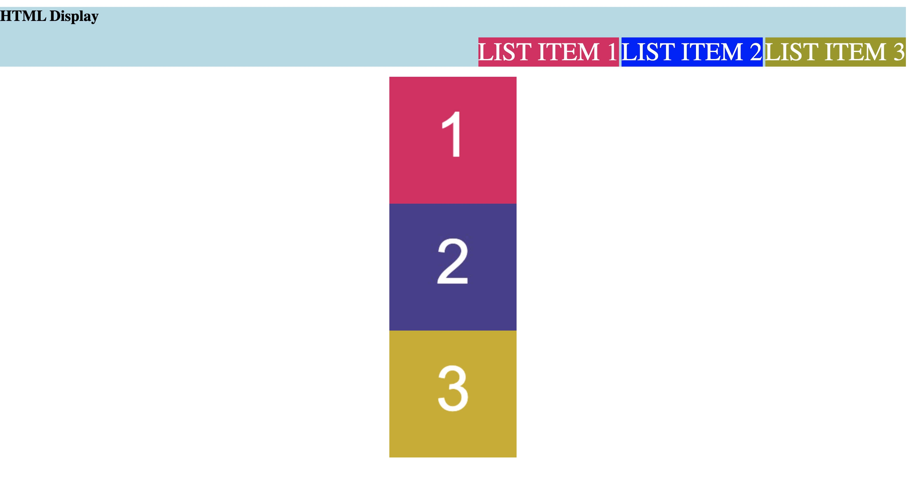

# 1.3 Lesson Plan: CSS Layout and the Box Model

## Overview

Today's lesson will delve further into CSS. Students will be introduced to the box model and learn how to customize layout using the `display` and `position` properties. Students will also collaborate on a mini-project that reinforces HTML and CSS fundamentals.

## Instructor Notes

* Be ready to view and edit CSS in Chrome DevTools. If you need a quick refresher, refer to the [Google documentation on viewing and changing CSS](https://developers.google.com/web/tools/chrome-devtools/css).

* If you are comfortable doing so, live-code the solutions to the activities. If not, just use the solutions provided and follow the prompts and talking points for review.

* This week's mini-project builds on the fundamental HTML and CSS concepts that students learned this week. Encourage students to review previous activities for help with syntax and for further study.

* Although students will work on individual projects for the mini-project, they will be put into groups. Encourage them to brainstorm together and share their learnings. This will be the first of many opportunities for students to collaborate and work in groups.

* This mini-project might also be some students' first experience building a development project from scratch. Remind them to break down the project into small, manageable steps and to let both the user story and acceptance criteria guide them to a step-by-step solution.

## Learning Objectives

By the end of class, students will be able to:

* Set an element as an inline or block element using the CSS `display` property.

* Determine how an element is positioned in an HTML document using the CSS `position` property.

* Identify the box model and its role in web design and layout.

## Time Tracker

| Start  | #   | Activity Name                   | Duration |
| ------ | --- | ------------------------------- | -------- |
| 5:30PM | 0   | Office Hours                    | 0:30     |
| 6:00PM | 1   | Relative Paths                  | 0:35     |
| 6:35PM | 2   | Display                         | 0:30     |
| 7:05PM | 3   | BREAK                           | 0:15     |
| 7:20PM | 4   | Box Model                       | 0:30     |
| 7:50PM | 5   | Positioning                     | 0:30     |
| 8:10PM | 6   | Mini-project                    | 0:50     |
| 9:00PM | 7   | Office Hours                    | 0:30     |
| 9:30PM | 8   | END                             | 0:00     |

## Slides

* [01.3 CSS Layout](https://docs.google.com/presentation/d/15ymGUhxAHnVa-h2IOWk7VMmMQYQqctGJxg0Uteuc3iU/edit?usp=sharing)

* **Note:** Editing access is not available for this document. If you wish to modify the slides, please create a copy by navigating to File > "Make a copy."

---

## 1. Relative Paths (35 mins)

### 1.1 Instructor Do: Stoke Curiosity (10 min)

* Welcome students to class.

* Explain that web developers often rely on tools to help troubleshoot issues and build pages faster.

* One of the most powerful development tools is available right in your web browser!

* Open `08-Stu-Project-Landing-Page/solved/index.html` in your browser and demonstrate the following:

  * Open Chrome DevTools by pressing Command+Option+J (Mac) or Ctrl+Shift+J (Windows, Linux, Chrome OS).

  * Tell the students that Chrome DevTools has many useful features for debugging and even experimenting with the code in the browser.

  * Navigate to the Styles tab on the Elements panel and note the CSS listed in the panel.

  * Point the cursor at a CSS property and click to uncheck the box. Note the style change on the webpage.

  * Change the `background-color` property in the body to `purple` to further demonstrate how you can manually change a value.

  * Explain that changing CSS in the browser is a great way to experiment with style properties.

  * You can also check an element's accessibility by simply pointing the cursor at the image.

  * Select the pointer icon and then point at an element on the page. A box should indicate details about the element's accessibility, including the role that it should fulfill (like link, header, or image) to be properly read by an accessibility device. If applicable, a contrast score will also be indicated.

  * Note that having enough contrast between colors helps ensure that your page is viewable to a range of users. Chrome DevTools is an easy way to check whether your page is readable.

  * Encourage students to experiment with Chrome DevTools as they build their own projects later in the class.

### 1.2 Instructor Do: Relative File Paths Slides and Demo (10 minutes)

* Flip to the slide on Relative File Paths and point out to students how we've been referencing external CSS style sheets.

* Have students remind you what an external CSS style sheet is before proceeding.

* First, open in your browser the HTML file [`html-bio-with-css.html`](./activities/01-Stu-Relative-Paths/starter/Demo/html-bio-with-css.html) that is inside the folder `01-Relative-Paths/starter/Demo`. Show students what the styled site looks like.

* Then open the same file in your editor.

* Point out again to students that the href needs to be able to "see" the CSS file and that href is like our "map" to where the file is.

    

* Then move the CSS file into a folder called `assets`. Refresh the page in the browser and point out that the HTML page no longer knows where the CSS file is.

* Fix the href link in the HTML to include the new assets directory. Refresh the page again and show students that this time it worked.

* Also explain that there are other instances in which we'll need to use relative paths to direct ourselves to resources—it may be images, PDFs, JavaScript files, etc. So it's important to get a handle on how relative paths work.

* Then flip to the next slide that talks about absolute file paths and explain that they are BAD because no other viewer of your HTML/CSS will be able to access those files. (The paths won't make any sense on the web.)

### 1.3 Student Do: Relative File Paths (10 minutes)

Answer any questions students have.

**Instructions:**

* Unzip the folder provided to you (or copy and paste the contents outside).

* Then modify each of the four `html-bio.html` pages such that they can access the CSS inside their folder. Don't move the CSS file and don't move the HTML file.

* Use relative linking to make it work!

* **Hint:** If you need some reading material on relative linking, you can use <https://css-tricks.com/quick-reminder-about-file-paths/>.

* If you finish early, help out those around you or begin reading through the Learn CSS Layout Guide found here: <http://learnlayout.com/no-layout.html>.

### 1.4 Instructor Do: Review Relative File Paths Activity (5 minutes)

* Review each of the Relative File Path examples. You can use the `01-Stu-Relative-Paths/solved` folder to quickly show solutions if you prefer.

---

## 2. Display (30 mins)

### 2.1 Instructor Demo: Display (10 min)

* Open `02-Ins-HTML-display/index.html` in your browser and demonstrate the following:

  * We use the `display` property to set whether an element behaves as an inline or a block element.

  * 🔑 **Inline elements** only occupy as much width as needed and do not automatically start a new line.

  * Images and `<a>` elements are examples of inline elements.

  * 🔑 **Block elements** always start on a new line and occupy as much width as there is available.

  * Paragraph and unordered lists are examples of block elements.

  * We can also use `display` to hide an element.

* Open `02-Ins-HTML-display/assets/css/style.css` in your IDE and demonstrate the following:

  * We use `display: block` to indicate a block element, which will occupy the whole width available:

    ```css
    .display-block {
      display: block;
    }
    ```

  * We use `display: inline` to indicate an inline element, which will only occupy the necessary width:

    ```css
    .display-inline {
      display: inline;
    }
    ```

  * We use `display: none` to completely remove an image so that it does not appear on the page and no longer occupies space in the layout:

    ```css
    .display-none {
      display: none;
    }
    ```

* Ask the class the following questions (☝️) and call on students for the answers (🙋):

  * ☝️ What is the difference between an inline and a block element?

  * 🙋 An inline element will only occupy as much width as necessary. In contrast, a block element will occupy as much width as there is available.

* Answer any questions before proceeding to the next activity.

* In preparation for the activity, ask TAs to start directing students to the activity instructions found in `16-Stu-HTML-display/README.md`.

### 2.2 Student Do: Display (10 min)

* Direct students to the activity instructions found in `03-Stu-HTML-display/README.md`.

* Break your students into pairs that will work together on this activity.

#### Instructions

* Fix the given code so that:
  * All three list items in the navigation bar should display inline.
  * All three boxes are visible.
  * Each box appeara centered and on its own line.

If successfule your code should look like the following:



#### 💡 Hints

Which `display` value hides an element?

#### 🏆 Bonus

If you have completed this activity, work through the following challenge with your partner to further your knowledge:

* What is the CSS `visibility` property? How is it different from the `display` property?

Use [Google](https://www.google.com) or another search engine to research this.

* While breaking everyone into groups, be sure to remind students and the rest of the instructional staff that questions on Slack or otherwise are welcome and will be handled. It's a good way for your team to prioritize students who need extra help.

### 2.3 Instructor Review: Display (10 min)

* Ask the class the following questions (☝️) and call on students for the answers (🙋):

  * ☝️ How comfortable do you feel with using display? (Poll via Fist to Five, Slack, or Zoom)

* Assure students that we will cover the solution to help solidify their understanding. If questions remain, remind them to use office hours to get extra help!

* Use the prompts and talking points (🔑) below to review the following key points:

  * ✔️ `display: inline`

  * ✔️ `display: block`

  * ✔️ `display: none`

* Open `03-Stu-HTML-display/solved/assets/css/style.css` in your IDE and explain the following:

  * In this activity, we are asked to debug broken code and ensure that the app behaves as expected.

  * 🔑 Currently, each list item in the navigation bar displays on its own line. To meet the expected behavior, we set the `display` property to `inline`:

    ```css
    li {
      display: inline;
      ...
    }
    ```

  * The boxes are images that currently display inline. To set them as block elements, we use `display: block`:

    ```css
    img {
      display: block;
      margin: 0 auto;
    }
    ```

  * 🔑 The third box, `image-3`, is set to `display: none`. This means that the box is not visible and is not taking up space. To make the box visible and match the expected behavior, we use `display: block`:

    ```css
    #image-3 {
      display: block;
    }
    ```

* Open `03-Stu-HTML-display/index.html` in your browser and explain the following:

  * We open the webpage in the browser to confirm that it now meets the expected behavior!

* Ask the class the following questions (☝️) and call on students for the answers (🙋):

  * ☝️ How can we use the `display` property to change how an element appears on the page?

  * 🙋 We can set an element to `display: inline` so that it only occupies as much width as necessary. We can set an element to `display: block` so that it occupies the entire width available. Finally, we can use `display: none` to completely remove an item.

  * ☝️ What can we do if we don't completely understand this?

  * 🙋 We can refer to supplemental material, read the [MDN Web Docs on display](https://developer.mozilla.org/en-US/docs/Web/CSS/display), and stay for office hours to ask for help.

* Answer any questions before proceeding to the next activity.

---

## 3. BREAK (15 min)

---

## 4. Box Model (30 mins)

### 4.1 Instructor Demo: Box Model (10 min)

* Open `04-Ins-CSS-box-model/index.html` in your browser and demonstrate the following:

  * In HTML, all elements are boxes. We use the **box model** to describe the amount of space that each element will occupy.

  * The innermost layer of the box is the content itself. The content has height and width.

  * The next layer is the **padding** that surrounds the content. We use CSS to set the width of the padding.

  * The **border** surrounds the padding. Like the padding, the width of the border is set by CSS.

  * Finally, the **margin** is the area outside the border.

* Open `04-Ins-CSS-box-model/assets/css/style.css` in your browser and demonstrate the following:

  * We use CSS to set the width of the padding, border, and margins.

  * The CSS `padding` property sets the width of the padding. In this case, all sides will have a width of 20px:

    ```css
    padding: 20px;
    ```

  * The CSS `border` property sets the width of the border, the type of the border, and the color:

    ```css
    border: 10px solid darkblue;
    ```

  * The CSS `margin` property sets the width of the margin. The margin on each side is 20px here:

    ```css
    margin: 20px;
    ```

* Ask the class the following questions (☝️) and call on students for the answers (🙋):

  * ☝️ What are the four components of the box model?

  * 🙋 The content, padding, border, and margin.

  * ☝️ How can the box model help us understand layout and design?

  * 🙋 The box model explains how much space an element will occupy on a page, which can inform the overall layout and design.

* Answer any questions before proceeding to the next activity.

* In preparation for the activity, ask TAs to start directing students to the activity instructions found in `05-Stu-CSS-box-model/README.md`.

### 4.2 Student Do: Box Model (10 min)

* Direct students to the activity instructions found in `05-Stu-CSS-box-model/README.md`.

* Break your students into pairs that will work together on this activity.

#### Instructions

Work with a partner to implement the following user story:

* As a developer, I want to use the CSS box model properties to position four boxes inside a frame.

* Correct the code so that each box has a defined:
  * `padding` property
  * `margin` property
  * `border` property

Your solution should match the following image:


#### 📝 Notes

Refer to the documentation:

[MDN Web Docs on CSS basic box model](https://developer.mozilla.org/en-US/docs/Web/CSS/CSS_Box_Model)

[MDN Web Docs on padding](https://developer.mozilla.org/en-US/docs/Web/CSS/padding)

[MDN Web Docs on margin](https://developer.mozilla.org/en-US/docs/Web/CSS/margin)

[MDN Web Docs on border](https://developer.mozilla.org/en-US/docs/Web/CSS/border)

#### 💡 Hints

How can we use the `margin` property to define space between elements?

#### 🏆 Bonus

If you have completed this activity, work through the following challenge with your partner to further your knowledge:

* What is the CSS `float` property?

Use [Google](https://www.google.com) or another search engine to research this.

> While breaking everyone into groups, be sure to remind students and the rest of the instructional staff that questions on Slack or otherwise are welcome and will be handled. It's a good way for your team to prioritize students who need extra help.

### 4.3 Instructor Review: Box Model (10 min)

* Ask the class the following questions (☝️) and call on students for the answers (🙋):

  * ☝️ How comfortable do you feel with the box model? (Poll via Fist to Five, Slack, or Zoom)

* Assure students that we will cover the solution to help solidify their understanding. If questions remain, remind them to use office hours to get extra help!

* Use the prompts and talking points (🔑) below to review the following key points:

  * ✔️ `margin`

  * ✔️ `padding`

  * ✔️ `border`

* Open `05-Stu-CSS-box-model/solved/assets/css/style.css` in your IDE and explain the following:

  * To complete this activity, we must center all four images inside the box.

  * The box has a width of 600px and a height of 600px. For the images to fit inside the box, the total combined space they occupy&mdash;including the content, padding, border, and margin&mdash;will have to be less than that:

    ```css
    section {
      width: 600px;
      height: 600px;
      text-align: center;
      border: 15px solid black;
    }
    ```

  * The width and height of the content is 200px:

    ```css
    width: 200px;
    height: 200px;
    ```

  * 🔑 First we set the margin on every side to 20px:

    ```css
    margin: 20px;
    ```

  * 🔑 We set the padding to 20px as well:

    ```css
    padding: 20px;
    ```

  * 🔑 Finally, we set the width of the border to 9px, make it a solid border, and give it a color of dark blue:

    ```css
    border: 9px solid darkblue;
    ```

* Open `05-Stu-CSS-box-model/solved/index.html` in your browser and explain the following:

  * The total width of the image is now 20px (left margin) + 9px (border) + 20px (left padding) + 200px (image) + 20px (right padding) + 9px (border) + 20px (right margin)&mdash;for a total of 298px.

  * The total height of the image is also 298px.

  * Because the width of the containing box is 600px and the height is 600px, the boxes fit evenly.

* Ask the class the following questions (☝️) and call on students for the answers (🙋):

  * ☝️ What is the difference between the padding and margin?

  * 🙋 The padding is the space between the content and the border. Padding surrounds the content. Margins determine the space surrounding an element. Both are often adjusted to make an element fit in a space.

  * ☝️ What can we do if we don't completely understand this?

  * 🙋 We can refer to supplemental material, read the [MDN Web Docs on the box model](https://developer.mozilla.org/en-US/docs/Learn/CSS/Building_blocks/The_box_model), and stay for office hours to ask for help.

* Answer any questions before proceeding to the next activity.

---

## 5. Positioning (30 mins)

### 5.1 Instructor Demo: Positioning (10 min)

* Open `06-Ins-CSS-positioning/index.html` in your browser and demonstrate the following:

  * We use the CSS `position` property to set how the element is positioned in a document.

  * The default position is `static`, meaning that the element is positioned based on the normal flow.

  * When an element's position is `relative`, it stays in the normal flow but can be offset by a value provided in the CSS.

  * When an element's position is `absolute`, it is no longer in the normal flow but instead is positioned relative to its ancestor element and is determined by values provided for top, bottom, left, and right.

  * An element in the `fixed` position is also not in the normal flow. However, unlike `absolute`, the position is determined in relation to the viewport.

* Open `06-Ins-CSS-positioning/assets/css/style.css` in your IDE and demonstrate the following:

  * 🔑 We use `position: relative` to set an element to `relative`, and we use the values of `top`, `right`, `bottom`, and `left` to offset the element. Here, we position the element to be 200px from the left:

    ```css
    #relative-box {
      position: relative;
      left: 200px;
    }
    ```

  * 🔑 To set an element to `absolute`, we first set the parent element to `relative`:

    ```css
    #absolute-section {
      position: relative;
    }
    ```

  * 🔑 We then use `position: absolute` and use the values of `top`, `right`, `bottom`, and `left` to position the item relative to the parent container. Here, we position the element 50px from the top and 100px from the right inside the container:

    ```css
    #absolute-box {
      position: absolute;
      top: 50px;
      right: 100px;
    }
    ```

  * 🔑 To set the element to `fixed`, we use `position: fixed`.  Then we use the values of `top`, `right`, `bottom`, and `left` to position the element relative to the viewport. Here, we position the element to be fixed in the bottom-right corner of the screen:

    ```css
    #fixed-box {
      position: fixed;
      bottom: 0;
      right: 0;
    }
    ```

* Ask the class the following questions (☝️) and call on students for the answers (🙋):

  * ☝️ How can we use the CSS `position` property to change the layout of the webpage?

  * 🙋 We use the `position` property to set how an element is positioned in the document, allowing us to move and rearrange elements or even fix them in a certain position relative to the viewport.

* Answer any questions before proceeding to the next activity.

* In preparation for the activity, ask TAs to start directing students to the activity instructions found in `07-Stu-CSS-positioning/README.md`.

### 5.2 Student Do: Positioning (10 min)

* Direct students to the activity instructions found in `07-Stu-CSS-positioning/README.md`.

* Break your students into pairs that will work together on this activity.

#### Instructions

 Work with a partner to implement the following user story:

* As a developer, I want to use the CSS position property to change the layout of my page.

Fix the given code so that:

* `box 2` is positioned in the middle of `square 1` using relative positioning.
* `box 2` is positioned outside of the upper-right corner of `square 2` using absolute positioning.

Your solution must match the following image:


#### 💡 Hints

How does the CSS `position` property change the document's normal flow?

#### 🏆 Bonus

If you have completed this activity, work through the following challenge with your partner to further your knowledge:

* What is the `z-index` property?

Use [Google](https://www.google.com) or another search engine to research this.

> While breaking everyone into groups, be sure to remind students and the rest of the instructional staff that questions on Slack or otherwise are welcome and will be handled. It's a good way for your team to prioritize students who need extra help.

### 5.3 Instructor Review: Positioning (10 min)

* Ask the class the following questions (☝️) and call on students for the answers (🙋):

  * ☝️ How comfortable do you feel with positioning? (Poll via Fist to Five, Slack, or Zoom)

* Assure students that we will cover the solution to help solidify their understanding. If questions remain, remind them to use office hours to get extra help!

* Use the prompts and talking points (🔑) below to review the following key points:

  * ✔️ `position: relative`

  * ✔️ `position: absolute`

* Open `07-Stu-CSS-positioning/solved/assets/css/style.css` in your IDE and explain the following:

  * In this activity, we need to use absolute and relative positioning to reposition `box 2` in each of the squares.

  * To start, we look at the dimensions of `square 1` and `square 2`, which have a class of `container`. The height is 600px, and the width is 600px:

    ```css
    .container {
      width: 600px;
      height: 600px;
      margin: 20px auto;
      border: 15px solid black;
    }
    ```

  * We can fit three boxes vertically in the square, so we can deduce that the dimensions of the boxes are 200px. This information will be useful in deciding how much to offset the box so that it is positioned in the middle.

  * 🔑  To position `box 2` in the middle of `square 1`, we will need to set the position of `relative-box-2` to `relative`. Then we offset it from its original position, 200px to the left&mdash;moving the box to the center of the square:

    ```css
    #relative-box-2 {
      position: relative;
      left: 200px;
    }
    ```

  * To use absolute positioning, we first need to set the parent element to `relative`. Therefore, `square 2` has an additional class of `absolute-container`:

    ```css
    .absolute-container {
      position: relative;
    }
    ```

  * 🔑  Then, to move `box 2` outside of `square 2`, we set the position of `absolute-box-2` to `absolute`, and we set the top to 0 and the left to 700px:

    ```css
    #absolute-box-2 {
      position: absolute;
      top: 0;
      left: 700px;
    }
    ```

* If time allows, explain the other CSS using the comments provided.

* Open `07-Stu-CSS-positioning/solved/index.html` in your browser and explain the following:

  * When we open the webpage, we see that the acceptance criteria has been met and the webpage matches the mockup.

* Ask the class the following questions (☝️) and call on students for the answers (🙋):

  * ☝️ What is the difference between absolute and relative positioning?

  * 🙋 Relative positioning offsets an image relative to its original position but does not change the layout of the other elements around it. Absolute positioning positions the image relative to its parent container and removes it from the flow, changing the layout of other elements around it.

  * ☝️ What can we do if we don't completely understand this?

  * 🙋 We can refer to supplemental material, read the [MDN Web Docs on position](https://developer.mozilla.org/en-US/docs/Web/CSS/position), and stay for office hours to ask for help.

* Answer any questions before proceeding to the next activity.

---

## 6. Mini-Project: Landing Page (50 mins)

### 6.1 Instructor Demo: Mini-Project (10 min)

* Open `08-Stu-Project-Landing-Page/solved/index.html` in your browser and demonstrate the following:

  * Each mini-project is an opportunity for you to implement what you learned in that unit and work with a group to create an application in class.

  * 🔑 For the first mini-project, you will be creating a landing page using HTML and CSS. Each of you will work on your own landing page. However, you will still be put into groups so that you can brainstorm and work together through the specifications of the mini-project.

  * 🔑 The landing page will have a contact form.

  * 🔑 The landing page will have a header, footer, and an image.

  * 🔑 The landing page should also use semantic HTML and be accessible.

  * Be creative! You can choose your own colors, text, and image.

  * 🔑 You might need to do a bit of research on your own! As in real life, you will not always be given everything you need to complete a task. Developers have to be able to research and find their own answers.

  * When you approach a complex coding problem like this, break down the challenge into manageable chunks. Work with your group to figure out the steps to complete this mini-project.

  * 🔑 You should also refer frequently to the user story and acceptance criteria. Checking your work against the goal stated in the user story and the conditions established in the acceptance criteria is a great way to stay on track.

* Ask the class the following questions (☝️) and call on students for the answers (🙋):

  * ☝️ How would we build this?

  * 🙋 We will use HTML to build the structure and use CSS to style the page.

* Answer any questions before allowing students to start the mini-project.

### 6.2 Student Do: Mini-Project (30 min)

* Direct students to the activity instructions found in `08-Stu-Project-Landing-Page/README.md`.

* Remind students that they are not expected to complete the project in the allotted time and instead encourage them to define their own, manageable scope of work as a group, while working to complete as much as they can.

* Break your students into groups that will work together on this activity.

#### Instructions

In this mini-project, you will build a landing page using HTML and CSS. While you will be responsible for your own landing page, you will work in a group to brainstorm and share ideas.

## User Story

Work in your group to implement the following user stories:

* As a client, I want to view a single webpage that collects a visitor's contact information.

* As a client, I want the landing page to have a header and footer.

* As a client, I want the landing page to have an image with a caption.

* As a client, I want the landing page to have a contact form.

* As a client, I want the landing page to have a polished and accessible UI.

## Acceptance Criteria

* It's done when the page uses semantic HTML elements.

* It's done when the page uses universal, element, and class selectors in CSS.

* It's done when the page features at least three colors in the design.

* It's done when the page uses a single font and font family for all text.

* It's done when the page uses at least two heading elements (`<h1>` through `<h6>`).

* It's done when the header is fixed to the top of the page on scroll.

* It's done when the header contains a navigation bar with three links that display inline, including a contact link.

* It's done when, if the contact link is clicked, the page jumps directly to the contact form.

* It's done when the contact form includes `input` elements for name and email.

* It's done when the contact form includes a Send button.

* It's done when the image includes a descriptive `alt` attribute.

* It's done when the page is deployed to GitHub Pages.

## 💡 Notes

Follow these instructions to deploy your project to GitHub Pages:

1. Create a new repository on your GitHub account and clone it to your computer.

2. When you're ready to deploy, use the `git add`, `git commit`, and `git push` commands to save and push your code to your GitHub repository.

3. Navigate to your GitHub repository in the browser and then select the Settings tab on the right side of the page.

4. On the Settings page, select Pages on the left side of the page. On the GitHub Pages screen, choose `main` in the dropdown under Source.

5. Navigate to <your-github-username.github.io/your-repository-name> and you will find that your new webpage has gone live! For example, if your GitHub username is "lernantino" and the project is "css-demo-site", then your URL would be <lernantino.github.io/css-demo-site>.

You can also refer to this [YouTube video on enabling GitHub Pages](https://youtu.be/P4Mu1t5rIXg) for more guidance.

> **Important**: It might take a few minutes for GitHub pages to display your site correctly. If your project does not deploy or display correctly, check that all file paths in your application are relative and use the right casing. GitHub is case-sensitive, an inccorect capital or lowercase letter could cause problems in deployment.

## 💡 Hints

Refer to the documentation:

* [MDN Web Docs on HTML elements](https://developer.mozilla.org/en-US/docs/Web/HTML/Element)

* [MDN Web Docs on color](https://developer.mozilla.org/en-US/docs/Web/CSS/color)

* [MDN Web Docs on font](https://developer.mozilla.org/en-US/docs/Web/CSS/font)

* [MDN Web Docs on HTML section heading elements](https://developer.mozilla.org/en-US/docs/Web/HTML/Element/Heading_Elements)

* [MDN Web Docs on how to structure a web form](https://developer.mozilla.org/en-US/docs/Learn/Forms/How_to_structure_a_web_form)

* [MDN Web Docs on the button element](https://developer.mozilla.org/en-US/docs/Web/HTML/Element/button)

* [MDN Web Docs on the figure element](https://developer.mozilla.org/en-US/docs/Web/HTML/Element/figure)

## 🏆 Bonus

If you have completed this activity, work through the following challenge with your group to further your knowledge:

* How can CSS be used to apply a different style to an `<a>` element when a cursor points at it?

Use [Google](https://www.google.com) or another search engine to research this.

> While breaking everyone into groups, be sure to remind students and the rest of the instructional staff that questions on Slack or otherwise are welcome and will be handled. It's a good way for your team to prioritize students who need extra help.

### 6.4 Instructor Review: Mini-Project  (10 min)

* Ask the class the following questions (☝️) and call on students for the answers (🙋):

  * ☝️ How comfortable do you feel with this mini-project? (Poll via Fist to Five, Slack, or Zoom)

* Assure students that we will cover the solution to help solidify their understanding. If questions remain, remind them to use office hours to get extra help!

* Use the prompts and talking points (🔑) below to review the following key points:

  * ✔️ Semantic HTML

  * ✔️ `alt` attribute

  * ✔️ `display: inline`

  * ✔️ `position: fixed`

* Open `08-Stu-Project-Landing-Page/solved/index.html` in your IDE and explain the following:

  * Everyone's landing pages will look different, so don't worry if yours doesn't look exactly like what we are about to review. As long as your landing page fulfills all of the specifications of the project, you did great!

  * We use `<link>` to link the HTML page to the CSS. The `<link>` is placed in the `<head>` and uses an `href` attribute to set the relative path to the CSS style sheet:

    ```html
    <link rel="stylesheet" type="text/css" href="./assets/css/style.css/">
    ```

  * 🔑 We use semantic HTML to define the header and an unordered list to create a list of links:

    ```html
    <header>
      <nav class="text-right">
        <ul>
          <li> <a href="https://github.com/">Github</a></li>
          <li> <a href="#">Portfolio</a></li>
          <li> <a href="#contact">Contact</a></li>
        </ul>
      </nav>
    </header>
    ```

  * We use a `<h1>` section heading for the title:

    ```html
    <h1 class="text-center">My New Website</h1>
    ```

  * 🔑 We use a `<figure>` element to add an image and a caption. We use an `alt` attribute to describe the image:

    ```html
    <figure>
        
        <figcaption class="text-center">Lorem ipsum dolor, sit amet consectetur adipisicing elit.</figcaption>
    </figure>
    ```

  * We use semantic HTML to define a section for the contact form. Inside the `<section>`, we add a sub-header. For accessibility, it is important that the section headings are organized in descending order. So because we used `<h1>` previously, we use `<h2>` now:

    ```html
    <section id="contact">
        <h2 class="text-center">Contact Me</h2>
    ```

  * You probably had to research how to create a form. A Google search can help you quickly learn how to use an unfamiliar element in your webpage:

    ```html
    <form>
      <ul>
        <li>
          <label class="text-right" for="name">Name:</label>
          <input type="text" id="name" name="user-name">
        </li>
        <li>
          <label class="text-right" for="email">Email:</label>
          <input type="text" id="email" name="user-email">
        </li>
      </ul>
      <div class="text-center">
        <button type="submit">SEND</button>
      </div>
    </form>
    ```

  * Finally, we added a footer with a `class` attribute used for styling:

    ```html
    <footer class="text-center">
      © 2022 My New Website Productions
    </footer>
    ```

* Open `08-Stu-Project-Landing-Page/solved/assets/css/style.css` in your IDE and explain the following:

  * We use a universal selector to set the margin and padding of all elements to 0:

    ```css
    * {
      margin:0;
      padding:0;
    }
    ```

  * 🔑 We use an element selector to select all the list items and set the display property to `inline`. This will create a horizontal set of links in the navbar:

    ```css
    li {
      display: inline;
      padding: 20px;
      text-decoration: none;
    }
    ```

  * 🔑 To keep the header fixed to the top of the viewport, we set the position to `fixed`:

    ```css
    header {
      position: fixed;
      border-bottom: 10px solid #DDAF94;
    }
    ```

* Ask the class the following questions (☝️) and call on students for the answers (🙋):

  * ☝️ Why is it important to design webpages with accessibility in mind?

  * 🙋 Making your website accessible to more people can result in more users!

  * ☝️ What can we do if we don't completely understand this?

  * 🙋 We can refer to supplemental material, read the [MDN Web Docs on structuring the web with HTML](https://developer.mozilla.org/en-US/docs/Learn/HTML) and the [MDN Web Docs on learning to style HTML using CSS](https://developer.mozilla.org/en-US/docs/Learn/CSS), and stay for office hours to ask for help.

* Answer any questions before proceeding to the next activity.

## 7. Instructor Do: Office Hours (30 minutes)

## 8. END (0 min)

How did today’s lesson go? Your feedback is important. Please take 5 minutes to complete this [anonymous survey](https://forms.gle/RfcVyXiMmZQut6aJ6).

---
© 2022 edX Boot Camps LLC. Confidential and Proprietary. All Rights Reserved.
