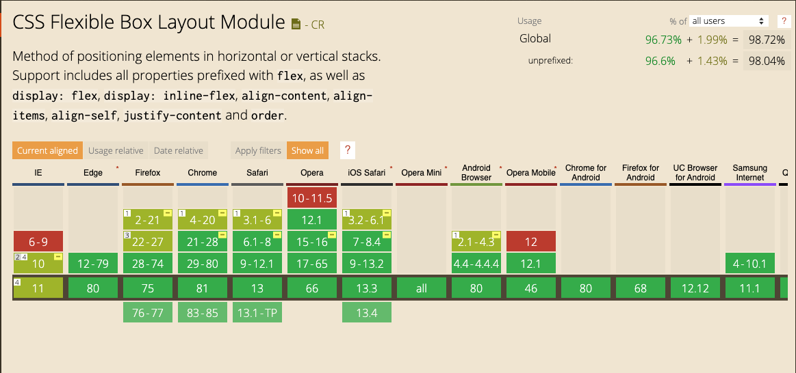
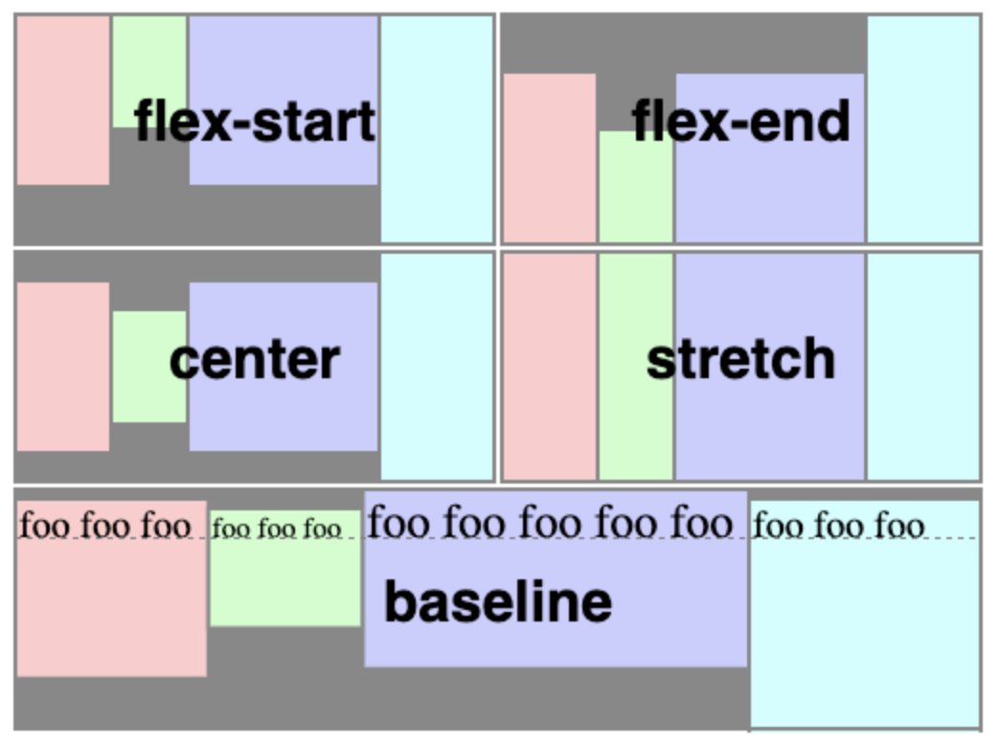
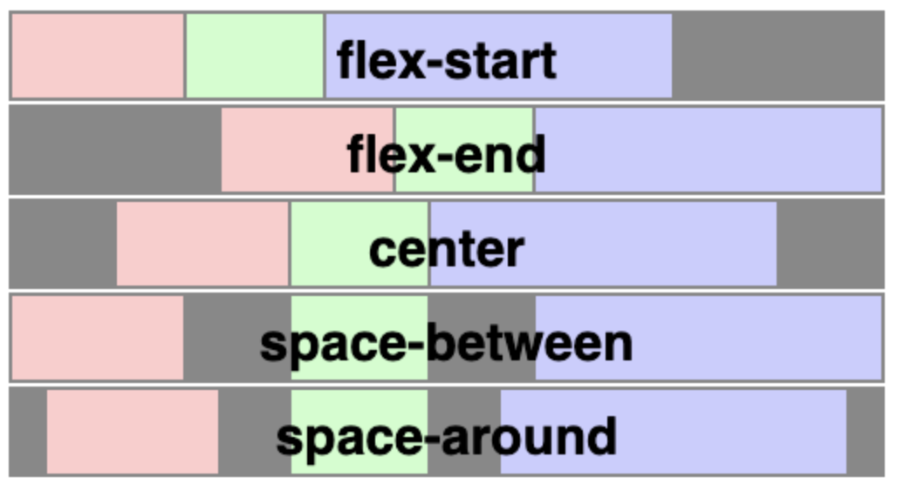
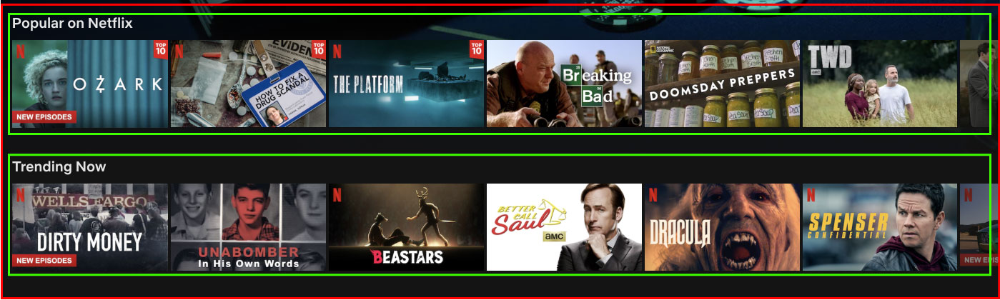

# 2.1 Lesson Plan: CSS Flexbox and the Flexible Box Model

## Overview

Today’s focus is on positioning elements in HTML documents. Students will learn how to use and apply CSS Flexbox to create rows, columns, and automatically responsive child elements in HTML documents, creating one-dimensional layouts.

In 2.2, students learn about CSS Grids, giving them the ability to code two-dimensional layouts.

## Learning Objectives

By the end of class today, students will:

1. Create CSS Flexbox containers and set them to display as a row or a column.
2. Position CSS Flexbox items inside containers to create clean and fluid layouts.
3. Nest CSS Flexbox containers to control the elements contained inside them.
4. Apply CSS Flexbox skills in a coding activity called Jake's Eatery.

## Slides

* [2.1 - CSS Flexbox](https://docs.google.com/presentation/d/1TzVF8Pm3l1xAze9U_0H_mp8PJR-tqn5NCWhmWYXaQms/edit?usp=sharing)

> **Note:** Editing access is not available for this document. If you wish to modify the slides, please create a copy by navigating to File > "Make a copy."

## Preparing for Class

* Make any teaching notes you'll need.

* As you lecture, relate your own on-the-job experience whenever possible to bring what students are learning to life and connect it to their future goals.

* If you need a refresher on how to use CSS Flexbox for positioning elements, we recommend reading the [Mozilla developer network tutorial](https://developer.mozilla.org/en-US/docs/Learn/CSS/CSS_layout/Flexbox). This tutorial describes the CSS Flexbox basics, including how to use the CSS Flexbox layout system to create web layouts.

* If you are unfamiliar with Flexbox, test out the HTML5 [Flexbox Froggy](https://flexboxfroggy.com/) game to review how to use CSS Flexbox to position elements on a webpage.
  * **Note:** Students will play the Flexbox Froggy game during today's lesson.
* You will give two very brief demos with CodePen. ***Be sure to run through the demos in advance of the class.*** Both demos are part of your Section 2 lecture, in which you introduce CSS Flexbox:
  * The demos (Section 3) show students how to implement concepts covered in the section 2 lecture: how to use CSS Flexbox on a parent element and how to use CSS Flexbox to create a column or a row.

* If needed, review the Strategies for Class Online in the module [README](../README.md).

## Time Trackers

* Use an online timer, which you or your TA can set at the start. You can add a timer to your Chrome browser, found here: [Chrome Timer](https://chrome.google.com/webstore/detail/timer/hepmlgghomccjinhcnkkikjpgkjibglj?hl=en).

| Start  | #   | Activity Name                    | Duration |
| ------ | --- | -------------------------------- | -------- |
| 5:30PM | 0   | Office Hours                     | 0:30     |
| 6:00PM | 1   | CSS Flexbox                      | 1:55     |
| 7:55PM | 2   | BREAK                            | 0:15     |
| 8:10PM | 3   | Code Practice                    | 0:50     |
| 9:00PM | 4   | Office Hours                     | 0:30     |
| 9:30PM | 5   | END                              | 0:00     |

---

## 1. CSS Flexbox

### 1. Instructor Do: Introducing CSS Flexbox (15 minutes)

> **Important point:** Your goal in this lecture is to introduce students to key concepts of the CSS Flexbox model, specifically `display: flex;`. This lecture supports the first learning objective of the day, creating CSS Flexbox containers and setting them to display as a row or column.

Today, we're covering the Flexible Box Model and how it makes web developers' lives easier.

Share today's objectives and the following three takeaways:

1. Flexbox is used to make either columns or rows out of containers.

2. Flexbox fixes the standard box model by making children of a container automatically take up 100% of the room of the container's height or width (depending on if it's a column or row).

3. Flexbox children can be given height, width, margin, or padding, and flex will automatically size the flex children to fit—even if you make an error.

> 💼 **Employer competitive note:**  Understanding the Flexible Box Model and CSS Flexbox allows you to design more realistic layouts. When you have a working knowledge of CSS Flexbox, you can design layouts with CSS Flexbox in mind. As a designer, this allows you to communicate efficiently to developers how you want your layout to be built and to function.

#### What Is CSS Flexbox?

In short, it's a time saver. Think lines of code you won't have to write.

* Let students know that the Flexible Box Model is very "forgiving" compared with the traditional box model and greatly simplifies our code.

  * By flexible and "forgiving," we mean that CSS Flexbox assumes what our layout should look like. Even if you make mistakes when sizing flex items, CSS Flexbox will assume what you want and display a layout that is 100% contained inside our flex container. Using the standard box model, the content would break outside of its parent container.

**CSS Flexbox** is a layout model that allows elements to align and distribute space within a container. Elements can be aligned to fill or distribute space between elements by using flexible widths and heights, which makes it a great tool to **use** for responsive design systems.

> **Instructor note:** Let the class know that designers will commonly refer to CSS Flexbox as just **"flex."** Both terms refer to the same thing, CSS Flexbox.

Flex solves many responsive layout problems on the web that the previous CSS layout properties (like floats and pixel layout) can’t address without workarounds. For example, aligning items next to each other in a navbar using the standard box model was an unexpectedly difficult challenge for the previous CSS layout properties we have learned.

Flex CAN make 100%-responsive containers. This means that the containers can line up next to each other, and the content will fit any way that you want.

#### Layout Methods

**Ask:** "What are the three layout methods we've already learned?"

* _`block` elements have specified dimensions and occupy whole lines._
* _`inline` elements are automatically sized and share their lines with other elements._
* _`inline-block` elements are a mix of the other two; they have specified dimensions, but also share their lines with other elements._

CSS Flexbox is a one-dimensional layout method for placing flexible children in rows or columns. Items flex to fill additional space and shrink to fit into smaller spaces.

#### Why Learn CSS Flexbox?

For a long time, the only reliable cross browser-compatible tools available for creating CSS layouts were **floats** and **positioning**. Modern layouts need a responsive design that modifies the content for each device state.

The following simple layout requirements are challenging to achieve with floats and positioning:

* Vertically center a block of content inside its parent. We talked about how to align items horizontally in `margin: 0 auto`.

 > **Instructor note:** You may need to remind students that a "parent" element is the one that contains other elements (which are "child" elements).

* Make all the children of a container take up an equal amount of the available width/height, regardless of how much width/height is available.

* Make all columns in the same container adopt the same height, even if they contain a different amount of content.

CSS Flexbox is supported across all major browsers, making it a great tool to make reliable UIs. Take a look at what [caniuse.com](https://caniuse.com/#search=flex) has to say about cross-compatibility.



Now that students understand what CSS Flexbox is and how it is used, let's introduce them to the basics of using CSS Flexbox in their work.

#### How Can We Use CSS Flexbox?

Using flex in our layout is easy! All you need to do is set `display: flex` onto any containing element. Our element is now a flex container! The content contained inside of our container are now flex items and will automatically display as a row.

Seeing is believing, so show the class how flex works in action in the following demo.

### 1.2 Instructor Do: Flex Containers and Flex-Direction Demo (10 minutes)

> **Important point:** Your goal is to demonstrate how to apply flex styling to a container and use the `flex-direction` property. This demo supports learning objective number one: create CSS Flexbox containers and set them to display as a row or a column.

Open the [demo in CodePen](https://codepen.io/matt-boisseau/pen/zYqVaxv).

**TAs:** Share the pen link in Slack for students to follow along.

1. **Say:** "Here we have three child divs in one parent div. Let's see what happens when we add Flexbox."

2. Add `display: flex;` to the `#parent` CSS rule.

 `#parent` is now a **flex container**, and the other divs are **flex items**. The flex items display in a row because that is the default flex direction.

 This is the same result we would have gotten from using `display: inline-block;` on the child divs.

1. Add `flex-grow: 1;` to the `#child1` CSS rule.

 `flex-grow` allows a flex item to expand to fill as much space as is available.

1. Add `flex-grow: 2;` to the `#child2` CSS rule.

 The extra horizontal space in `#parent` is divided between `#child1` and `#child2`. `#child2` will try to occupy twice as much of that space because its `flex-grow` value is twice as much.

1. Add `flex-direction: column;` to the `#parent` CSS rule.

 The flex items display in a column because we set `flex-direction` to `column`. Extra space is divided in the same way as before, only vertically.

Now that students are aware of the basics of CSS Flexbox, it's time for them to try to practice these concepts by building two very basic flex layouts.

### 1.3 Student Do: Your First CSS Flexbox Layout Activity (15 minutes)

Direct students to the activity, found in [01-Stu-Your-First-Flex-Layout](activities/01-Stu-Your-First-Flex-Layout).

> **Recommendation:** Keep everyone in the main Zoom room during this activity. With the TAs, monitor the students as they work and offer encouragement where needed. If many students have the same question, ask everyone to pause and watch your screen as you explain how students can solve the issue.

#### **Summary**

Let’s show students how easy it is to create layouts using CSS Flexbox. In this activity, students will make **two** CSS Flexbox containers using the `flex-direction` property.

#### Instructions

Students will use HTML and CSS to build a one-column layout and a one-row layout using Flexbox.

*If students struggle:* Check the student's CSS and make sure they're using `flex-direction: row;` or `flex-direction: column;`. If you're not experienced at web development, lean on the solved file to show students how their code is different.

*If students complete the activity early:* Share this [resource](https://yoksel.github.io/flex-cheatsheet/) with them.

#### **Instructors and TAs**

*If you're a skilled front-end developer:* Support students who have problems with flex. Answer their questions and help them understand why they ran into their problem.

*If you are not a skilled front-end developer:* If a student asks you for help and you don't know how to solve the problem, direct them toward the solved file.

#### **Deliverable**

Students will create two layouts: one layout will display a column, and the other will display a row.

### 1.4 Instructor Do: Your First CSS Flexbox Layout Activity Review (10 minutes)

Bring everyone's attention back to your screen and lead a review of the activity.

Aim to review the work of two to three students (have a few volunteers share work in Slack).

A few questions to prompt a discussion:  

* What are some different UI elements you have seen recently on the web that were either a column or a row? If the students are having a hard time thinking of UI elements, pull up [Amazon.com](https://www.amazon.com) or another big-name website like [Netflix](https://www.netflix.com/) and point out content that is arranged in a column or a row.
* Did you find using flex to be easy or hard? Why?
* Do you have a point or concept you would like to talk about? If so, feel free to bring it up.

Offer students actionable feedback that they can apply to their work, for example:

* Suggest to students to try specifying height as a percentage for any column layout that has been built with CSS Flexbox. CSS Flexbox can make the height of our content responsive, as well as the width.
* Tell your class that they should try specifying width, margins, and padding to flex items to see how your layout reacts when using CSS Flexbox.

Next, ensure that the concepts are sinking in with a review:

> **Recommendation:** Students should speak their answers aloud. But it's acceptable for them to type answers into Slack; have TAs monitor those questions.

**Ask:**

* "Why do we use flex?"

 *We use flex to create columns and rows with responsive children elements.*

* "What kind of layouts can we create using flex? One-dimensional or two?"

 *One-dimensional.*

* "What does it mean to create a one-dimensional layout?"

 *One-dimensional layouts are referring to a layout that is either a column or a row.*

### 1.5 Instructor Do: Alignment With CSS Flexbox (10 minutes)

> **Important point:** The goal of this section is to instill confidence in students about their ability to align and justify elements using CSS Flexbox. This part of the lecture supports learning objective number two: position CSS Flexbox items inside containers to create clean and fluid layouts.

**Say:** "Being able to align content in CSS Flexbox is one of its most attractive features. Can anyone guess why?"

*Answer:* It allows us to responsively position child elements inside their containers with only a few lines of code.

Previously, aligning content inside a flex container was an awkward and unresponsive experience. The only tools developers had available to position elements vertically were margin and padding or to hack it into place with absolute positioning. That was the old-school way.

Today, there is an easier way to align content with two properties: `align-items`
and `justify-content`.

#### **The `align-items` Property**

The `align-items` property defines the default behavior of flex items as they fill the container and specifies their layout within that container along the cross axis (top–bottom). The property aligns items vertically.

The following values can be used with `align-items`:

* `flex-start` aligns items at the beginning of the container (or top).
* `flex-end` aligns items at the end of the container (bottom).
* `center` centers content vertically in its parent container.
* `baseline` aligns items so that their baselines align.
* `stretch` items stretch to fill the container top–bottom or left–right.



#### **The `justify-content` Property**

The CSS property `justify-content:` is used to distribute content across the left and right sides of containers, in much the same way as `margin-left: auto` or `margin: 0 auto;`.

The following values can be used with `justify-content`:

* `flex-start` flex items align at the start line (this is the default).
* `flex-end` flex items are aligned at the end.
* `center` flex items are aligned in the center of the container, similar to `margin: 0 auto;`.
* `space-between` items are evenly distributed in the line; the first item is on the start line, and the last item is on the end line.
* `space-around` items are evenly distributed in line with equal space around them.
* `space-evenly` items are distributed so that the spacing between any two adjacent alignment subjects, before the first alignment subject and after the last alignment subject, is the same.



> **Key tech note:** You can use **`align-items:`** and **`justify-content:`** together to perfectly center items inside of flex containers. These two properties will automatically position items inside their parent container with no need to mess with media queries.

Now it is time to allow students to try aligning elements themselves, which is the goal of the following activity.

### 1.6 Student Do: Aligning CSS Flexbox Items Activity (15 minutes)

Direct students to the activity, found in [02-Stu-Aligning-With-Flex-Items](activities/02-Stu-Aligning-With-Flex-Items/README.md).

> **Recommendation:** Keep everyone in the main Zoom room during this activity. With the TAs, monitor the students as they work and offer encouragement where needed. If many students have the same question, ask everyone to pause and watch your screen as you explain how to solve the issue.

#### Summary

In this activity, students learn how easy it is to align items inside their parent containers using CSS Flexbox.

#### Instructions

This activity includes three main tasks:

1. The first part is aligning content top–bottom with `align-items` to see how it affects HTML elements.
2. The second part is using `justify-content` to align items left–right in our HTML.
3. The third part is using both in tandem to see what kinds of alignment you can achieve.

*If students struggle:* Make sure they use the correct CSS property. Check students' code for the CSS properties `align-items` or `justify-content` (depending on the directions given). If you aren't an experienced web developer, lean on the solved file to show students where their code is different from the solved.

*If students complete the activity early:* Share the resources [justify-content](https://yoksel.github.io/flex-cheatsheet/#justify-content) and [align-items](https://yoksel.github.io/flex-cheatsheet/#align-items) with them.

#### Instructors and TAs

Monitor students' progress with your TAs and offer help where needed. Encourage students to help one another as well.

**Say:** "Take note of how these two categories of tools are different and similar and be prepared to share what you find with the class."

*If you aren't an experienced front-end developer:* Feel free to lean on the solved activity file located in the Google Drive zip. Help students understand how their code is different from the solved file.

### 1.7 Instructor Do: Aligning CSS Flexbox Items Activity Review (10 minutes)

Bring everyone's attention back to your screen and lead a review of the activity.

Aim to review the work of two to three students (have a few volunteers share work in Slack). Be sure the feedback you and your TAs provide is *actionable*.

**Ask:**

* "Did you have any difficulty with this activity? What problems did you encounter?"

* "What are some examples (or layouts) of how aligning elements using `align-items` and `justify-content` would be useful?"

* "Can you perfectly center content using `align-items` and `justify-content`?"

 *Yes.*

* "What does the CSS property `align-items` do?"

 _`align-items` positions flex children in a flex container top–bottom._

* "What does the CSS property `justify-content` do?"

 _`justify-content` positions flex items left–right._

* "How are they different?"

 *They align flex children in opposite directions.*

* "How are they similar?"

 _They use the same CSS properties: `flex-start`, `flex-end`, `center`, `space-between`, and `space-around`._

#### Common Misconceptions and FAQs

Complete the review by covering a few common misconceptions or FAQs about Flexbox and aligning items.

* `align-items` and `justify-content` are applied to the parent container and control content contained inside.
* Using `align-items` and `justify-content`, it is possible to achieve almost any layout that requires responsive alignment.

Next, go more in depth with your next lecture on nesting CSS Flexbox containers.

### 1.8 Instructor Do: Nesting CSS Flexbox Containers (10 minutes)

> **Important point:** Your goal in this section is to explain the how and why of nesting flex containers inside one another. This part of the lecture supports learning objective number three: nest CSS Flexbox containers to control the elements contained inside them.

In this section, you'll go deeper into what is possible with CSS Flexbox by introducing the nesting concept.

**Why is this useful?**

Nesting flex containers can be used to create complex layouts that are composed of rows nested in columns or columns nested in rows.

> **Key tech note:** Nesting flex items allows you to create more complex UIs using pure CSS Flexbox.

This is mainly useful for aligning the contents of children by converting them to flex children.

Now, break down nesting CSS elements for the class.

**Demo the following code for your class:**

* Open the following: [Nested Flex Layouts](https://codepen.io/crbecker1/pen/jOqbYQe).
*Let's break this code down for students.*

```css
/* COLUMN STYLES */
.columnOne {
  display: flex;
  flex-direction: column;
  background-color: lightblue;
  height: 800px;
  padding: 50px;
  margin: 15px;
}
.middleRow {
  height: 25%;
  background-color: green;
}
.bottomRow {
  height: 25%;
  background-color: purple;
}
```

* **Say:** "These are styles that are similar to the column-style grid we showed earlier."

* This column is set to display as a flex container with a height of 800 pixels. It is also set to display as a column.

* The children have been given a percentage-based height so that they display inside our flex container.

```css
/* Nested Column Styles */
.topRow {
  height: 50%;
  background-color: blue;
/*   display: flex; */
/*   align-items: center; */
/*   justify-content: center; */
}
.card {
  width: 33.3%;
  max-width: 350px;
  height: 75%;
  border-radius: 7px;
  background-color: red;
  margin: 15px;
}
```

* Focus students on `.card` (`.topRow` currently only has CSS properties, so it displays correctly). These elements have a width of 33.3% and a height of 75%.

* Notice how this layout is broken because we have a fixed height on our `.columnOne` element of 800 pixels.

**Say:** "What if we want to display these card elements as a row? Easy! We just need to create a nested flex element."

* Uncomment `display: flex;` from `.topRow`. This will cause our row to display as a row. (Remember, this is the default for flex containers.)

**Say:** "Nesting grids is easy! All you need to do is set display flex to a flex child. Like magic, our element is now a flex container, and we can apply flex-specific styles to it."

* Uncomment `align-items:center;` and `justify-content: center;` from `.topRow`.

**Say:** "Now that we have a nested flex container, we can easily align the child contents inside of it using `align-items` or `justify-content`."

> :key: **Key tech note:** When you "nest" multiple flex items, you're just setting **`display: flex`** to a parent container and then adding **`display: flex`** onto a child. You can now use flex container-specific properties on the child like `align-items` and `justify-content`.

Nesting flex items are beneficial for making more complex layouts completely in flex. For example:

* If you nest three rows (with content inside) inside a flex container, you can create a layout like the following:



* The red lines represent our flex container set to display as a column, and the green lines are our two flex containers nested and positioned inside the main container.

Knowing how to nest flex items will be handy in your work as a professional designer because it will let you design more accurately. Having working knowledge of the tools of front-end development will help you empathize with the dev team and create more realistic designs.

**Say:** "Let's play a game! The game is called Flexbox Froggy, and it will help reinforce the concepts we talked about during class today."

> **Instructor note:** Playing a game is a simple way to get students coding. During the following exercise, encourage students to have fun and research CSS properties they don't understand.

### 1.9 Student Do: Play CSS Flexbox Froggy Activity (10 minutes)

**TAs:** Slack out the following URL to students: [Flexbox Froggy](https://flexboxfroggy.com/).

> **Note:** There are no instructions for this activity.

> **Recommendation:** Keep everyone in the main Zoom room during this activity. With the TAs, monitor students as they work and offer encouragement where needed.

#### Summary

Have the students play Flexbox Froggy for 10 minutes to help reinforce the concepts we lectured about in class today before students move on to the day's coding challenge.

#### Instructions

For the next 10 minutes, students should play the web game Flexbox Froggy to help gain an understanding of how Flexbox works in practice.

*If students struggle:* You should encourage them to research the CSS Flexbox property on which they are stuck (depending on where they are in the game).

*If students complete the activity early:* Invite them to find some helpful information about Flexbox and share a couple of links with the class on Slack.

#### Instructors and TAs

> **Recommendation:** Use Slack or create a breakout room to assist struggling students.

Monitor students' progress with your TAs and answer student questions.

*If you aren't an experienced web developer:* Share your screen and play the game yourself! Flexbox Froggy will help you sharpen your developer skills to better assist students in the future.

*If you are an experienced web developer:* Keep an eye out for students who are having difficulty or have questions. Help lead students to the correct answer by describing what property they are trying to manipulate during the game.

#### Deliverable

There are no deliverables for this assignment. Students should just work hard and have fun.

### 1.10 Instructor Do: Play CSS Flexbox Froggy Activity Review (10 minutes)

Call attention back to your screen and lead a review of the concepts that students practiced while playing Flexbox Froggy.

Get the conversation started and test for student competency with the following question:

**Ask:** "Why would you want to nest a flex container inside another?"

You nest flex containers inside each other in one of two scenarios:

1. If you want to control the children of a flex container with `justify-content` or `align-items`.
2. When you need a complex flex structure like a column with rows or vice versa.

While this might seem like a simple review, understanding why you would nest flex containers inside each other is important and can be used to create complex flex layouts.

**Actionable feedback:**

Here are a few suggestions that will make student's work easier the next time they work with flex. For example:

* When building nested CSS flex containers, try using `align-items` and `justify-content` to control the position of the nested flex containers.
* Students should plan which containers are going to be rows or columns. Pre-planning what HTML elements you'll build will save class time and frustration.

---

## 2. BREAK (15 minutes)

---

## 3. Code Practice (50 mins)

### 3.1 Instructor Do: Introduce Jake's Eatery Activity (10 minutes)

> **Important Point:** The goal of the following activity is to give students time to hone their skills and challenge themselves to create a real layout. Students must practice on their own without guidance when learning front-end development. Remember, it is not enough to just do one activity and think you have mastered the concept. This lecture supports learning objective number four: apply CSS Flexbox skills in a coding activity called Jake's Eatery.

Creating layouts is a fundamental part of becoming a front-end developer. Students must practice if they are to truly understand the concepts involved in building layouts.

> **Instructor note:** During this coding activity, students will put all the skills we lectured about earlier to the test. Students will attempt to re-create Jake's Eatery using flex. During this time, students will also be developing something else: their workflows as front-end developers.

**Say:** "Believe it or not, what we have learned so far is plenty to make some pretty nice (and responsive) layouts!"

> **Instructor note:** Some students are likely still not confident in their programming abilities and might struggle with imposter syndrome. The best way for students to get over this feeling is by building cool stuff. That's the idea behind this activity.

This activity will challenge students by requiring them to:

* Use flex to create responsive layouts.
* Nest flex items inside each other to create complex designs.
* Think critically about how they approach front-end development as well as develop personal workflows.

**Say:** "Today, we'll build a flex layout for Jake's Eatery. We already have the skills needed to build a decent-looking website by hand, and we just need practice and repetition to become great front-end developers!

Now that students know what they'll build, let's turn them loose to code!

### 3.2 Student Do: Jake's Eatery Activity (30 minutes)

Direct students to the activity, found in [03-Jake-Eatery](Activities/03_Jakes_Eatery/README.md).

> **Recommendation:** Keep everyone in the main Zoom room during this activity. With the TAs, monitor the students as they work and offer encouragement where needed. If many students have the same question, ask everyone to pause and watch your screen as you explain how to solve the issue. Alternatively, have a TA create a breakout room to offer help to struggling students.

#### Summary

Students will build Jake's Eatery from scratch, starting from the HTML up. This is largely an exploratory project that emphasizes self-learning and applying what they've learned to build the site correctly.

#### Instructions

Students will build a complete layout by hand. Be prepared for student questions about getting CSS Flexbox to work correctly.

*If students struggle:* During this activity, the goal is to challenge students to apply the CSS properties that were practiced earlier in order to construct a layout. If students have questions, help them research their problem. Alternatively, you can always lean on the solved file to show students how their HTML or CSS is different.

*If students complete the activity early:* Challenge students to continue to work on the layout and iterate on it. Help students come up with ideas of how they might iterate on the design. What do you like about the design? What might you do differently?

#### Instructors and TAs

*If students struggle during this activity:* Make sure you review the solution file located in Activities/Jakes_Eatery/solved. If students are stuck and you do not know the answer to their questions, you have two options:

1. Help them find the solution on the web. This has the added benefit of increasing your front-end developer knowledge while you help your students solve their problem.

2. Show students how their code is different from the solved file. Encourage students to review the solved file to see how the element they were struggling with was built.

#### Deliverable

The deliverable for this activity is a finished Jake's Eatery webpage.

> **Instructor note:** For an example of how this looks, please consult the solved file.

### 3.3 Instructor Do: Jake's Eatery Activity Review (10 minutes)

Call attention back to your screen.

First, lead a discussion of the Jake's Eatery activity.

* Ask students to share their work via Slack.
* Open up one or two pieces of work and point out things that students did well:
  * *Did it respond well?*
  * *Did it look nice?*

* To stimulate a discussion, consider the following:
  * Ask: "Did anyone have any questions about flex from the activity?"
  * *If you are an experienced front-end developer,* ask: "Did anyone have any trouble with their code that they want to work through together?"

**Actionable feedback:**

Students will need actionable feedback that they can apply to their work. Here are some general takeaways for CSS Flexbox:

* When setting `display: flex` to an HTML element, the flex items will automatically format as a row. Try using `flex-direction` to create a column using CSS Flexbox.
* Tell your class to try to apply box model properties (margin, padding, height, and width) to the flex children to see how the Flexible Box Module reacts.
* Remember that CSS Flexbox can only make one-dimensional layouts—layouts that are either a row or a column. Tell your students that, in the next class, we'll build complex two-dimensional layouts.

**Concepts review:**

Now review the topics discussed in the lesson via active recall:

**What does it mean when we say that flex is a one-dimensional layout?**

*Answer:* Flex can be used to create responsive, flexible containers in either rows or columns.

**What does the CSS property `align-items` do?**

*Answer:* `align-items` positions flex items vertically in a flex container.

**What does the CSS property `justify-content` do?**

*Answer:* `justify-content` aligns items horizontally in a flex container.

**Why would you want to nest a flex container inside another?**

*Answer:* You nest flex containers inside each other in two instances:

1. You want to control the contents of that div with `justify-content` or `align-items`.
2. You need a complex flex structure.

## 7. Instructor Do: Office Hours (30 minutes)

Thank the class. Let students know that we'll cover CSS Grids in the next lesson.

Dismiss the class and stay online to hold office hours.

## 8. END (0 min)

---

© 2022 edX Boot Camps LLC. Confidential and Proprietary. All Rights Reserved.
