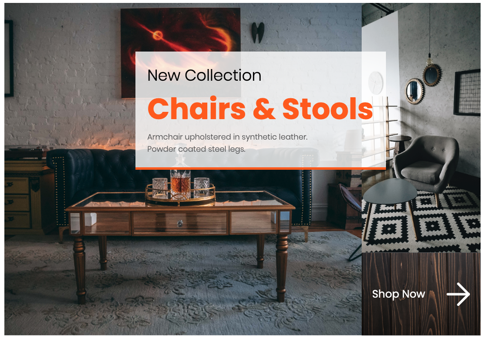

# 2.2 Lesson Plan: CSS Grids and Media Queries

## Overview

Today is going to be all about the fundamentals of CSS Grids. We will talk about `display: grid`, `grid-template-areas` and how to build out grid columns and rows, giving students the ability to code two-dimensional layouts.

## Learning Objectives

By the end of class today, students will be able to:

1. Design and code basic grids using CSS Grid.
2. Build layouts by positioning elements inside grids.
3. Create a complex layout by nesting HTML elements inside of a grid.
4. Write media queries in code to create a responsive grid layout.

## Slides

**Review the slides beforehand.**

* [2.2 - CSS Grids](https://docs.google.com/presentation/d/1RJeNu1vuXTSfDeC7FuANw5tsLp4FXav0IGiAdgWJ1eo/edit?usp=sharing).

## Preparing for Class

* Make any teaching notes you'll need.

* As you review this lesson plan, make note of opportunities for ***relating professional anecdotes to bring concepts to life***. Be sure to connect the concepts to work that real-life designers do. Look for the :gem: (gem) and > :briefcase: (briefcase) icons in the lesson plan as prompts for you and TAs to share your insights.

There are two demos in this lesson:

* Demo: `grid-template-areas`
* Demo: Nesting Grids

***Be sure to run through the demos at least one time as part of your pre-class preparation.***

Make sure you practice how to build basic layouts with grids.

Practice building grids before this class so that you can assist students who have any questions. View the following resources if you need to practice:

* [MDN Grid Tutorial](https://developer.mozilla.org/en-US/docs/Web/CSS/CSS_Grid_Layout/Basic_Concepts_of_Grid_Layout)

* If needed, review the Strategies for Class Online in the module README.

* Make sure that you have all the class activities downloaded and ready to go at the start of class.

## Time Trackers

* Use an online timer, which you or your TA can set at the start. You can add a timer to your Chrome browser, found here: [Chrome Timer](https://chrome.google.com/webstore/detail/timer/hepmlgghomccjinhcnkkikjpgkjibglj?hl=en).

| Start  | #   | Activity Name                    | Duration |
| ------ | --- | -------------------------------- | -------- |
| 5:30PM | 0   | Office Hours                     | 0:30     |
| 6:00PM | 1   | Instructor Do: CSS Grids         | 0:20     |
| 6:20PM | 2   | Inst Demo: grid-template-areas   | 0:10     |
| 6:30PM | 3   | Student Do: CSS Grid, Part 1     | 0:30     |
| 7:00PM | 4   | Instructor Review: Part 1        | 0:10     |
| 7:10PM | 5   | Instructor Do: Grid Positioning  | 0:10     |
| 7:20PM | 6   | Instructor Do: Nesting Grids     | 0:20     |
| 7:40PM | 7   | BREAK                            | 0:10     |
| 7:50PM | 8   | Student Do: CSS Grid, Part 2     | 0:30     |
| 8:20PM | 9   | Instructor Review: Part 2        | 0:10     |
| 8:30PM | 10  | Instructor Do: Responsive Design | 0:15     |
| 8:45PM | 11  | Student Do: CSS Grid, Part 3     | 0:15     |
| 9:00PM | 12  | Instructor Review: Part 3        | 0:10     |
| 9:10PM | 13  | Office Hours                     | 0:30     |
| 9:40PM | 14  | END                              | 0:00     |

---

## CSS Grid

Let the class know that today they will create a complete webpage layout during the in-class activities using CSS Grid.

Some consider CSS Grid to be a complicated but powerful tool. Help students prepare and become open to learning to work with CSS Grid by explaining why:

* It's considered complicated because there are many different ways to build a CSS Grid. We will teach the most straightforward method using `grid-template-areas`.
* It's considered powerful because you can make flexible layouts with about a third of the code of using the standard box model. Using `grid-template-areas`, you can also completely move HTML elements using CSS Grid without having to modify the HTML.

### 1. Instructor Do: Introduction to CSS Grids (20 minutes)

> **Important point:** Your goal in this section is to introduce CSS Grids on an elementary level and generate excitement about using them to design websites.

**Today, we build a grid-based landing page.**

Introduce students to the layout we will build today: a landing page for **Furniture: Chairs and Stools**.

Here, you will introduce students to the concepts of CSS Grids, helping them to grasp the difference between one- and two-dimensional layouts.

> 💼 **Employer competitive note:** CSS Grids are used to create layouts that can contain both columns and rows. As a designer, this expands the possibilities of what you can design in your day-to-day work. Having working knowledge of how CSS Grids function allows you to design accurate two-dimensional layouts for your content.

#### Grid Layouts

CSS Grids are used to create two-dimensional layouts. Two-dimensional layouts are layouts that can span multiple columns or rows. Grids allow you to define the layout section by section, allowing you to create children that span rows or columns and line up next to each other.

#### Before Flex and CSS Grids

Before flex and grids, building layouts was a frustrating and challenging experience. To build interesting layouts, many CSS hacks were introduced. However, the ability to create flexible complex layouts was difficult, and getting them supported by all browsers was also basically impossible.

In 2013, Microsoft's Edge browser shipped its implementation of the CSS Grid. It was quickly adopted by the W3 Consortium and soon standardized and supported by all browsers.

#### Flexbox vs. CSS Grid

CSS Grids are used to build two-dimensional layouts, meaning you can create full, complex designs as opposed to one-dimensional layouts, which are only left–right or top–bottom.


Now that students have a basic appreciation for CSS Grids, take them deeper into grid layouts.

**TAs:** Share in Slack the following CSS Grid resources with the class. When posting these resources to Slack, tell students to review them after class tonight:

* [W3Schools - Grid Documentation](https://www.w3schools.com/css/css_grid.asp)
* [Mozilla Developer Network - CSS Grid Introduction](https://developer.mozilla.org/en-US/docs/Web/CSS/grid)
* [CSS Tricks - A Complete Guide to Grid](https://css-tricks.com/snippets/css/complete-guide-grid/)

**Say:** "We are going to break apart the different sections of the grid that we are going to be using to build custom grids."

#### CSS Grid Containers

Very similar to flex, converting an HTML element into a grid container is easy.

* All you need to do is set the `display: grid;` to any HTML element. If that element has any children nested inside it, they become grid items.

* This is an important concept when we start nesting grids inside of each other later in this lesson.

> **Key tech note:** Grid containers are any HTML element to which you apply `display: grid;`. Some CSS properties are used only on the grid container, such as `align-items` and `justify-content`.

#### CSS Property: `grid-template-columns`

The CSS property `grid-template-columns` is used to specify the number of columns based on the children you have in your container.

The example below is a grid that has four columns set to 25%.

```css
.containerGrid {
  display: grid;
  grid-template-columns: 25% 25% 25% 25%;
}
```

You can specify widths for different looks. Below is an example of a two-column grid:

```css
.containerGrid {
  display: grid;
  grid-template-columns: 75% 25%;
}
```

> **Key tech note:** Columns can be specified with pixels, fractions, units, or percentages.

Below is an example of how to use `grid-template-columns` with a mix of pixels and percentages. We have a two-column grid that has a fixed column of 150px and a fluid column taking up 75% of its container.

```css
.containerGrid {
  display: grid;
  grid-template-columns: 150px 75%;
}
```

#### CSS Property: `grid-template-rows`

The CSS property `grid-template-rows` is used to specify the number of rows of content that will display in your container.

> **Key tech note:** With fraction units (more on this later) or percentages, grid children will take the height of their containers.

```css
.containerGrid {
  display: grid;
  grid-template-rows: 25% 25% 25% 25%;
}
```

> **Key tech note:** CSS rows can be specified with pixels, fraction units, or percentages.

#### Columns and Rows Create Grids

`grid-template-rows` and `grid-template-columns` are used together to create full grid layouts.

In the example below, you can see that this is a two-column layout with four rows that could contain other elements.

```css
.containerGrid {
  display: grid;
  grid-template-rows: 25% 25% 25% 25%;
  grid-template-columns: 50% 50%
}
```

#### Sizing Grid Areas

When specifying the width of your grid areas, there are several ways to do it.

You can specify the size of your columns and rows using hard pixel widths (200px, for example), percentages, or fraction units.

A difficult concept for students to understand is that you can use pixels along with percentages and fraction units depending on the layout you are trying to achieve.

#### Fraction Units

Fraction units specify the space taken up by each row. Fraction units are calculated with how much space is left in your container and what fraction of the space the element should take up.

Fraction units are specified using arbitrary numbers:

`1fr`, for example, is the normal unit of measurement.

`2fr` will take up double the space of `1fr`, and so on and so forth.

Sample fractional code:

```css
.containerGrid {
  display: grid;
  height: 500px;
  grid-template-columns: 1fr 1fr 1fr;
  grid-template-rows: 1fr 1fr;
}
```

> **Key tech note:** Fraction units will take up a "fraction" of whatever space is remaining in your container after content, margin, paddings, and the widths of your remaining elements.

#### CSS Property: `grid-template-areas`

All the properties we just talked about are used to create templates, which are specified by `grid-template-areas`. Templates are used to display how your content lays out on the page.

`grid-template-areas` are easy to set up: all you need to do is create a class that targets any individual grid element.

You can then specify a title for the grid area and use the CSS property `grid-template-areas` to determine where exactly in this layout these items are supposed to fall.

> **Key tech note:** This is an incredibly powerful CSS property, as you can specify precisely where each item lines up in a visual way. Encourage students to read the documentation on `grid-template-areas`: [W3Schools grid-template-areas documentation](https://www.w3schools.com/cssref/pr_grid-template-areas.asp).

> **Instructor note:** The following section pertains to the demo you will give in class to display the power of CSS grids with template areas.

In the demo, we will specify a grid that is three columns wide and three rows tall.

In this example, it is set up so that our title takes up three rows (because we specified three fr units for our row and columns).

We have a sidebar that occupies one fraction and also content that takes up two frs next to it.

Lastly, we have a footer that spans all three columns left–right.

```html
<div class="containerGrid">
  <div class="titleBar">Title Content</div>
  <div class="headerBar">Header Content</div>
  <div class="leftSidebar">Left Sidebar content</div>
  <div class="rightContent">Right content</div>
  <div class="footerBar">footer Content</div>
</div>
```

Notice how we also have three different rows specified in our `grid-template-rows`. We have this set up because, according to what we told our CSS, this grid has three rows.

We also have three grid columns specified with fraction units.

This is mimicked in our CSS property `grid-template-rows`:

```css
.containerGrid {
  display: grid;
  height: 500px;
  grid-template-columns: 1fr 1fr 1fr;
  grid-template-rows: 1fr 1fr 1fr;
  grid-template-areas:
    "topBar topBar topBar"
     "leftSidebar rightContent rightContent"
    "footerBar footerBar footerBar"
    ;
}
.topBar {
  grid-area: topBar;
}

.leftSidebar {
  grid-area: leftSidebar;
}

.leftSidebar {
  grid-area: leftSidebar;
}

.rightContent {
  grid-area: rightContent;
}

.footerBar {
  grid-area: footerBar;
}

```

A real advantage of using `grid-template-areas` is that you can alter your HTML content without modifying the actual HTML file. `grid-template-areas` allow developers (and designers) to rearrange content for different devices in any way they see fit.

Do you want to switch two sections of content? Using CSS Grid, you can move your HTML content around any way you like.

Grids can create this type of layout, even though the HTML in the footer is positioned at the bottom.

Now move on to your demo of `grid-template-areas`. It will prepare students for the following activity.

### 2. Instructor Do: grid-template-areas Demo (10 minutes)

Now it's time for a demo.

> **Recommendation:** Let students know that you'll pause for questions a couple of times during your demo. Questions can be asked aloud or via Slack. If they're posted on Slack, ask a TA to track the questions.

Have TAs slack out the following CodePen: [CodePen Grid](https://codepen.io/crbecker1/pen/RwWvMGM).

Open the following CodePen in front of the class: [CodePen Grid](https://codepen.io/crbecker1/pen/RwWvMGM).

* On Lines 7 and 9, switch the places of the footer and title, or copy and paste the following lines of code.

It should look like this:

```css
.containerGrid {   
  grid-template-areas:
    "title title headerBar"
    "leftSidebar rightContent rightContent";
}

```

Notice how the footer is now in the place of the title in the template.

You can also make your template span horizontally and vertically, depending on your setup for your `grid-template-areas`.

In this CodePen, replace the farthest left title with a sidebar. The result should look like this:

```css
.containerGrid { 
  grid-template-areas:
      "title title headerBar"
      "leftSidebar leftSidebar rightContent"
      "footerBar footerBar footerBar";
}

```

Notice how the sidebar now takes up the place of the footer, and the footer is nudged over to create your layout.

> **Key tech note:** This is incredibly powerful when making a site responsive, as it allows changing the placement of elements in your layout without modifying the HTML.

Now that students have been introduced to the basic grid concepts, it's time to hone their skills with our introduction to grids activity.

### 3. Student Do: CSS Grid, Part 1 (30 minutes)

It's time for students to test creating grid-based layouts for themselves.

Direct students to the first activity, found in [01-Stu-CSS-Grid-Part-1](activities/01-Stu-CSS-Grid-Part-1/README.md).

#### Summary

In this activity, students will create the beginning of their site for a furniture store.

They will use the basics of CSS Grid to create the structure and content for the first half of their design.

> **Instructor note:** Students will add another grid and finish their design in a later activity.

#### Instructions

During this activity, students will do two things:

1. Use CSS Grid to create the structure of the first half of their site.
2. Use CSS to style their content to create a nice-looking site.

*If students struggle:* During this activity, the most common problem is students not understanding what happens when you set a container to `display: grid`. If you are unable to solve students' problems, lean on the solved file to show them how their code differs from the solved file.

*If students complete the activity early:* Share the following [resource](https://css-tricks.com/getting-started-css-grid/) with students to prep them for the next activity.

#### Instructors and TAs

*If you're an experienced web developer:* Watch their screens and help students if they get stuck on a grid problem. Don't be afraid to show them some of your own personal tips and tricks.

*If you're not an experienced web developer:* Be sure to review the solved file in the repository. If students are stuck, either show them how their code differs from the solved code or direct their attention to the solved file.

#### Deliverable

If the first half of your students' sites look like the following image, then students are in good shape:



Let's review the key concepts of grids to test for student competency.

### 4. Instructor Do: CSS Grid, Part 1 Review (10 minutes)

Call attention back to your screen and lead a review of the CSS Grid, Part 1 activity. Be sure to ask students what surprised them, confused them, and what they learned.

Discuss students’ work with the goal of being able to provide actionable feedback. For example:

* When building a CSS Grid, make sure you include `grid-template-rows` and `grid-template-columns` and grid areas. Without these three CSS properties, your grid might not display correctly.
* You can use CSS Grid to build layouts that contain both rows and columns using CSS Grid areas (two-dimensional).
* CSS Grids can greatly simplify your code, allowing you to write code that can be made responsive easily.

Now take the review one step further and ask the following:

**Ask:**

* "What happens to the children of a parent container when you set it to `display: grid;`?"

 *They become grid items.*

* "What is a fraction unit in grids?"

 *A fraction unit is a CSS Grid property that tells a grid row or column to take up a fraction of the remaining width.*

* "Why are `grid-template-areas` powerful?"

 _`grid-template-areas` allow web developers to control exactly where their grid lays out in a visual manner._

Common misconceptions and FAQs about how CSS Grids work:

* There are many ways to build a CSS Grid. We teach the most visually straightforward way to build a CSS Grid using template areas.
* Fraction units take up a fraction of the space, similar to using percentage, except you don't have to specify what percentage of space is taken up. Fraction units assume what you want and render the layout to make all your elements fit.

> **Instructor note:** Take questions.

By now, students should have a fundamental concept of how grids work. Let's introduce a topic that is a bit more complex: positioning children inside grid containers responsively!

### 5. Instructor Do: Grid Positioning (10 minutes)

> **Important point:** The goal of this section is to show students the power of commands like **`align-items`** and **`justify-content`** when working within grid containers. This lecture ties into the second learning objective, which is for students to learn to position elements inside grids to create a layout.

Now teach students two additional grid properties by looking at how things align horizontally and vertically in a grid using `align-items` and `justify-content`.

`align-items` centers items vertically.

`justify-content` aligns items horizontally.

These properties greatly simplify front-end developers' workflow by giving them more control over the positioning of their child elements.

Positioning in CSS Grids is very straightforward and very similar to positioning with flex.

> **Key tech note:** Just like in CSS Flexbox, there are two properties with CSS Grids that you can use to align the content inside of your grid automatically. The properties are `align-items` and `justify-content`.

Using these two properties together, you can center your content perfectly in the center of your container.

There are several properties used to align the contents of a grid container.

* `start`: Lines are packed toward the beginning of the container.
* `end`: Lines are packed toward the end of the container.
* `center`: Lines are packed toward the center of the container.
* `stretch`: Stretch "auto"-sized items to fit the container.
* `space-around`: Lines are evenly distributed in the container with half-size spaces on either end.
* `space-between`: Lines are evenly distributed in the container.
* `space-evenly`: Lines are evenly distributed and centered inside the container.

Aligning child elements of grids is an important part of today's lecture. Understanding this concept will significantly help students create responsive layouts without hassle.

Let's move onto the next core concept: how to nest grids inside each other.

### 6. Instructor Do: Nesting CSS Grids (20 minutes)

> **Important point:** This section shows students how easy it is to nest a grid inside of another grid. This ties into the third learning objective, which is for students to learn to create a complex layout using nesting inside a grid.

The next step is to help students understand how nesting grids work. The grid properties you just taught the class can be applied to grids nesting within grids.

> 💼 **Employer competitive note:** Just like in 2.1, nesting a grid inside of another is a common practice for UX designers. Learning how to build layouts using nested grids will give students insight into how to design technically correct grid systems.

CSS Grids are primarily nested inside of each other to control content with `align-items` and `justify-content`.

All layouts are built by nesting HTML elements inside each other. When you nest a grid inside another grid, you can control the position of the child grid, allowing you to create complex layouts.

You do this by declaring to a child element of a grid container that its display is now `display: grid;`. It will accept all the properties that we have been practicing in the previous examples.

This means that we can use nested grids to build complex layouts inside our main grids, making it possible to create our primary grid to contain the layout and the secondary grids to hold our content and position it accordingly.

#### **Nesting Grids Demo**

Now it's time for a demo.

**TAs:** Slack out this CodePen file: [Nested Grids](https://codepen.io/crbecker1/pen/WNwQMdB).

1. Open the CodePen file: [Nested Grids](https://codepen.io/crbecker1/pen/WNwQMdB).
2. Uncomment `display: grid;` on Line 23.
3. Uncomment `grid-template-columns: 1fr 1fr 1fr;` on Line 24.
4. Tell the class: "It is possible to create complex layouts using only grids. The grid we just made could contain content!"


Now that students know how and why you would nest a grid inside another, it's time to take a break. When we return we will jump into an activity to reinforce the concepts we just learned

---

## 7. BREAK (10 minutes)

---

### 8. Student Do: CSS Grid, Part 2 (30 minutes)

For Part 2 of this activity students can keep working on the same file from before **Or** if they were unable to finish, they can use the provided starter code.

Direct students to the activity, found in [02-Stu-CSS-Grid-Part-2](activities/02-Stu-CSS-Grid-Part-2/README.md).

#### Summary

This activity allows students to see how easy it is to align items in grids.

#### Instructions

In this activity, students will work independently and experiment with properties to align their items inside their container.

Students will follow each step outlined in the activity instructions (i.e., using `align-contents` and `justify-items`) to create the second half of their online furniture store webpage.

#### Instructor and TAs

> **Recommendation:** With the TAs, monitor students as they work and offer encouragement where needed. If many students have the same question, ask everyone to pause and watch your screen as you explain how students can solve the issue.

*If students struggle:* A common problem students will have during this activity is trying to use `align-items` or `justify-content` on a child element of a grid container. `align-items` and `justify-content` have to be used on the grid container. If you are unable to answer students' questions, lean on the solved file to show them how their code differs from the solved file.

*If students complete the activity early:* Share the following [resource](https://medium.com/@kswanie21/css3-animations-with-transitions-transforms-5a9c01e5efb5) with them to prep for the next lesson.

#### Deliverable

By the end of the activity, students' work should look like the following image:


By now, students should have a solid understanding of how grids work conceptually. Let's review some of the key concepts next.

### 9. Instructor Do: CSS Grid, Part 2 Review (10 minutes)

Check in with the class to see what went well and what didn't.

Discuss student experiences with this activity to provide them with actionable feedback. For example:

* `align-items` and `justify-content` are used to control content **inside** of a grid container.

**Review concepts.**

> **Recommendation:** Invite students to raise their hands to respond to the following questions. Alternatively, they can post their responses in Slack; ask a TA to monitor the Slack responses.

**Ask:**

* "What does the property `align-content` do?"

 _`align-content` aligns grid items top–bottom._

* "What does the property `justify-content` do?"

 _`justify-content` automatically aligns grid items left–right._

* "Why would you want to nest a grid inside a grid?"

 *You nest grids to make complex layouts using CSS Grids.*

> **Instructor note:** Pause for questions.

### 10. Instructor Do: Responsive Web Design and Media Queries (15 minutes)

> **Important point:** The goal of this section is to show students the power of media queries and responsive web design. This ties into the final learning objective, which is for students to be able to write media queries and create a mobile breakpoint on a page.

Now that students know how to lay out a page, it's time to discuss media queries and their role in RWD.

> 💼 **Employer competitive note:** Mobile-first design principles are an industry standard for both developers and designers. All websites (and apps to a degree) are responsive in today's world. Media queries are the driving force behind responsive design, and having a working knowledge of how a media query works will make students better designers.

Now we're going to work in the code and practice the technical aspects of prototyping across screen widths.

* Remind students that responsive web design is about designing content that works fluidly across different screen states: mobile, tablet, or phone.

But how exactly *does* it work?

#### Media Queries

Media queries "check" the viewport size of your browser and adjust your CSS accordingly to make the content lay out differently.

**Media queries** define how CSS styles are applied in relation to the characteristics of the device **viewport**. In layman's terms, media queries overwrite previously written CSS properties to alter our code to display correctly for different sizes. This could be a smartphone, tablet, or even a projector. Websites need to respond correctly to all device sizes.

**TAs:** Take a moment and share the following resources with the class—they should read these resources after class tonight or if they get stuck when writing their own media queries:

* [W3Schools - RWD Media Queries](https://www.w3schools.com/css/css_rwd_mediaqueries.asp).
* [W3Schools - Media Query Examples](https://www.w3schools.com/css/css3_mediaqueries_ex.asp).
* [Mozilla Developer Network - Media Queries](https://developer.mozilla.org/en-US/docs/Web/CSS/Media_Queries/Using_media_queries).

#### Viewport

The viewport is the window of whatever device you are visiting the website on. This could be a tablet, cell phone, or desktop computer.

* There are many possible resolutions that your website could respond to. Here are some examples of a few different device sizes:


#### Media Query Syntax

Let's break down the syntax of a media query for the class:

```css
@media only screen { }
```

The `@media` selector specifies the start of our media query.

Here, we select what type of devices we are targeting. This one is targeting screens.

You can also use:

* `all`
* `print`
* `screen`
* `speech`

We write new styles that will overwrite our old ones between the brackets.

```css
@media only screen and (max-width: 600px) {
  body {
    background-color: lightblue;
  }
}
```

In the above example, this media query is checking the maximum width of our browser window. When the browser window is smaller than 768px, it will use the code in the media query.

In this case, it will set our body's background color to **light blue**.

> **Key tech note:** Media queries overwrite properties that were specified earlier in your stylesheet but only at pixel breakpoints that you specify.

```css
body {
  background-color: red;
}

@media only screen and (max-width: 600px) {
  body {
    background-color: lightblue;
  }
}
```

This allows you to restructure your content however you see fit depending on the screen size.

**Ask:** "What if I need to set up a media query between two specific sizes?"

You can also write media queries to be set to display between two set widths.

Take a look at the following code:

```css
@media all and (min-width: 1024px) and (max-width: 1280px) {
  body {
    background-color: green;
  }
}
```

This code is checking for a browser width between 1,024px and 1,280px.

There are many ways to write media queries, and we've only scratched the surface on how to write them.

**TAs:** Slack out the following resource, so students can see how many different ways there are to write media queries:

* [CSS Tricks Media Queries](https://css-tricks.com/snippets/css/media-queries-for-standard-devices/)

It's time for students to make their furniture landing page responsive by writing breakpoints with CSS.

### 11. Student Do: CSS Grid, Part 3: Custom Breakpoints (15 minutes)

For Part 3 of this activity students can keep working on the same file from before **Or** if they were unable to finish, they can use the provided starter code.

Direct students to the activity, found in [03-Stu-CSS-Grid-Part-3](activities/03-Stu-CSS-Grid-Part-3/README.md)

#### Summary

Now it's time for the students to practice writing a custom media query by making a grid responsive at different breakpoints.

#### Instructions

During this activity, students will practice writing their own media queries by modifying the `grid-template-areas` to display for mobile.

*If students struggle:* Sometimes students have trouble conceptually understanding how media queries work. Media queries **overwrite** previously written CSS. Show students how the solved file modifies the grid container's rows, columns, and grid areas to display for mobile devices.

#### Instructors and TAs

With the TAs, monitor students as they work and offer help where needed.

#### Deliverable

The product of students' work is a responsive grid layout, which they can share on Slack. To check their work, squash the browser window and see if their pages are responsive.

> **Instructor note:** For reference, check the solved file in your instructor resources. Also make sure to take questions.

Finally, transition into a recap of today's lesson.

### 12. Instructor Do: CSS Grid, Part 3: Custom Breakpoints Review, Recap, and End Class (10 minutes)

Call attention back to your screen and lead a review of the custom breakpoints activity. The key is to give students time to reflect on what they learned and hear about what their classmates learned.

If students want to share their work in Slack, you can display it onscreen for everyone to see and learn from.

**Ask:**

* "Where did you struggle in setting your breakpoints?"
* "What would you do differently the next time you're setting breakpoints?"
* "What worked well?"

**Recap today's class concepts.**

Now transition into a review of the concepts covered in today's lesson.

**Ask:**

* "Why do we care about grid layouts?"

 *Grids allow us to create flexible grid layouts visually in our CSS code, taking the effort out of creating rows and columns.*

* "What are nested grids?"

 _Nested grids are simply an HTML element with `display: grid;` contained inside a grid container (a parent also set to display grid), so you can use CSS Grid syntax on the element._

* "What is a breakpoint?"

 *A breakpoint is a width or height that you specify that defines where our new CSS selectors and properties take over.*

* "How do media queries work?"

 *Media queries work by overwriting previously written styles at certain breakpoints.*

**Remind everyone to stay online for office hours.**

* Take any final questions and encourage students who want feedback on their work or want to see a demo of CSS to stay for office hours.
* Thank everyone for their hard work.
* Remind everyone to practice extensively outside of class, where most of the learning takes place.
* Stay online for office hours.

### 13. Instructor Do: End Class

Dismiss the class and stay online to hold office hours.

---

© 2022 edX Boot Camps LLC. Confidential and Proprietary. All Rights Reserved.
