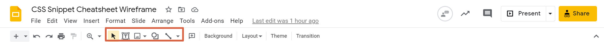

# 2.3 Lesson Plan: CSS Tools

## Overview

This lesson is all about exposing students to what's possible with CSS for both the end user and the developer who's writing it. This lesson introduces some other tools and skills that will increase the students' efficacy in building webpages.

## Instructor Notes

* To emphasize that CSS can be fun and interesting, class will begin with a quick introduction to wireframing. Before class, take a few minutes to acclimate yourself to it and perhaps find examples of wireframing tools you can introduce to the students.

* Students may become overwhelmed by how many CSS tools and options there are, so offer support and reiterate often that CSS gets easier through practice and a lot of trial and error!.

## Slides

**Review the slides beforehand.**

* [2.3 - CSS Tools](https://docs.google.com/presentation/d/1PDjpFcd4iZlIWkdivvRV5pMKsSKN6EuFySdDFAUA3y0/edit?usp=sharing).

## Learning Objectives

By the end of class, students will be able to do the following:

* Create and explain the purpose of a wireframe.

* Use CSS selectors to reference HTML elements in different ways.

* Use CSS variables to keep their code clean.

* Use advanced CSS styling for an enhanced UI.

## Time Tracker

| Start  | #   | Activity Name                    | Duration |
| ------ | --- | -------------------------------- | -------- |
| 5:30PM | 0   | Office Hours                     | 0:30     |
| 6:00PM | 1   | Instructor Do: Wireframing       | 0:15     |
| 6:15PM | 2   | Student Do: Wireframing          | 0:15     |
| 6:30PM | 3   | Instructor Review: Wireframing   | 0:10     |
| 6:40PM | 4   | Instructor Demo: CSS Selectors   | 0:10     |
| 6:50PM | 5   | Student Do: CSS Selectors        | 0:15     |
| 7:05PM | 6   | Instructor Review: CSS Selectors | 0:10     |
| 7:15PM | 7   | Instructor Demo: CSS Variables   | 0:10     |
| 7:25PM | 8   | Student Do: CSS Variables        | 0:15     |
| 7:40PM | 9   | Instructor Review: CSS Variables | 0:10     |
| 7:50PM | 10  | BREAK                            | 0:15     |
| 8:05PM | 11  | Instructor Demo: Mini-project    | 0:10     |
| 8:15PM | 12  | Student Do: Mini-project         | 0:45     |
| 8:50PM | 13  | Instructor Review: Mini-project  | 0:10     |
| 9:00PM | 14  | Office Hours                     | 0:30     |
| 9:30PM | 15  | END                              | 0:00     |

---

## CSS Tools

### 1. Instructor Do: Wireframing (15 min)

Welcome students back to class. Today we will continue with CSS and learn some helpful tools to really expand the power of CSS.

Reassure students that learning CSS is not an easy task and that even the world's best developers struggle with it at times. It requires a lot of patience and practice, but it is worth it when you see something come together.

* Open [Wireframe example from Wikipedia](https://en.wikipedia.org/wiki/Website_wireframe#/media/File:Profilewireframe.png) in your browser and explain the following:

  * Explain that the image they are looking at is called a **wireframe** and it is a tool developers use to create robust UI/UXs.

  * Wireframes allow us to visualize how our webpages will act and feel before we do any actual coding.

  * Explain that wireframes can be hand-sketched or you can use digital tools like Figma or Framebox.

  * Let students know that it is important to pay particular attention to the location of navigation bars, titles, headers, content, images, buttons, and footers.

  * Explain that there are three main elements to an effective wireframe: information design, navigation design, and interface design.

    * Information design: How we place and present information to our users.

    * Navigation design: How the user moves throughout the site and how pages relate to each other.

    * Interface design: How the user interacts with the elements on the page, with a focus on functionality.

  * Let students know that they will get hands-on experience by creating a wireframe for this unit's mini-project.

* Open `01-Ins-Wireframing/assets/images/01-unfinished-wireframe.png` in your IDE and explain the following:

  * This image shows the start of a wireframe for the unit's mini-project, with the rows and columns highlighted.

  * 🔑 When creating a wireframe, we want a way to visually represent our page layout. Using rows and columns is an effective way to guide our decision-making when placing elements on the page.

  * 🔑 These rows and columns directly translate to containers that we can use when we begin coding the mini-project.

* Open `07-Stu-Mini-Project/solved/index.html` in your browser and explain the following:

  * Here is the final product that we will create today, which you can keep in mind as you work on your wireframe.

  * 🔑 Pay attention to how elements are placed in relation to each other and try to convey that in the wireframe you create.

* Ask the class the following questions (☝️) and call on students for the answers (🙋):

  * ☝️ Why would we want to create a wireframe?

  * 🙋 A wireframe gives us a blueprint for our UI/UX.

* Answer any questions before proceeding to the next activity.

* In preparation for the activity, ask TAs to start directing students to the activity instructions found in `02-Stu-Wireframing`.

### 2. Student Do: Wireframing (15 min)

* Direct students to the activity instructions found in `02-Stu-Wireframing/README.md`.

* Break your students into pairs that will work together on this activity.

#### Instructions

Work with a partner to implement the following user story:

* As a developer, I want to be able to see how my elements will be grouped together so that I can better design my website.

The following image shows a wireframe that depicts the web application's appearance and functionality:


1. Navigate to [Google Slides](https://docs.google.com/presentation/u/0/?tgif=d) and create a new presentation using the blank template.

2. Using the tools highlighted in the following image, create a wireframe that includes all the elements that you need for the project:

   

#### 🏆 Bonus

If you have completed the activity and want to further your knowledge, work through the following challenge with your partner:

* How might our wireframe look on a mobile device?

Use [Google](https://www.google.com) or another search engine to research this.

* While breaking everyone into groups, be sure to remind students and instructional staff that questions on Slack or otherwise are welcome and will be handled. It's a good way for your team to prioritize students who need extra help.

### 3. Instructor Review: Wireframing (10 min)  

* Ask the class the following questions (☝️) and call on students for the answers (🙋):

  * ☝️ How comfortable do you feel with wireframes? (Poll via Fist to Five, Slack, or Zoom)

* Assure students that we will cover the solution to help solidify their understanding. If questions remain, remind them to use office hours to get extra help!

* Use the prompts and talking points (🔑) below to review the following key points (✔️):

  * ✔️ Wireframes

  * ✔️ page layout

  * ✔️ Containers

* Open `02-Stu-Wireframing/solved/assets/images/01-wireframe-form-completed.png` and explain the following image:

  * We started with defining our header and sub-heading.
  
  * We then move to the body and footer.

  * 🔑 The next section is the row which will hold three card elements that will have their own container.

  * Inside of our row we have columns which hold the data being displayed on the cards.

  * 🔑 The container which holds our column acts similar to our row container but on the opposite axis.

  * Our wireframe may not look pretty but it gives us some great insight on how our website may look and feel.

  * 🔑 Say we noticed one section of our website is not what we thought or wanted, a wireframe gives us the opportunity to catch this before we begin coding.

* Ask the class the following questions (☝️) and call on students for the answers (🙋):

  * ☝️ Are wireframes supposed to be functional?

  * 🙋 No, it is a rough draft of the UI/UX.

  * ☝️ What can we do if we don't completely understand this?

  * 🙋 We can refer to supplemental material, read the [Wikipedia Page on Website Wireframe](https://en.wikipedia.org/wiki/Website_wireframe), and stay for office hours to ask for help.

* Answer any questions before proceeding to the next activity.

### 4. Instructor Demo: CSS Selectors (10 min)

* Open `03-Ins-CSS-Selectors` in your browser and demonstrate the following:

  * 🔑 We can be very specific in how we select certain HTML elements using CSS.

  * 🔑 There's no difference to the user in how we achieved this result.

* Open `03-Ins-CSS-Selectors/assets/css/style.css` in your IDE and demonstrate the following:

  * 🔑 We can use the `:nth-child()` selector to apply styles to elements based on their order.

  * 🔑 We can use the adjacent sibling `+` selector to apply styles to elements that come after another specific element.

  * 🔑 We can use the direct child `>` selector to apply styles to elements that are direct children of an HTML element.

* Ask the class the following questions (☝️) and call on students for the answers (🙋):

  * ☝️ When would we use these selectors over what we've been using?

  * 🙋 The answer is that's it's up to you! CSS provides numerous ways to achieve a goal, so it's a matter of knowing what's available to use in certain situations.

* If time permits, visit the [MDN Web Docs on CSS selectors](https://developer.mozilla.org/en-US/docs/Web/CSS/CSS_Selectors) and walk through how students can find more information on them.

* Answer any questions before proceeding to the next activity.

* In preparation for the activity, ask TAs to start directing students to the activity instructions found in `04-Stu-CSS-Selectors`.

### 5. Student Do: CSS Selectors (15 min)

* Direct students to the activity instructions found in `04-Stu-CSS-Selectors/README.md`.

* Break your students into pairs that will work together on this activity.

* While breaking everyone into groups, be sure to remind students and instructional staff that questions on Slack or otherwise are welcome and will be handled. It's a good way for your team to prioritize students who need extra help.

#### Instructions

Work with a partner to implement the following user story:

* As a user, I want to see an icon next to every `<a>` element that has a link to a downloadable CSS file in its `href` attribute.

* Add a 📝 emoji to any link to a CSS file.
  * Should be added only using CSS

Your web application should look like the following image once complete:


#### 💡 Hints

* How can you target a file type by its file extension (i.e., `.css`, `.html`, `.md`, etc.)?

Refer to the following documentation:

[MDN Web Docs on attribute selectors](https://developer.mozilla.org/en-US/docs/Web/CSS/Attribute_selectors)

#### 🏆 Bonus

If you have completed the activity and want to further your knowledge, work through the following challenge with your partner:

* How do selectors affect CSS performance?

Use [Google](https://www.google.com) or another search engine to research this.

### 6. Instructor Review: CSS Selectors (10 min)  

* Ask the class the following questions (☝️) and call on students for the answers (🙋):

  * ☝️ How comfortable do you feel with CSS selectors? (Poll via Fist to Five, Slack, or Zoom)

* Assure students that we will cover the solution to help solidify their understanding. If questions remain, remind them to use office hours to get extra help!

* Use the prompts and talking points (🔑) below to review the following key points (✔️):

  * ✔️ We can select HTML elements by their attributes.

  * ✔️ We can use partial string matching to get results

  * ✔️ Use the examples provided in the documentation to learn whenever possible!

* Open `04-Stu-CSS-Selectors/solved/assets/css/style.css` in your IDE and explain the following:

  * 🔑 We select specific `<a>` elements based on their `href` attribute value with square bracket notation `[]`:

    ```css
    a[href$='.css']::after {
      content: '📝';
      display: inline-block;
      margin-left: 3px;
    }
    ```

  * 🔑 We use `$=` syntax to match any `href` value that ends with `.css`.

  * We use the `::after` pseudo-element to add an icon to the right of the selected `<a>` element.

  * 🔑 Understanding the use case for a lot of CSS features usually requires using the examples provided by documentation and making it work for your needs.

* Ask the class the following questions (☝️) and call on students for the answers (🙋):

  * ☝️ Why did we have to set a margin to the left side of the icon?

  * 🙋 The icon would have been too close to the link text content without it.

  * ☝️ What can we do if we don't completely understand this?

  * 🙋 We can refer to supplemental material, read the [MDN Web Docs for attribute selectors](https://developer.mozilla.org/en-US/docs/Web/CSS/Attribute_selectors), and stay for office hours to ask for help.

* Answer any questions before proceeding to the next activity.

### 7. Instructor Demo: CSS Variables (10 min)

* Open `05-Ins-CSS-Variables` in your browser and demonstrate the following:

  * 🔑 There's no difference on the page&mdash;everything looks the same!

  * 🔑 Not every enhancement to your site will be noticeable by your users.

* Open `05-Ins-CSS-Variables/assets/css/style.css` in your browser and demonstrate the following:

  * 🔑 We can create CSS variables to hold repeated values and reference them instead.

* Ask the class the following questions (☝️) and call on students for the answers (🙋):

  * ☝️ Why would creating CSS variables help developers?

  * 🙋 It's easier to refer to one variable than a repeated value. It also makes it easier to change a color theme!

* Answer any questions before proceeding to the next activity.

* In preparation for the activity, ask TAs to start directing students to the activity instructions found in `06-Stu-CSS-Variables`.

### 8. Student Do: CSS Variables (15 min)

* Direct students to the activity instructions found in `06-Stu-CSS-Variables/README.md`.

* Break your students into pairs that will work together on this activity.

* While breaking everyone into groups, be sure to remind students and instructional staff that questions on Slack or otherwise are welcome and will be handled. It's a good way for your team to prioritize students who need extra help.

#### Instructions

Work with a partner to implement the following user story:

As a developer, I want to manage CSS values that are used in multiple CSS rules in a more efficient manner.

* Create two CSS Variables:
  * One for any repeated color value
  * One for any repeated border radius value

#### 🏆 Bonus

If you have completed the activity and want to further your knowledge, work through the following challenge with your partner:

* What does the term DRY mean in web development?

Use [Google](https://www.google.com) or another search engine to research this.

### 9. Instructor Review: CSS Variables (10 min)  

* Ask the class the following questions (☝️) and call on students for the answers (🙋):

  * ☝️ How comfortable do you feel with CSS variables? (Poll via Fist to Five, Slack, or Zoom)

* Assure students that we will cover the solution to help solidify their understanding. If questions remain, remind them to use office hours to get extra help!

* Use the prompts and talking points (🔑) below to review the following key points (✔️):

  * ✔️ Adding variables to the global style sheet with the `:root` element

  * ✔️ Reducing the risk of a typo with variables

  * ✔️ Not limited to colors

* Open `06-Stu-CSS-Variables/solved/assets/css/style.css` in your IDE and explain the following:

  * We identify where values are repeated throughout the style sheet.

  * 🔑 Repeating values throughout a style sheet can introduce a lot of errors, so we store them under a named variable:

    ```css
    :root {
      --white: #fff;
      --dark-blue: #13293d;
      --tan: #d8a47f;
      --border-radius: 50px;
    }
    ```

  * 🔑 By selecting the root HTML element `:root`, we can make these custom CSS properties (variables) available throughout our style sheet.

  * 🔑 This is great for colors because hex codes are hard to remember, but you can also use it with other values like border radius.

* Ask the class the following questions (☝️) and call on students for the answers (🙋):

  * ☝️ Do we have to use specific names for the variables?

  * 🙋 No, we don't. As long as we use the `--` syntax, we can call them whatever we need to.

  * ☝️ What can we do if we don't completely understand this?

  * 🙋 We can refer to supplemental material, read the [MDN Web Docs on using CSS custom properties](https://developer.mozilla.org/en-US/docs/Web/CSS/Using_CSS_custom_properties), and stay for office hours to ask for help.

* Answer any questions before proceeding to the next activity.

### 10. BREAK (10 min)

### 11. Instructor Demo: Mini-Project (10 min)

* Open `07-Stu-Mini-Project/solved` in your browser and demonstrate the following:

  * 🔑 The page adjusts its layout on different screen sizes.

  * 🔑 When we hover over a CSS snippet card, it glows.

  * 🔑 When we click on a CSS snippet, the entire block of code is highlighted.

* Ensure that students know that their result just needs to match in layout and responsiveness, and encourage them to have fun with their design choices. Their design doesn't need to match the solution's design.

* Answer any questions before allowing students to start the mini-project.

### 12. Student Do: Mini-Project (45 min)

* Direct students to the activity instructions found in `07-Stu-Mini-Project/README.md`.

* Break your students into groups that will work together on this activity.

* While breaking everyone into groups, be sure to remind students and instructional staff that questions on Slack or otherwise are welcome and will be handled. It's a good way for your team to prioritize students who need extra help.

#### Instructions

The completed application should meet the following criteria:

* As a user, I can view a collection of labeled CSS snippets in a responsive grid.

* As a user, I can easily identify these CSS snippets by their headings.

* As a user, I can highlight a code snippet by clicking on it.

* As a user, I can view my application on a mobile device as well as a desktop.

#### Specifications

* Must use semantic HTML elements and proper indentation.

* Use CSS variables to maintain clean and reusable values for a color scheme.

* Use flexbox and media queries to create a responsive grid layout.

* Each CSS snippet should have a card-like layout with the CSS syntax wrapped in an [HTML pre element](https://developer.mozilla.org/en-US/docs/Web/HTML/Element/pre).

* Each CSS snippet can easily be highlighted for copying on click using the [CSS user-select property](https://developer.mozilla.org/en-US/docs/Web/CSS/user-select).

* Must incorporate a background color using a [CSS linear-gradient function](https://developer.mozilla.org/en-US/docs/Web/CSS/linear-gradient).

* Must incorporate a bit of animation using the [CSS transition property](https://developer.mozilla.org/en-US/docs/Web/CSS/transition).

* You and your group can decide which CSS styles and colors you will use to design the application, but the app needs to be a responsive. Use the following images to gain an understanding of how the app should look at different screen sizes, from a layout perspective:

  * At size 992px and above, the app should resemble the following image:

    

  * At size 768px and above, the app should resemble the following image:

    

  * On mobile devices, anything under 768px, the app should resemble the following image:

    

#### 💡 Hints

* The HTML `<pre>` element is very literal about spaces and indentation. To gain a better understanding of how to work with it, check out this article on [considerations for styling the pre tag](https://css-tricks.com/considerations-styling-pre-tag/).

#### 🏆 Bonus

* Set this project up in your own GitHub repositories so that you can deploy and use it for future reference!

### 13. Instructor Review: Mini-Project  (10 min)  

* Ask the class the following questions (☝️) and call on students for the answers (🙋):

  * ☝️ How comfortable do you feel tackling this mini-project? (Poll via Fist to Five, Slack, or Zoom)

* Assure students that we will cover the solution to help solidify their understanding. If questions remain, remind them to use office hours to get extra help!

* Use the prompts and talking points below to review the following key (🔑) points:

  * ✔️ Use of the `<pre>` tag and monospace font

  * ✔️ Mobile-first responsive layout with flexbox

  * ✔️ Transition and linear-gradient use

* Open `07-Stu-Mini-Project/solved` in your IDE and explain the following:

  * 🔑 The HTML `<pre>` element interprets spaces and returns literally, so the HTML code needs to look a little disjointed.

  * 🔑 We build a mobile-first style sheet, where the media queries apply to larger screens, not smaller:

    ```css
    /* media query for larger screens */
    @media screen and (min-width: 992px) {
      header {
        width: 75%;
      }

      .card-column {
        flex: 0 0 33.333%;
        max-width: 33.333%;
      }
    }
    ```

  * 🔑 We can create a gradient effect for the backgrounds using the `linear-gradient()` function:

    ```css
    .code-card pre {
      /* set styles to make it so code wraps in <pre> instead of overflowing */
      white-space: pre-wrap;
      overflow: auto;
      tab-size: 4;
      padding: 1.2rem 1rem;
      color: var(--gin);
      border-radius: 8px;
      /* use linear-gradient() function to create a fading background  */
      background-image: linear-gradient(
        rgba(232, 102, 236, 0.3) 0%,
        rgba(232, 102, 236, 0.6) 100%
      );
      display: flex;
      align-items: center;
    }
    ```

  * 🔑 We can animate HTML elements on a pseudo-class state using the `transition` property:

    ```css
    .code-card {
      display: flex;
      flex-direction: column;
      justify-content: flex-start;
      min-height: 100%;
      padding: 2rem;
      color: var(--heliotrope);

      /* outline is like border, but on the outside of the box instead of inside */
      outline: 2px dashed var(--gin);
      outline-offset: -2px;
      transition: all 0.5s ease-in-out;
    }
    ```

  * We create the glowing effect with an inner and outer box shadow:

    ```css
    .code-card:hover,
    .code-card:hover .card-header {
      box-shadow: inset 0px 0px 8px var(--heliotrope), 0 0 15px var(--heliotrope);
    }
    ```

  * We can change the selection color by updating the `::selection` pseudo-element.

* Ask the class the following questions (☝️) and call on students for the answers (🙋):

  * ☝️ What did we use to create the responsive layout?

  * 🙋 flexbox and media queries.

  * ☝️ What can we do if we don't completely understand this?

  * 🙋 We can refer to supplemental material and stay for office hours to ask for help, but CSS is best learned through a lot of repeated practice.

* Reassure students that CSS is incredibly difficult for even the best web developers and is not something they should feel discouraged by. It requires a ton of patience and trial and error to become proficient in CSS.

### 14. Instructor Do: End Class

Dismiss the class and stay online to hold office hours.

---
© 2022 edX Boot Camps LLC. Confidential and Proprietary. All Rights Reserved.
