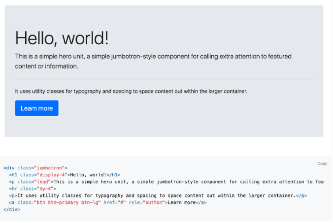

# Get Started With Bootstrap

The goal of this activity is to help you become familiar with Bootstrap 4, a popular framework for rapidly prototyping designs.

It’s easy to start. All you need is the following link, which you’ll place in the `<head>` section of your HTML file:

`<link rel="stylesheet" href="https://stackpath.bootstrapcdn.com/bootstrap/4.3.1/css/bootstrap.min.css" integrity="sha384-ggOyR0iXCbMQv3Xipma34MD+dH/1fQ784/j6cY/iJTQUOhcWr7x9JvoRxT2MZw1T" crossorigin="anonymous">`

## Instructions

1. Copy the link above. You can also find the link and other ways to implement [Bootstrap here](getbootstrap.com).

2. Bookmark this useful link for future projects.

3. Open `starter/index.html`.

4. Paste the Bootstrap link into the `<head>` section of your HTML file.

- That’s it! With the Bootstrap link in place, you’re now free to use Bootstrap and its components on your page.

- **Tip:** You only need to insert the link once for each website you use Bootstrap with.

5. Open [this link](https://getbootstrap.com/docs/4.3/components/alerts/) to the Bootstrap component documentation.

6. Navigate to the `jumbotron` component. Then copy the code listed on the page.

7. Paste the code in the `<body>` of `index.html`. Save your page and refresh to see the changes.

- **Note:** Keep this file open, as you’ll use it during the next few activities.
