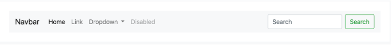

# Bootstrap Navigation Bars

In this activity, you’ll build on the previous activity.

You have a `jumbotron` component on your page. Now it’s time to add a navigation bar.

## Instructions

1. Navigate to the [Bootstrap component documentation](https://getbootstrap.com/docs/4.3/components/navbar/) and then to the `navbar` component.

2. Copy the code for the first `navbar` on the page. Then paste it above the `jumbotron` component.

3. Be sure to place the code within the `<body>` of `index.html`.

4. Save your page to see the changes. You should see something resembling the following:

- **Note:** Keep this file open, as you’ll use it during the next few activities.
