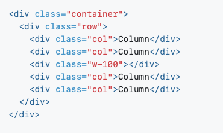

# Bootstrap Containers and Rows

Your page has a `navbar` and `jumbotron`, so it’s time to add a structure for its content.

Understanding how to structure a layout using containers, rows, and columns is necessary to create effective layouts with Bootstrap, as they are the default way to add structure to your site using Bootstrap 4.

## Bootstrap Grid Reference

Here is a quick reference for each Bootstrap 4 class used to build containers and rows:

- `Container`: Containers provide a means to center and horizontally pad your site’s contents.

- `Container-fluid`: Fluid containers function almost the same way as regular containers, except that they span the entire width of your device’s viewport.

- `Row`: Rows are wrappers for columns.

- `Column`: Columns are nested within rows and determine the width of your content within a row (Bootstrap rows can be divided into 12 columns).

- Read more about column widths and screen sizes [here](https://getbootstrap.com/docs/4.3/layout/grid/#grid-options).

## Instructions

1. Add a `
` with the class `container-fluid` after your `jumbotron`.

2. Within this new `
`, add another `
` with the class `row`.

3. At this point, you should have two `
` tags, one nested in the other.

4. Lastly, add a `
` with the classes `cardContainer col-lg-3 col-md-3 col-sm-12` within the row div.

5. **BONUS:** Can you tell what the `col-lg-3 col-md-3 col-sm-12` classes are doing to the `
`?

- Take a look at the Bootstrap documentation for an answer.

- **Hint:** Look up `lg`, `md`, and `sm` references.

6. Your final step is to copy and paste this newly created `
` three times within the `row div`.

7. You should now have a `row 
` with four children `
` tags.

8. If you want to see what is happening on your page, add some dummy copy within the child divs.
