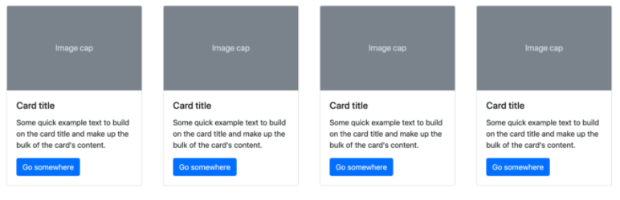

# Bootstrap Cards

It’s time to add content to your webpage. In this activity, you will add the `card` component to your template.

## Instructions

1. Review the [Boostrap documentation](https://getbootstrap.com/docs/4.3/components/card/) on cards.

2. Copy the code for the first card component on the page. Paste the code inside each `
` with a class of `cardContainer col-lg-3 col-md-3 col-sm-12`.

- **Note:** There are four `
` tags within your page.

3. Save your changes, then refresh your page. Your results should look like the image shown below:

