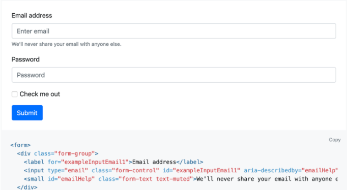
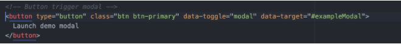
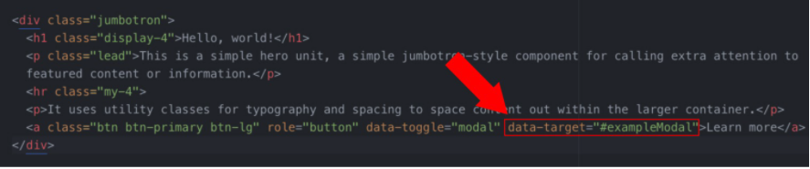
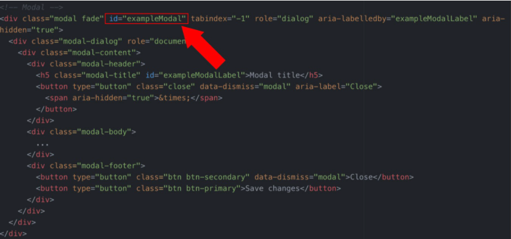

# Bootstrap Forms and Modals

In this activity, you will add HTML and CSS on top of Bootstrap so that your page is more responsive.

Companies never use Bootstrap in its basic form, so it’s smart to practice customizing it with HTML and CSS.

## Instructions

### Add a Form to Your Page

1. In your `index.html` file, create a section with the class of `container-fluid` and `signUp`.

- Nested inside of it, create a div with the class of row. We will nest our form inside this element.

2. Open the Bootstrap form component page: https://getbootstrap.com/docs/4.3/components/forms/.

3. Navigate to the first form element you find on the page.

4. Copy it and paste it into your HTML below your cards. Look for the comment `<!-- Add form group below →`.

5. Open the `index.css` file.

6. Create a `class` that targets the `<form>` element wrapped inside the class of `signUp`.

- Give this CSS selector the property `margin` with a property of `35px auto` to center our form element and give it some spacing.
- Give this CSS selector the `background-color` property with a value of `#f2f2f2`.
- Give this CSS selector the property of `padding` with a value of `25px`.
- Give this CSS selector a `border-radius` of `7px`.

### Add a Modal to Your Page

7. At the bottom of our document, you’ll notice that we already have the script tags to use Bootstrap components that require JavaScript. Without these tag components that require JavaScript, the code will not work. The tags follow, just in case you don’t have these in your template already:

- ``
- ``
- ``

8. Open Bootstrap’s modal component page: https://getbootstrap.com/docs/4.3/components/modal/#live-demo.

9. Copy the modal element of the live demo and paste it into your HTML.

10. Delete the button element, so you can link the modal to your own button pictured below.

11. This button has two important attributes to take note of:

- `data-toggle=”modal”`
- `data-target=”#exampleModal”`

12. Add these two attributes to the button in the `jumbotron`.

> **Note:** The attribute data target must match the ID of the jumbotron you want it to toggle. You can have multiple modal windows, but each must have a different ID and data target.

13. Reload your page and see the result. Make sure you click the `jumbotron` button! You should see your modal animate before your eyes.

14. Now that that modal is working, copy another Bootstrap form element and style it to look real!

- https://getbootstrap.com/docs/4.4/components/forms/

15. Style it however you want or use this opportunity to teach yourself some new CSS tricks.
