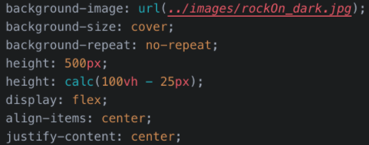

# Custom Webpage Jumbotron

In this activity, you will turn the default Bootstrap 4 jumbotron you have now into a professional-level, attention-grabbing image.

## Instructions

1. Add the `rockBackground` class to the `jumbotron 
`.

- Again, you will be using this class to style this element.

2. Add a new `
` with the class `jumboCopy` within the `jumbotron 
`.

3. Move the jumbotron’s content within this new `
`.

4. Update the copy and button text in the jumbotron to reflect the design above.

- **Note:** Feel free to add a more compelling description.

5. Add the following CSS within a selector that targets the `jumbotron 
`:

6. Add a selector for the `jumboCopy` class with the following properties and values:

Great work!
