# 3.1 Lesson Plan: Introduction to UX/Bootstrap

## Overview

Today, you'll introduce students to the concept of User Experience (UX) and User Funnels. You will then introduce students to the concept of content delivery networks (CDNs), specifically Bootstrap. You'll show how to use Bootstrap's built-in column media queries to control layouts and explain the importance of acquiring these skills.

Module 3 comprises of three lessons that provide the instruction and practice for students to capably work in Bootstrap. In Lesson 3.1, you'll introduce UX and Bootstrap. In Lesson 3.2, students will learn how to overwrite Bootstrap components' CSS to customize a Bootstrap template so that they can create custom websites. In Lesson 3.3, students will practice the role of freelance web developer by exporting web-ready images from a design. Students will then use the assets to create a design file based on a prompt. And finally by the end of the module, students will rebuild their portfolio using Bootstrap.

## Learning Objectives

By the end of class, students will be able to:

1. Articulate the steps in the design-thinking process.
2. Analyze user funnels on github.com to better understand how to design sections.
3. Link Bootstrap to an HTML page through their first CDN.
4. Explain how Bootstrap CDNs save developers time during the web development process.
5. Code an HTML/CSS webpage using Bootstrap components.

## Instructor Notes

Remember, you can lose the class’s focus in the time it takes to open a new tab. Practice your transitions to and from the slideshow.

> **Recommendation:** Narrating what you're doing during transitions eases students’ feelings of uncertainty and fills awkward silences. Here are some examples of what you can say during common transitions:

* From sharing the slideshow to Zoom gallery view: “I’m going to stop sharing my screen for a moment while we review this activity.”
  
* From sharing the slideshow to sharing a tab on your browser: “Bear with me as I switch over to my browser for the next demonstration.”

> **Recommendation:** Transitions and activities tend to take longer in virtual classrooms. If you find that you are running short on time, feel free to combine or shorten activity reviews.

## Prepare for Class

**Review the slides beforehand.**

* [3.1 Intro to Bootstrap](https://docs.google.com/presentation/d/1il4-vXtCj-95sen5gBmVer7cbqEXJPlCHpDGrRJ59_A/edit?usp=sharing).

* Make any teaching notes you'll need.

* As you lecture, relate your own on-the-job experience whenever possible to bring what students are learning to life and connect it to their future goals.

### Bootstrap

Bootstrap is widely used in the web world and often listed on job postings. Learning Bootstrap is invaluable, as many companies use it.

* It is a particularly useful tool for user experience (UX) developers who aren't specifically front-end developers.
* Bootstrap is used to build responsive websites quickly without having to write media queries to control what it looks like at different browser widths.

If you need a working knowledge of Bootstrap, please review the following:

* [Bootstrap's Getting Started Guide](https://getbootstrap.com/docs/3.3/getting-started/) provides an overview of how Bootstrap works conceptually.
* [Bootstrap's grid system](https://getbootstrap.com/docs/3.3/examples/grid/) provides an overview of how Bootstrap's grid system functions.
* [Bootstrap's prebuilt components](https://getbootstrap.com/docs/3.3/components/) provide an overview of what components are and how you can use them.

_TAs should review the Bootstrap documentation, too, time permitting_.

**You'll lead three Bootstrap demos.**

There will be a lot of copying and pasting of components to see how they work. To prepare before class, be sure to run through each Bootstrap demo on your own:

* Components Demo
* Navigation Bars Demo
* Containers, Rows Demo

Find the demo files here: [3.1 Demo Files](./activities/01-Ins-Demo-Files).

If you need a refresher on how to use Bootstrap, review the solved activity folder [In-Class Activity Solution](./activities/01-Ins-Demo-Files/Student-InClass-Activity-Solution/solved). This solved file reflects what students create after this class is over.

## Time Tracker

| Start  | #   | Activity Name                     | Duration |
| ------ | --- | --------------------------------- | -------- |
| 5:30PM | 0  | Office Hours                       | 0:30 |
| 6:00PM | 1  | User Experience (UX)               | 0:55 |
| 6:55PM | 2  | Bootstrap 4                        | 0:45 |
| 7:40PM | 3  | BREAK                              | 0:10 |
| 7:50PM | 4  | Bootstrap Continued                | 1:05 |
| 9:05PM | 5  | Office Hours                       | 0:30 |
| 9:35PM | 6  | END                                | 0:05 |

### Office Hours (30 minutes)

Encourage students to come early and utilize the time provided and not to be afraid to ask questions.

> **Instructor note:** Do your part by engaging students who come early and participate in office hours.

---

## 1. User Experience (UX) (55 mins)

### 1.1 Instructor Do: Welcome and Intro to UX (15 minutes)

Welcome students to back to class!

Open and today's slides: [3.1 Intro to UX/Bootstrap](https://docs.google.com/presentation/d/1il4-vXtCj-95sen5gBmVer7cbqEXJPlCHpDGrRJ59_A/edit?usp=sharing).

**Give an overview of the day.**

**Say:** "Today, we'll introduces the concept of User Experience (UX) and the value of design in the software development process. Then we will talk about Bootstrap, a CSS framework used to rapidly create responsive prototypes."

#### What is UX?

**User experience is:**

* UX design is a process used by design teams to create products that provide useful experiences to users. This includes aspects of branding, design, usability, and function. UX is:

  * How people feel when they use a product or service.

  * Associated with every human–object interaction.

  * Focused on the relationship between people, computers, and software products.

**What is a user experience designer?**

* A UX designer is like a doctor. They investigate, analyze, and diagnose how users feel about the products they use.

* UX professionals consider the why, what, and how of using a product.

  * "Why" is about the users’ motivations. Can users relate to a task or values?

  * "What" is about the product's functionality. What can users do with the product?

  * "How" is about the design of functionality in an accessible and creative way.

**Why does UX matter?**

* Happy users or customers mean that the business is happy and healthy.

* Good UX is good for business. According to a Forrester Research study, companies that invest in UX see a lower cost of customer acquisition, lower support cost, increased customer retention, and increased market share.

**UX is not UI design:**

* UX designers are typically seen as interface, or visual, designers. That is a poor understanding.

* A UX designer is concerned with the entirety of a product: branding, design, usability, and functionality.

**UX and human-centered design:**

* Human-centered design (HCD) is the methodology used to guarantee a high quality of user experience.

* The foundations of HCD come from design thinking.

#### UX Design Is About Collaboration

**Design is a team sport:**

* As teams and products grow in complexity, designers are valued because of their collaboration and team-building skills, rather than individual tasks.

* Today, being a designer means bringing the team together, checking all egos at the door, and helping to create a safe space for collaboration.

> **Insight:** Ask a TA to share how teamwork has made them a better teammate.

**There are many roles on UX teams:**

* The UX field is vast, and many specializations occur in the field. During this boot camp, students should try to identify their passions. Share your experience working with the different roles we encounter in the UX field.

* Emotional intelligence is a must-have skill for designers.

* UX is about examining and coordinating business needs, user needs, and resources to get the best possible solution. To do well in UX, we need to empathize with everyone involved. A UX designer needs to be fluent in everything from business to technology to design, yet be an advocate for users.

* Emotional intelligence (aka emotional quotient, or EQ) is the ability to understand, use, and manage your own emotions in positive ways to relieve stress, communicate effectively, empathize with others, overcome challenges, and defuse conflict.

**Highlight the hard and soft skills:**

* Design thinking, UX, and human-centered design research methods
* User research
* Prototyping
* UI design

The biggest challenge designers face is developing the critical soft skills of design, including, but not limited to:

* Communication and critique
* Collaboration
* Flexibility

### 1.2 Student Do: What Is Your Favorite App? (10 minutes)

> **Goal:** Create a quick discussion around students' favorite apps and what constitutes good UX.

Review this image on the slide.

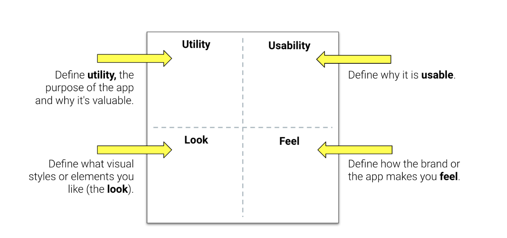

There are four main factors designers use to evaluate apps.

  1. Utility: the purpose of the app.
  2. Usability: define why it is valuable.
  3. Look: what visual elements are inspiring.
  4. Feel: how the brand makes you feel.

**Instructions:**

1. Use Slack.

2. Tell students to post the following:

   * The name of their favorite app.
   * One sentence about why it is their favorite app.
   * What category (utility, usability, look, or feel) their sentence falls under.

3. Select two or three students' posts, and ask them to explain why they choose that app.

### 1.3 Instructor Do: Design Thinking and User Funnels (30 min)

#### Design Thinking

**Design thinking:**

* What: Design thinking is a five-step process for creative problem solving.

* When: The process is used in every project. Each project can differ greatly, depending on the timelines, budgets, goals, team personalities, and even the work styles of clients and stakeholders (often very hands-on). Therefore, the process requires constant tailoring for each project. Being able to customize your process requires confidence that only comes from experience and practice.

* Why it matters:

  * So product teams can create designs that are relevant to your users.
  * So product teams can create designs that are easy and enjoyable to use.
  * So product teams can understand the return on investment of your UX design.

**The design-thinking process has five main steps:**

* Empathize.

  * By talking with your users.

  * User research is how we develop empathy.
  
  * The key is to feel what users feel—their pains and frustrations.

* Define.

  * Define your user’s problems in a way that can be solved.

  * Framing problems is essential so that we can create useful solutions and explore opportunities.
  
* Ideate.

  * Ideate by brainstorming ideas for innovative solutions.

  * Designers use brainstorming to generate ideas and solutions.

* Prototype.

  * Build prototypes for the proposed solution!

  * Different methods are involved, such as sketching and prototyping.

* Test.

  * Test your prototype until a viable product/service is created.

  * Designs will fail! Testing is iterative, so it involves testing, adjusting, and testing again.

**Case Study: Using Design Thinking to Disrupt Medicine**

The design thinking process yields great products. To illustrate, share the PillPack case study:

PillPack is an online pharmacy that began as a startup-in-residence at IDEO Cambridge. Working with designers and using a human-centered approach, PillPack refined its brand's vision, strategy, and identity across channels. Encourage students to read the case study describing how PillPack did it. By all accounts, the initiative was successful. Time magazine named PillPack one of the best inventions of 2014, and Amazon bought PillPack for $1 billion in 2018.

**UX and design thinking recap:**

* In life, we usually start with a problem defined for us.

* But think about design thinking as a set of mindfulness principles.

* Every single design is a series of multiple iterations of building, testing, and learning.

* Today, we will be teaching design thinking in a linear way, but it is often implemented in a nonlinear fashion.

#### User Funnels and Value Propositions on the Web

> 💼 **Employer competitive note:** Professional designers make sure that each section of a webpage or website supports a single call to action (CTA). CTAs are the way that businesses make money. Creating designs that allow users to convert at multiple points in your UI will make your boss and business stakeholders happy because the business will make money.

A **user funnel**, also known as a sales or marketing funnel, describes the process you create to attract potential buyers to your website and guide them to take some desired action. Websites are built with a section that advertises features and services the business provides. The order of the content always defines the most important features and services as well as the most important CTAs.

A **CTA** is a statement designed to prompt an immediate action associated with interacting with a UI. An example of a CTA is a "Shop Now" button with text and images enticing the user to perform the desired action.

A **value proposition** is essentially advertising a feature of your business. Value propositions are an innovation, service, or feature intended to make a company or product attractive to customers.

#### User Funnels on the Web

Value propositions on the web are laid out purposefully in user funnels. This understanding will help students appreciate that designers indeed think about how they use content to engage users at every turn.

Modern websites have a very defined "flow" to how their webpage is built—this is known as a user funnel. Sections are designed to advertise one important CTA. They're designed to catch users' attention as they scroll down through the page. Sections will be ordered from the most important CTA to the least important.

Businesses have many different types of users. It's important to tailor CTAs on your homepage to generate the most interest in your user base.

Let's log out of GitHub to analyze [GitHub's homepage](https://www.github.com) as an example of how businesses build their sections to promote products.

**TAs:** Slack out the [GitHub homepage](https://www.github.com) so that students can follow along on their own if they wish.

Each section targets the type of users the website wants to capture. These sections follow a series of steps that essentially promote a product or service.

#### GitHub User Funnel Step 1: Sign Up


The first section on most websites (besides news or ecommerce) encourages users to sign up or create a free account for more information on the product or service the site offers.

In GitHub's case, the initial CTA is to create a free account for the service. The account would be for GitHub's average user—your run-of-the-mill developer.

#### GitHub User Funnel Step 2: Introduce the Product and Service

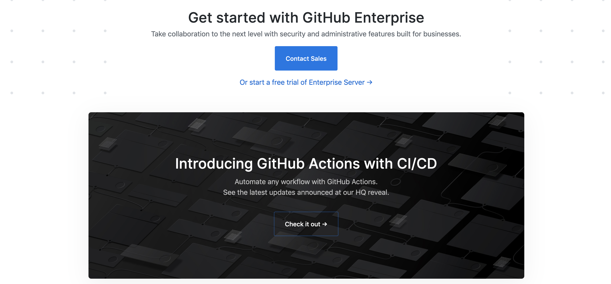

The next few sections are value propositions on how or why you might use the product or service.

Here, GitHub advertises contacting the sales team and signing up for the enterprise service.

This section grabs the attention of project managers or bosses of software teams.

#### GitHub User Funnel Step 3: Play as a Team

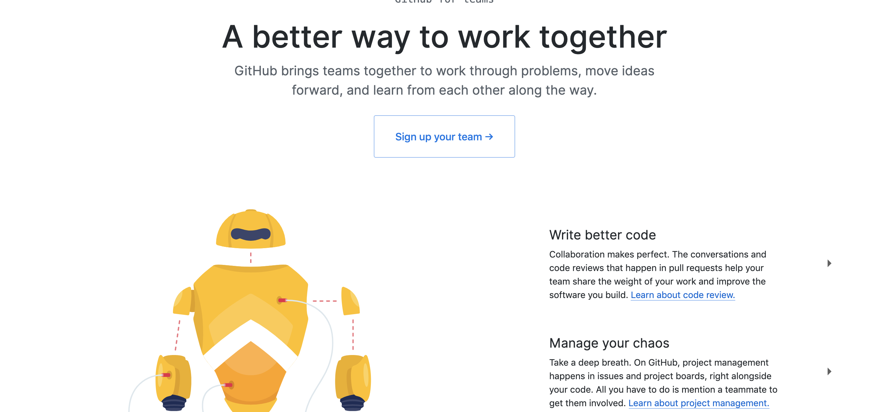

> **Instructor note:** _Ask,_ "What do we see here? Any CTAs?"

This specific section advertises how you can use GitHub's products or services to work as a team!

Notice the CTA: Sign up your team.

#### GitHub User Funnel Step 4: New Feature/New Section

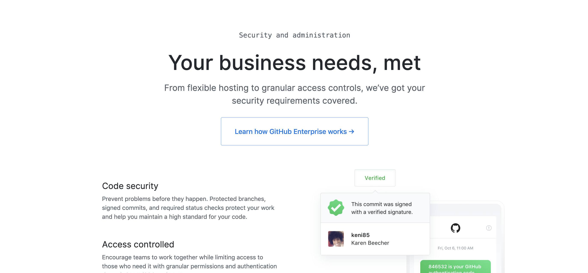

This is an informative section, specifically for one of GitHub's products—GitHub Enterprise.

> **Instructor note:** _Ask,_ "Does anyone see a CTA?"

Instead of signing up, however, this just wants the user to learn more about how GitHub Enterprise works, which will lead to a CTA to convert.

#### GitHub User Funnel Step 5: More Features

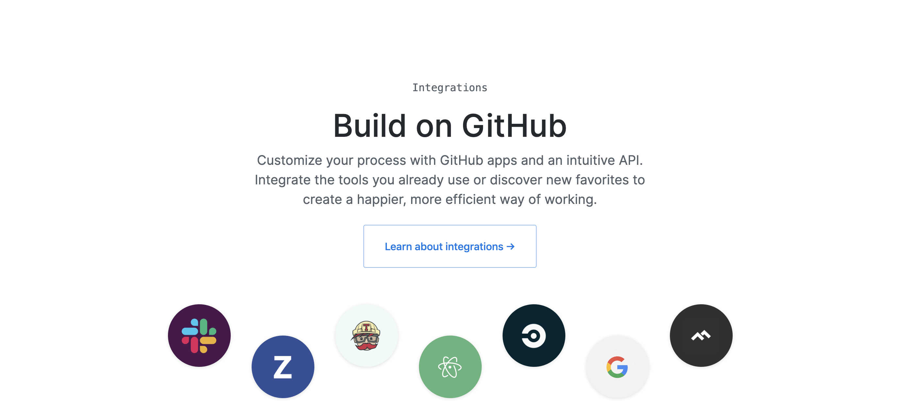

This section is another GitHub feature—GitHub integrations.

> **Instructor note:** _Ask,_ "As the user, what do you think you're supposed to do here?"

It is merely advertising for you to learn about how integrations work on GitHub, which will also lead to a CTA of some sort.

#### GitHub User Funnel Step 6: Appeal to the Masses

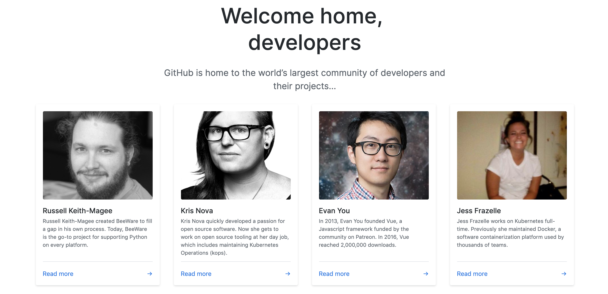

This section is specific to the community and aims to empathize with the people they want to sign up for their service—developers.

> **Instructor note:** _Ask,_ "For what purpose is this section?"

A section like this one is meant to catch the interest of the average user base if they're exploring the website but have not yet converted.

#### GitHub User Funnel Step 7: One Last Chance

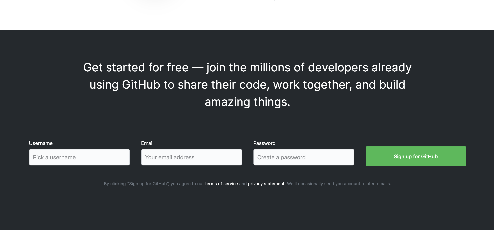

We come to the bottom of our page.

> **Instructor note:** _Ask,_ "What do we think GitHub wants the user to do here?"

If a user made it this far down the page, GitHub tried one last time to get the user to sign up for the service.

This CTA is the same as the first—sign up for GitHub. The reason: At this point, the user is probably looking for something or considering signing up for the product or service, so GitHub prompts them one more time.

#### GitHub User Funnel Step 8: Maybe They Are Just Lost?

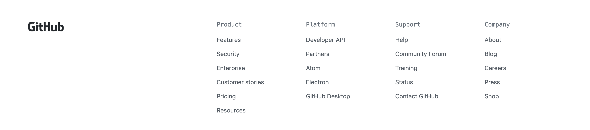

Lastly, we have our classic footer, which serves as a directory to keep users engaged in the website. Maybe they're having trouble finding what they're looking for? Most websites follow this convention, and a well-designed footer converts users and keeps them engaged as an added bonus.

**Ask:** "What do we think GitHub wants the user to do here?"

Each section has a purpose. Help your class to keep this in mind when you move on to developing your templates.

> **Instructor note:** Pause for questions.

Next, review what students just learned about clear and defined user funnels from the GitHub site:

1. Businesses will attempt to convert users on each section of a website.
2. Each section has a different feature they're highlighting, complete with a CTA.
3. You'll see the same CTA in multiple locations in an attempt to catch a user if they reach a decision at any point when exploring the UI.
4. Sections of websites will cater to different demographics. For example, one section might cater to the standard user, while another is catering to people who run teams and are looking for different tech that they can leverage.

---

## 2. Bootstrap 4 ( mins)

That was a whirlwind of UX and thinking about design. That is a lot of things to keep in mind. We will now introduce a technology that will allow us to quickly and easily implement UX forward design to our HTML and CSS. Bootstrap!

### 2.1 Instructor Do: Intro to Bootstrap (15 minutes)

#### Introducing Bootstrap

> **Important point:** The goal of this section is to introduce students to the concept of CDNs and Bootstrap in particular. This lecture and the demo that follows will prepare students to tackle today's first and second learning objectives: linking Bootstrap to an HTML page through a CDN and being able to explain how the Bootstrap CDN saves developers time during the web development process.

> **Employer competitive note:** Bootstrap is used to create front-end prototypes rapidly. Bootstrap is a common framework in the professional world of web development. This framework enables students to create designs that use both Bootstrap components and the responsive col class system.

**Bootstrap** is an open-source front-end UI framework for developing front-end websites with HTML, CSS, and JavaScript. With Bootstrap, developers can prototype ideas quickly or build entire apps with Bootstrap’s responsive grid system, prebuilt components, and plugins built on jQuery, creating fully responsive templates.

#### What's a Framework?

A **framework** is a codebase written to simplify common problems in a programming language.

Compare a framework to a collection of tools. If you were a carpenter, you would have a set of specialized tools used to speed your carpentry work. A framework is the same—tools designed to solve a specific problem. For example, with Bootstrap, developers can create responsive websites with literally zero CSS (it has already been written; the developer just has to leverage it). The developer's tools would be the components and responsive column system speeding the workflow.

Software frameworks are written so developers can focus on meeting deadlines, rather than re-creating common system processes. Why reinvent the wheel when the problem has already been solved multiple times by other developers?

Frameworks are hosted on CDNs, which we'll define in a moment. First, let's discuss the pros and cons of a framework.

#### Using Frameworks: Pros and Cons

Pros:

* Include predefined classes and functions that can be used to design web applications.
* Streamline the development process.

Cons:

* Lock development teams into a codebase.
* Harder to customize and refactor code.

#### Front-End Frameworks

There are many types of front-end frameworks. Bootstrap is the most popular, which is why we teach it in this class.

* [Bootstrap](https://www.getbootstrap.com) - UX/UI focus
* [Materialize CSS](https://materializecss.com/)
* [Semantic UI](https://semantic-ui.com/)
* [Material UI](https://v0.material-ui.com/#/)
* [ZURB Foundation](https://foundation.zurb.com/)
* [Pure CSS](https://purecss.io/)

#### Why Use Bootstrap?

Many companies look for Bootstrap as a skill in front-end development positions.

**Reason 1:** Bootstrap has been the most popular CSS framework on the web since its inception in 2011. According to builtwith.com, Bootstrap runs on about  more than 20 million websites. Students can see for themselves (and share with the class): [Twitter Bootstrap Usage Statistics](https://trends.builtwith.com/docinfo/Twitter-Bootstrap). Once Bootstrap is active, you can simply copy snippets from the documentation to save yourself the time it takes to create elements from scratch!

**Reason 2:** Bootstrap is mobile-responsive by default with its custom columns system. This means that your website will automatically look great when viewed on screens ranging from monitors to tablets to phones.

**Reason 3:** Bootstrap has many features and is easy to use. Familiarize yourself with the UI features Bootstrap offers by reading the [Bootstrap documentation](https://getbootstrap.com/docs/4.4/getting-started/introduction/). Also, once Bootstrap is active, you can simply copy snippets from the documentation to save yourself the time it takes to create elements from scratch!

**TAs:** Slack out Bootstrap's documentation to the class: [Bootstrap documentation](https://getbootstrap.com/docs/4.4/getting-started/introduction/).

#### Bootstrap Knowledge Makes You More Employable

If you Google search front-end development jobs, you’ll see Bootstrap listed in the more competitive fields, which is why it is such a desirable skill.

> **Instructor note:** Illustrate this point by searching for Bootstrap in any job engine.

Bootstrap dramatically reduces the time it takes for developers to create front-end interfaces. Companies often request Bootstrap for front-end development and UX positions.

#### What Is a CDN?

Bootstrap (and frameworks in general) are hosted on a CDN (aka framework or library). Many of today’s most popular and powerful web technologies are frameworks built for developers by developers to speed their workflows.

CDNs are servers (or data centers) that publicly host files that contain code.

To conceptually understand what a CDN is, let's use your TV or smartphone as an analogy:

Your TV comes with standard programs (programming languages installed in your TV), but what if you want to add to the functionality of it? You install other software onto your TV to extend the functionality (e.g., Netflix). The same is true for CDNs—they serve content directly to your website over the internet. You "install" a CDN by linking to it.

These code-containing files can be imported into programs or websites, allowing them to use the JavaScript functions or, in our case, HTML/CSS files.

Why that's helpful to us: As long as your site is connected to the internet, you can import a CDN's code into your webpage without actually installing the framework into your working files. The webpage doesn't have to worry about running slower due to having more stuff to load, and you don't have to manually update the code—the developers of the CDN do that for you.

* **TAs:** Share this link by Cloudflare: [What is a CDN?](https://www.cloudflare.com/learning/cdn/what-is-a-cdn/).

> **Instructor note:** Students can open the link or follow along with you on the big screen.

> :key: **Key tech note:** Bootstrap's website is a CDN. CDN style sheets are publicly accessible over the internet and free to use! Take, for example, node.js, Bootstrap, or react.js—all are frameworks that save developers time by adding functions that solve common problems on the web.

**Instructors:** Open up the following link in front of the class showcasing a Bootstrap CSS file hosted on Bootstrap's CDN: [Bootstrap CDN](https://stackpath.bootstrapcdn.com/bootstrap/4.4.1/css/bootstrap.css).

> **Instructor note:** This is the same CSS file we import into our HTML files that allow us to use Bootstrap on our own sites.

Scroll down the page, so students get the picture of how much work went into this file.

**Say:** "CDNs give us access to this entire CSS file, saving us a lot of time and hard work. Would you want to write all of that by yourself? I wouldn't."

Now that we know what a CDN is, show students how one works in the following demo.

> **Instructor note:** Pause and check in with students for questions.

### 2.2 Instructor Do: Bootstrap Components (10 minutes)

> 📌 **Important point:** Your goal for this demo is to quickly familiarize students with Bootstrap documentation and help students get started with prebuilt code.

> **Recommendation:** Navigate away from the slideshow for this demonstration. If you shared your entire desktop, make sure to open your files on that shared desktop. If you shared a single window, be sure to re-share your screen to capture the appropriate window or desktop. Remember to narrate what you are doing during transitions and demonstrations. In this instance, you might say: “I’m now going to switch from the slideshow to another tab so I can demonstrate variables.”

Demo the Bootstrap components.

You can find them at [https://getbootstrap.com](https://getbootstrap.com/docs/4.4/getting-started/introduction/).

Convey to students that Bootstrap is "easy" to work with. It's easy to copy a Bootstrap component into your website, and, once you link to Bootstrap using a link tag, you're free to copy and paste these elements into your project.

> **Recommendation:** Since you’ll be sharing your screen for this demonstration, ask students to use the "Raise Hands" feature on Zoom to ask questions. At a good breaking point, call on a specific student to unmute and ask their question. Alternatively, you can ask students to share their questions in the Zoom chat or Slack and have the TA provide answers.

Bootstrap components are prewritten pieces of HTML, CSS, and JavaScript that have been designed to be copied and pasted into your code and then customized. Components speed development time by giving you responsive UI elements that you are then free to customize.

Let students know that you'll show them the Bootstrap CDN's prebuilt components, which are publicly available on the internet. These prebuilt components are HTML, CSS, and JavaScript/jQuery code (for animated components) that have already been written for you.

Assure students that accessing these components is just like linking to an external CSS file. The Bootstrap CDN works the same way, and only the code files are hosted from the CDN network, rather than your website's root folder.

Students just need to copy the HTML that is needed to load these prebuilt components for them.

Occasionally, students will need to use jQuery components. Three script tags must be included for these components to work properly.

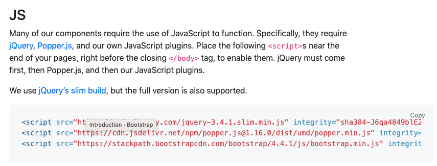

Point out how, with Bootstrap components, a front-end developer can build a responsive, well-structured template in less than an hour. With the extra time, a developer can customize their template and make it look professional.

#### Demo Instructions

1. Download and open the instructor demo file located at [3.1 Demo Files](./activities/01-Ins-Demo-Files).

1. Open the [Bootstrap Quick Start Guide](https://getbootstrap.com/docs/4.3/getting-started/introduction/) in your browser.

 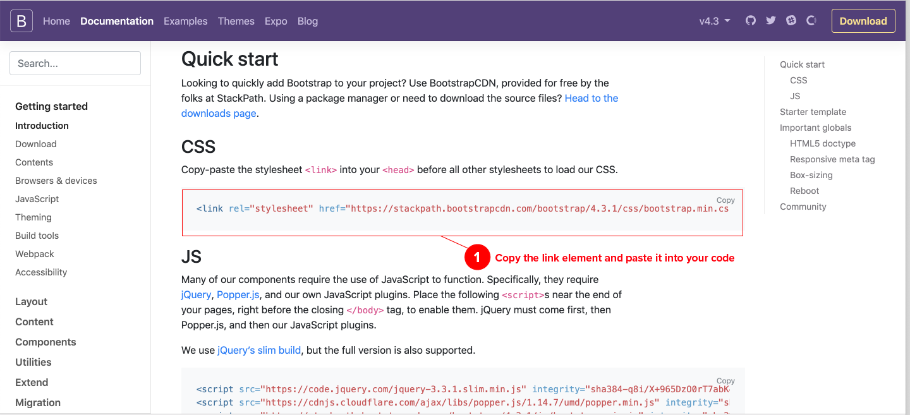

1. Copy the link to the CSS file and paste it into your code on line 10.

1. Click on "Components."

 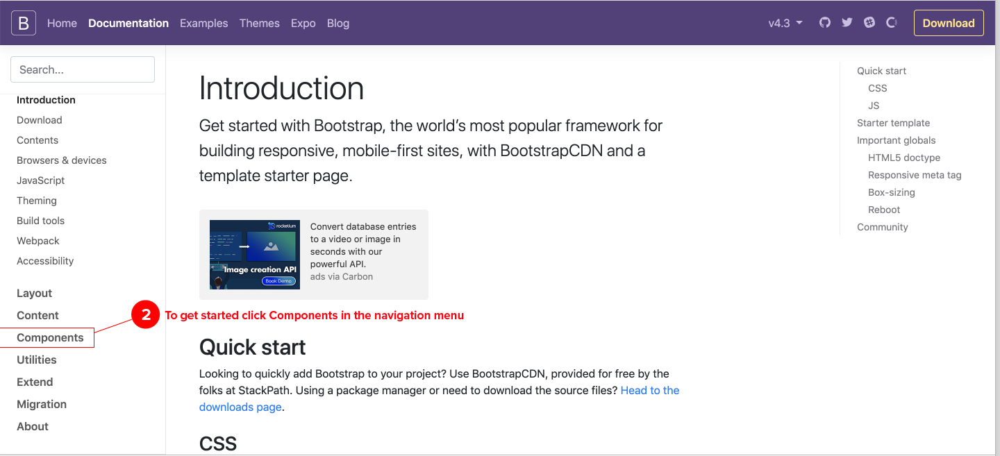

1. Click on "Jumbotron" in the list.

 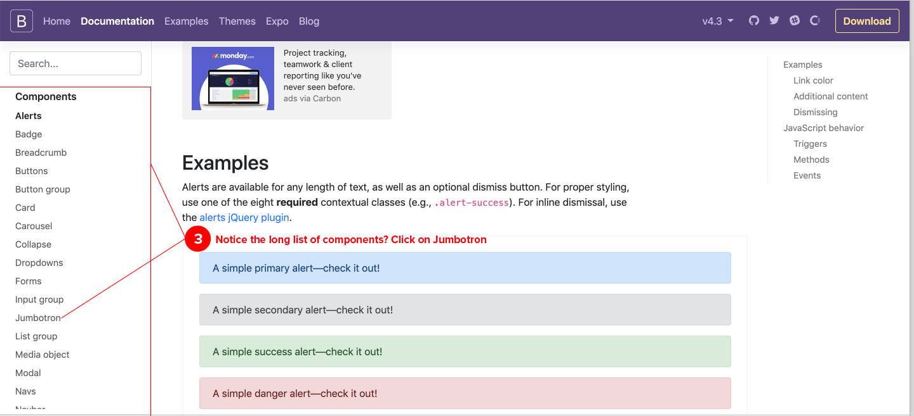

1. Copy the code below and paste it into your HTML to see the jumbotron appear. Paste the code on line 4.

 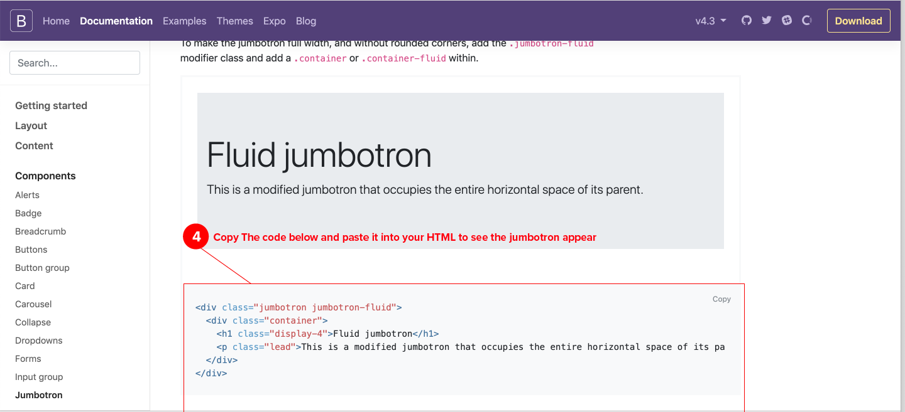

1. Open the index.html file in your browser.

> **Recommendation:** Take a moment to check in with the class and see how comfortable they feel about the material covered.
>
> Stop sharing your screen for a moment and switch to gallery view in Zoom to see your class on one screen.
>
> Ask the class to use the Zoom meeting reactions found in the "Meeting Controls" panel at the bottom of the Zoom window to use the thumbs-up 👍 or clap 👏 emojis if they're feeling comfortable and confident with the material you've covered so far.

We’ve covered the concept of Bootstrap components. Hopefully, students now appreciate how easy and effective this content management tool is. Next, they get to apply it themselves with a hands-on Bootstrap activity.

### 2.3 Student Do: Getting Started With Bootstrap Activity (10 minutes)

Direct students to the first activity, found in [02-Stu-Get-Started-Bootstrap](./activities/02-Stu-Get-Started-Boostrap/README.md).

> **Recommendation:** This activity should be done individually, so you don’t need to create breakout rooms. Instead, make sure that the whole class is muted and switch to Zoom gallery view, so you can monitor students as they work. Tell them that, if they have a question, they should share it on the #ClassActivities Slack channel and a member of the instructional staff will respond. If a student has a question that is relevant to the whole class, you or one of the TAs should unmute and share your answer with everyone.

#### Summary

This activity will be students' introduction to a CDN, which they should find surprisingly easy. In this activity, they'll also use their first Bootstrap component.

#### Instructions

First, students will connect to the Bootstrap CDN using a link tag. Next, students will add their first Bootstrap component to a webpage—a jumbotron.

_If students struggle:_ First, make sure that students have correctly linked to Bootstrap's CDN with a link tag. Check the placement of the component; this should be an easy copy and paste. Make that sure students open the correct file in their web browsers.

#### Instructors and TAs

> **Recommendation:** Be sure to check your #ClassActivities Slack channel for questions while students are working and provide feedback.

With your TAs, offer help where needed. Encourage students to help one another, too.

Students might encounter the following common problems:

1. They might place Bootstrap's link tag in the incorrect location.
2. They might open the incorrect `index.html` file to view their results.

#### Deliverable

A webpage with a basic jumbotron component will display on the screen.

### 2.4 Instructor Do: Getting Started With Bootstrap Activity Review (10 minutes)

**Review students' experience.**

Call the class back to attention so that you can lead a review of the Bootstrap activity.

Review the solution file with students found in [02-Stu-Get-Started-Bootstrap](./activities/02-Stu-Get-Started-Boostrap/solved).

Offer students actionable feedback that they can apply to their work. For example:

1. Getting started with Bootstrap is easy—you can even find prebuilt Bootstrap templates to get you started if you're in a rush.
2. Just because you use Bootstrap on your site doesn't mean that you can't use the stuff we learned previously. All concepts taught before Bootstrap can be applied to this section.

Next, lead a review of the concepts that students just practiced.

**Ask:**

* "What does CDN stand for? What do CDNs do?"

 _CDN stands for content delivery network. CDNs host files that can be imported into your website._

* "What is a Bootstrap component?"

 _A Bootstrap component is a prewritten piece of code that is copied and pasted and then customized on your website._

* "Why is Bootstrap useful?"

 _Bootstrap greatly speeds development time by giving you prebuilt components and CSS properties to make your website responsive._

Take a moment to give students a sense of some common misconceptions or FAQs about getting started with Bootstrap. For example:

1. Bootstrap is used to speed your development process, but without hard work, your design will still look like a template.
2. You can overwrite CSS or JavaScript properties on any Bootstrap components. They're prebuilt to get you started faster, but you can still customize them to your satisfaction.

Let's move on, build on our knowledge, and add another Bootstrap component to a webpage: a navbar.

---

## 3. BREAK (10 min)

That was a lot of work. Let's take a break and relax—you’ve earned it!

Let students know they'll learn about Navbars and introduced to Rows and Containers next.

> **Recommendation:** Don't stop sharing your screen. Put up a Google timer or a YouTube timer video to help get students back into the Zoom room on time.
---

## 4. Bootstrap Continued ( mins)

### 4.1 Instructor Do: Bootstrap Navigation Bars (15 minutes)

> 📌 **Important point:** Your goal for this section is to explain Bootstrap's prebuilt navigation components. By the end of this section, students should feel like they're becoming more familiar with Bootstrap's website and catalog of components.

A **prebuilt navigation component** is a navbar (the layout depends on the navbar you use) that comes with prebuilt functionality. Prebuilt navigation components will be responsive and have drop-down menus already coded. All you need to do is style your navbar to make it your own.

Navbars are essential; they're literally on every webpage in some way, shape, or form. For example:

1. On a shopping website, the navbar may have two or three main menus and more depth, with submenus, such as those on Ikea's website. Ikea's site has two top-level navbars, one for general customer service topics and a second one for sale items and new offers.
2. On a personal website, the navigation might be a horizontal bar across the top of the page, showing "About," "Shop," "Blog," and "Work With Me."
3. On mobile, the navbar is a hamburger menu.

Adding a navbar to a template is necessary for a site to be fully functioning. Without navigation, users will view your website as a landing page.

> :key: **Key tech note:** Building a custom navbar into your website is a time-consuming process. There are so many HTML elements to build and style, and that is not even counting making it responsive. With Bootstrap, all you need to do is remove elements you don't need.

How Bootstrap saves time:

1. Bootstrap is responsive. You no longer have to create your own breakpoints and styles for these breakpoints—they have already been created. You can control the responsive layout with Bootstrap's col class system.
2. Bootstrap components all have prebuilt functionality. You don't have to code the interactions for each component. Simply tweak the design of your components, and that's it!
3. You can build a complete website using Bootstrap components. The developers of Bootstrap have already coded all the components you could ever use, and it's based on design trends. Do you need to add cards to your site? Bootstrap has a component just for that purpose.

> **Instructor note:** Take any questions about using Bootstrap to create navigation menus before moving on.

Seeing is believing—show students how to use Bootstrap to create navigation elements on a page in the following demo.

#### Navigation Bars Demo

> 📌 **Important point:** Your goal for this demo is to quickly familiarize students with Bootstrap documentation and help students apply navigation bars.

> **Recommendation:** Navigate away from the slideshow for this demonstration. If you shared your entire desktop, make sure to open your files on that shared desktop. If you shared a single window, be sure to re-share your screen to capture the appropriate window or desktop.

In this demo, show students how to add a navbar to a template.

1. Open the instructor demo file [01-Ins-Demo-Files/2_Navigation](./activities/01-Ins-Demo-Files/2_Navigation).

2. Open Bootstrap's ["Getting started" documentation](https://getbootstrap.com/docs/4.3/getting-started/introduction/).

3. Navigate to Bootstrap's ["Navbar" component](https://getbootstrap.com/docs/4.3/components/navbar/).

4. Copy the code for the first navbar on the list.
5. Paste it into your code under line 17.
6. Reload the page to show the component to the class.

Students will explore navbar components in the next activity.

> **Recommendation:** Take a moment to check in with the class and see how comfortable they feel about the material covered.
>
> Stop sharing your screen for a moment and switch to gallery view in Zoom to see your class on one screen.
>
> Ask the class to use the Zoom meeting reactions found in the "Meeting Controls" panel at the bottom of the Zoom window to use the thumbs-up 👍 or clap 👏 emojis if they're feeling comfortable and confident with the material you've covered so far.

Now it is the students' turn to add a navbar to a template in the following activity.

### 4.2 Student Do: Add a Navigation Bar Activity (10 minutes)

> **Recommendation:** This activity should be done individually, so you don’t need to create breakout rooms. Instead, make sure the whole class is muted and switch to Zoom gallery view, so you can monitor students as they work. Tell them that, if they have a question, they should share it on the #ClassActivities Slack channel and a member of the instructional staff will respond. If a student has a question that is relevant to the whole class, you or one of the TAs should unmute and share your answer with everyone.

Direct students to the activity, found in [03-Stu-NavBar](./activities/03-Stu-NavBar/README.md).

#### Summary

Students have a jumbotron component on their pages from the previous activity. Now it’s time to add a navbar.

#### Instructions

Students will navigate the Bootstrap component documentation page again and then copy and paste the code for the navbar onto their page.

_If students struggle:_ First, make sure students have correctly linked to Bootstrap's CDN with a link tag. Check the placement of the component; this should be an easy copy and paste. Make sure students open the correct file in their web browsers.

#### Instructors and TAs

> **Recommendation:** Be sure to check your #ClassActivities Slack channel for questions while students are working and provide feedback.

With your TAs, offer help where needed. Encourage students to help one another, too.

Look for students who are struggling to place their code within the `<body>` of the index.html page.

Students might encounter the following common problems:

1. Students might not be properly linked to Bootstrap's CDN.
2. Students might place the component in the incorrect area, leading to a weird-looking template.

#### Deliverable

A webpage with a basic navigation component will display on the screen.

### 4.3 Instructor Do: Add a Navigation Bar Activity Review (5 minutes)

> **Recommendation:** Since students can’t physically come to the front of the class to demonstrate, stop sharing your screen and ask a student to share their screen instead. Once they are finished, ask them to stop sharing, so you can reshare your screen.

**Review students' experience.**

Call the class back to attention so that you can lead a review of the navbar activity.

Offer students actionable feedback that they can apply to their work. For example:

1. Navbars can be designed to display on the left side of a page like a column.
2. Bootstrap's navbar can be customized like any other template. Don't feel constrained to using the base layout.

Share some common misconceptions or FAQs about working with Bootstrap components. For example:

1. Bootstrap components can be placed anywhere on your page. The order in which your elements are laid out is up to you.
2. As a designer, there are Bootstrap toolkits used to prototype components before you build.

Next, we'll add responsive containers and rows to fill with content.

### 4.4 Instructor Do: Grid Design With Bootstrap (45 minutes)

> 📌 **Important point:** The goal of this section is to introduce students to Bootstrap's responsive class system. By the end of this section, students should understand how to build the structure for our responsive Bootstrap classes.

Understanding how containers and rows work in Bootstrap is an essential skill that students should learn from this class. Understanding how to work with the two different containers will help students build responsive classes with the proper HTML structure. Bootstrap requires rows to be wrapped inside of our containers in order to make their content responsive.

The **responsive column system** (`col` class system) is a series of classes that you can add to any HTML element to make it respond to different viewports based on the classes you write.

The responsive column system has three parts:

1. Containers and container-fluids that serve as the outside wrapper of our responsive content.
2. Rows that are used to separate rows of content within containers.
3. The Bootstrap classes that are applied to HTML elements to define how our layout responds to different viewports (screen widths).

Now introduce the concept of two prewritten Bootstrap classes: the container and the row. Prewritten classes are literally HTML classes that are already responsive. All you have to do is apply them to any HTML element wrapped inside a row and a container.

Up to this point in the lecture, we have constructed a Bootstrap template using components in the activities, but to take our templates to the next level, we need to be able to add rows of our own content that are responsive.

> **Instructor note:** Bootstrap also has design templates for designing with Bootstrap's grid system and components.

**Say:** "We now have the basics of a nice and solid Bootstrap template, but before we can move forward, we need to learn about the Bootstrap grid system."

We will first introduce two classes: containers and container-fluids. Then we will introduce Bootstrap's `col` class system in order to make our site's contents responsive.

> :key: **Key tech note:** Bootstrap classes are CSS; be mindful that all CSS is case-sensitive.

The foundation of this system is made up of the Bootstrap class container, container-fluid, and rows. Let’s define each element individually:

* `.container`: Containers provide a means to center and horizontally pad your site’s contents. Use `.container` for a container with a fixed width.

* `.container-fluid`: A fluid container has the same function as a regular container except that you use `.container-fluid` for width: 100% across all viewport and device sizes. This container will always span the full width of the webpage or parent container.

* `.row`: Rows serve as a way to separate content within containers. Rows can display either horizontally or vertically depending on the layout you are trying to achieve.

#### Bootstrap Responsive Screen Sizes

Bootstrap’s grid system works from a series of classes that define breakpoints.

| Size | Class | Screen Type | Pixel Width Range |
|-|-|-|-|
| Extra Small | `col-xs-` | Phone | < 576px |
| Small | `col-sm-` | Small Tablet | >= 576px |
| Medium | `col-md-` | Tablet, Small Laptop | >= 768px |
| Large | `col-lg-` | Laptop | >= 992px |
| Extra Large | `col-xl-` | Desktop | >= 140px |
| Auto Responsive | `col-` | - | - |

#### Bootstrap Column Example

Bootstrap's `col` system must have a `container` or a `container-fluid` and a row in order for our Bootstrap columns to respond correctly. Below is an example of what the proper structure looks like.

> **Instructor note:** In the example below, you can see we have a container-fluid as our outside wrapper, a row to separate content, and three divs. The divs are assigned different classes that control how our layout responds depending on the size of different viewports. Point out this basic structure (containers -> rows -> col classes) for students before we move on to defining how the col class system works in detail.

```html
<div class="container-fluid"><!-- This could also just be a regular container -->
  <div class="row"><!-- Rows are used to separate our columns. If we need multiple rows, we can always add another. -->
    <div class="col-sm-12 col-md-4 col-lg-4">sample column</div>
    <div class="col-sm-12 col-md-4 col-lg-4">sample column</div>
    <div class="col-sm-12 col-md-4 col-lg-4">sample column</div>
  </div>
</div>
```

> **Remember:** Start with the `col-sm` first.

> **Instructor note:** Take any questions students have about containers or rows before moving on.

Now show students how containers and rows work with a live demo.

#### Containers, Rows Demo

> 📌 **Important point:** The goal of this demo is to allow student to practice the 12-column system and practice using bootstrap responsive rules. The section covers creating a fluid layout with the bootstrap col system.

> **Recommendation:** Navigate away from the slideshow for this demonstration. If you shared your entire desktop, make sure to open your files on that shared desktop. If you shared a single window, be sure to re-share your screen to capture the appropriate window or desktop.

In the following demo, you will walk through containers, rows.

> **Instructor note:** Be sure to work from the same demo file you used earlier, or you can start with a fresh template below.

Open the instructor demo file located at [01-Ins-Demo-Files/3_Containers_Rows](./activities/01-Ins-Demo-Files/3_Containers_Rows).

When all the numbers on the classes equal 12, they will display responsively and evenly across your elements.

You will add the number to the end of your classes. Here are two examples of a responsive container with content for understanding:

**Write the code below into your template for your class. Leave this up on a different screen for reference:**

```html
<div class="container-fluid">
  <div class="row">
    <div class="cardContainer col-lg-3 col-md-3 col-sm-12">
      <!-- Paste Card Here -->
    </div>
    <div class="cardContainer col-lg-3 col-md-3 col-sm-12">
      <!-- Paste Card Here -->
    </div>
    <div class="cardContainer col-lg-3 col-md-3 col-sm-12">
      <!-- Paste Card Here -->
    </div>
    <div class="cardContainer col-lg-3 col-md-3 col-sm-12">
      <!-- Paste Card Here -->
    </div>
  </div>
</div>
```

> **Instructor note:** The code above is making use of three Bootstrap classes. We'll explain what each piece of code is doing:
>
> * `col-lg-3`: On screens with large breakpoints, we have four children, each with the class `col-lg-3`. That means that, on large screens, we'll see a four-column layout that spans the whole section (3 + 3 + 3 + 3 = 12).
>
> * `col-md-3`: This will work the same way as `col-lg-3`, except on medium displays.

> * `col-sm-12`: Notice that each child has a value of 12 at the end of the class. This means that, on small displays, each child element will take up 100% of the width of its container.

> :key: **Key tech note:** When creating responsive layouts with Bootstrap, you can use any or all of the responsive classes for your 12-column layout, depending on where you want your website to respond.

In the example above, the content at large and medium resolutions will display a row that is four items across. At small resolutions, each item will display 100% of the width of the container (calculating margins and padding).

> **Instructor note:** _Take time for questions._ Since you're moving on to a lecture, take a moment to be sure that students understood what they just saw in your navbar demo.

> **Recommendation:** Take a moment to check in with the class and see how comfortable they feel about the material covered.
>
> * Stop sharing your screen for a moment and switch to gallery view in Zoom to see your class on one screen.
> * Ask the class to use the Zoom meeting reactions found in the "Meeting Controls" panel at the bottom of the Zoom window to use the thumbs-up 👍 or clap 👏 emojis if they're feeling comfortable and confident with the material you've covered so far.

Now you'll talk about the key concepts to understand Bootstrap's 12-column layout.

#### Bootstrap 12-Column Key Concepts

> 📌 **Important point:** The goal of this section is to show students how to utilize Bootstrap's col classes in their HTML elements to make responsive layouts.

Bootstrap's **12-column grid system** is a series of prewritten CSS classes that define breakpoints for our content.

Bootstrap has developed CSS classes that are used to control the layout of HTML elements. Each class targets a specific width (e.g., `col-lg-4` targets large windows). When our website's width (of the browser windows) reaches each breakpoint, the contents will be rearranged to display differently.

For a visual, let's take another look at the example where we point out containers and rows:

```html
<div class="container-fluid"><!-- This could also just be a regular container -->
  <div class="row"><!-- Rows are used to separate our columns. If we need multiple rows, we can always add another. -->
    <div class="col-sm-12 col-md-4 col-lg-4">sample column</div>
    <div class="col-sm-12 col-md-4 col-lg-4">sample column</div>
    <div class="col-sm-12 col-md-4 col-lg-4">sample column</div>
  </div>
</div>
```

In the example above, the classes `col-sm-12`, `col-md-4`, and `col-lg-4` define how this row will respond. These classes actually control your layout. The containers and rows are required for structure. Notice how we're using multiple Bootstrap classes here. We do this to define our grid layout, which defines breakpoints for our content.

Bootstrap's grid system works off a number system (12) that tells the CSS how to display content on your page in a responsive number. Each element is given a class with a number (1–12) that specifies how much space the element takes up on the screen.

Benefits of using the col classes:

1. Bootstrap classes, columns, and rows can be used on layouts to create fluid layouts quickly without writing media queries ourselves.
2. Bootstrap's column system allows you to visually see how you have designed breakpoints for specific elements.

**When Bootstrap’s classes equal 12 inside a container, the children will be fully responsive and span the full container.**

Here are some key takeaways from an example that you can explain to the class:

* Bootstrap lets you organize content based on the number of columns out of 12 that a div spans.
* ```<div class="col-xl-12"></div>``` (spans full-width desktop greater than 140px).
* In the code below, each div spans one-third of our container: 4 + 4 + 4 = 12.

```html
<div class="col-xl-4"></div>
<div class="col-xl-4"></div>
<div class="col-xl-4"></div>
```

#### Bootstrap Grid: `container`

Notable items about the example below:

1. This example uses a regular container. Regular containers have margins on the left and right sides so your content will always display at 1,024px.
2. This example has multiple rows. You can have rows display content differently based on your preference and design. The row will respond based on the classes wrapped inside of it.
3. The first row has two rows that will take up 50% of the width on large layouts; 6 + 6 = 12, so this row will be fully responsive.
4. The second row has three divs with the class of `col-lg-4`. Each div will take up 33% of the space; 4 + 4 + 4 = 12, so this row will also be completely responsive.

```html
<div class="container">
  <div class="row">
    <div class="col-lg-6"></div>
    <div class="col-lg-6"></div>
  </div>
  <div class="row">
    <div class="col-lg-4"></div>
    <div class="col-lg-4"></div>
    <div class="col-lg-4"></div>
  </div>
  <div class="row">
    ...
  </div>
</div>
```

#### Bootstrap Grid: `container-fluid`

Notable items about the example below:

1. This row uses a container-fluid. Container-fluids don't have margins on the left and the right and will span 100% of the space.
2. You can still use regular tags inside of a Bootstrap container. Notice how we have an h1 containing the text "Hello World!" You can target and style this h1 the same as any other HTML element.
3. This example has a row containing two div with the class of `col-sm-12`; 12 + 12 = 24, so this example's rows will both span 100% width and stack on top of each other.

```html
<div class="container-fluid">
  <h1>Hello World!</h1>
  <div class="row">
    <div class="col-sm-12" style="background-color:yellow;">
      <p>I love the color yellow</p>
    </div>
    <div class="col-sm-12" style="background-color:violet;">
      <p>Purple is my jam!</p>
    </div>
</div>
```

> **Instructor note:** Pause for questions students might have about the column system.

In the next section, you'll introduce Bootstrap's column system to create truly responsive components with only HTML.

#### Bootstrap's Col Class Demo

> **Recommendation:** Navigate away from the slideshow for this demonstration. If you shared your entire desktop, make sure to open your files on that shared desktop. If you shared a single window, be sure to re-share your screen to capture the appropriate window or desktop.

In the following demo, you will walk through Bootstrap's col class.

> **Instructor note:** Be sure to work from the same demo file you used earlier.

> **Recommendation:** Since you’ll be sharing your screen for this demonstration, ask students to use the "Raise Hands" feature on Zoom to ask questions. At a good breaking point, call on a specific student to unmute and ask their question. Alternatively, you can ask students to share their questions in the Zoom chat or Slack and have the TA provide answers.

1. Add one div to your template between the rows on lines 64 and 66.

2. Code that div the following classes: `cardContainer col-lg-3 col-md-3 col-sm-12`. Explain to the class that you are adding your own class, `cardContainer`, in front of Bootstrap's, so you can customize it later without changing Bootstrap's col classes.

3. After you're finished adding the classes to your div, copy and paste it three more times under the first, so you have four for each row.

 The result should look like this:

 ```html
 <div class="row">
 <div class="cardContainer col-lg-3 col-md-3 col-sm-12"></div>
 <div class="cardContainer col-lg-3 col-md-3 col-sm-12"></div>
 <div class="cardContainer col-lg-3 col-md-3 col-sm-12"></div>
 <div class="cardContainer col-lg-3 col-md-3 col-sm-12"></div>
 </div>
 ```

Bootstrap's responsive column is the most important thing students can learn from this section.

> **Recommendation:** Take a moment to check in with the class and see how comfortable they feel about the material covered.
>
> * Stop sharing your screen for a moment and switch to gallery view in Zoom to see your class on one screen.
>
> * Ask the class to use the Zoom meeting reactions found in the "Meeting Controls" panel at the bottom of the Zoom window to use the thumbs-up 👍 or clap 👏 emojis if they're feeling comfortable and confident with the material you've covered so far.

In the next lesson students will practice with these concepts to gain competency.

* Finally, ask the class if there are any questions.
  
## 5. Instructor Do: Office Hours (30 minutes)

That’s it for today! Remind students to use the office hours to practice and receive feedback on their code.

Say goodnight and dismiss the class.

## 6. END (0 min)

---

© 2022 edX Boot Camps LLC. Confidential and Proprietary. All Rights Reserved.
