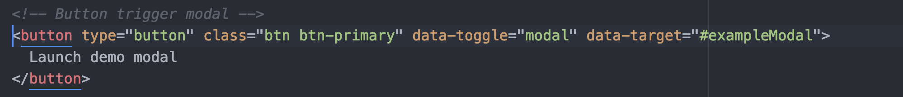
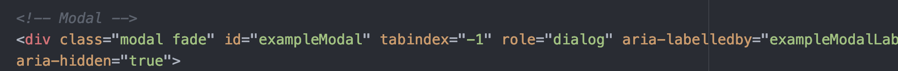
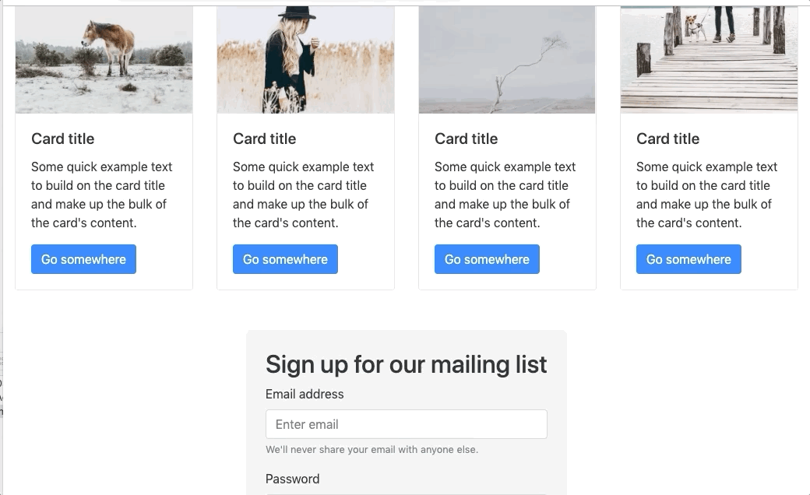
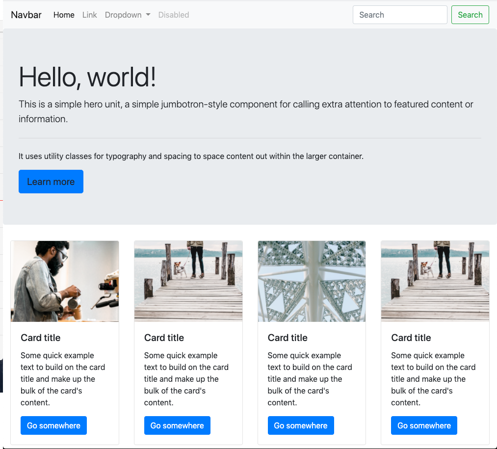
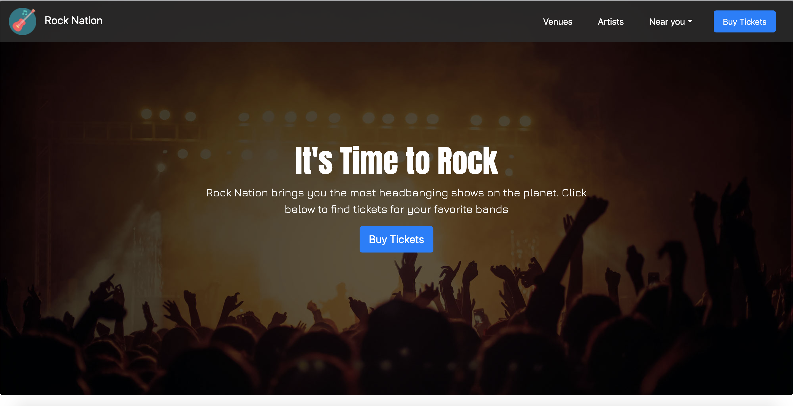
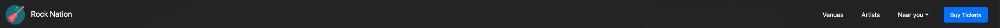

# 3.2 Lesson Plan: Customizing Bootstrap 4

## Overview

Today, you'll review Bootstrap components, and introduce some new ones. Then you will teach students how to customize Bootstrap, specifically the Bootstrap 4 template they created.

## Learning Objectives

By the end of class, students will be able to:

1. Create a fluid layout with the Bootstrap 4 built-in col system.
2. Build a desktop layout with three columns in Bootstrap using its built-in 12-column grid and user interface (UI) components.
3. Customize the Bootstrap 4 template's UI components.

## Instructor Notes

Remember, you can lose the class’s focus in the time it takes to open a new tab. Practice your transitions to and from the slideshow.

> **Recommendation:** Narrating what you're doing during transitions eases students’ feelings of uncertainty and fills awkward silences. Here are some examples of what you can say during common transitions:

* From sharing the slideshow to Zoom gallery view: “I’m going to stop sharing my screen for a moment while we review this activity.”
* From sharing the slideshow to sharing a tab on your browser: “Bear with me as I switch over to my browser for the next demonstration.”

> **Recommendation:** Transitions and activities tend to take longer in virtual classrooms. If you find that you are running short on time, feel free to combine or shorten activity reviews.

## Preparing for Class

**Review the slides beforehand.**

* [3.2 Customizing Bootstrap](https://docs.google.com/presentation/d/1mIZY9uTtyN5gkrg3hEUgpNNBpahCrlcQsJrWqSw7xBw/edit?usp=sharing).

* Make any teaching notes you'll need.

* As you lecture, relate your own on-the-job experience whenever possible to bring what students are learning to life and connect it to their future goals.

* Today, you'll show students how to overwrite and customize the template we created last class. You'll model these concepts, then your students will apply them in their activities.

* Before class, review and practice each demo for a smooth experience
  
* The demo files are located in the folder `activities/01-Ins-Demo-Files`.

* Consider the student questions that might arise during the demos or class. Make notes so that you can address them.

## Time Trackers

| Start  | #   | Activity Name                     | Duration |
| ------ | --- | --------------------------------- | -------- |
| 5:30PM | 0  | Office Hours                        | 0:30 |
| 6:00PM | 1  | Return to Bootstrap                 | 1:30 |
| 7:30PM | 2  | BREAK                               | 0:10 |
| 7:40PM | 3  | Customizing Bootstrap               | 1:20 |
| 9:00PM | 4  | Office Hours                        | 0:30 |
| 9:30PM | 5  | END                                 | 0:00 |

---

## Office Hours (30 mins)

> **Instructor note:** Encourage your students to make the most out of class and not to be afraid to ask questions.
>
> * Do your part by engaging students.

---

## 1. Return to Bootstrap (90 mins)

### 1.1 Instructor Do: Welcome and Components Review (10 min)

Welcome the students!

Open today's slides. [3.2 Customizing Bootstrap](https://docs.google.com/presentation/d/1mIZY9uTtyN5gkrg3hEUgpNNBpahCrlcQsJrWqSw7xBw/edit?usp=sharing).

Today will be a deeper dive into Bootstrap 4, so make sure that students are on steady footing and feel sufficiently comfortable with the basics of the tool.

Take questions that students might have from last class as you review the following concepts.

> **Recommendation:** Instead of switching to Zoom gallery view, have students share their answers in the Zoom chat or Slack, so they can refer to your shared screen to answer the questions.

**Ask:**

* "What is a Bootstrap 4 component?"

 _A Bootstrap 4 component is a prewritten piece of HTML code that can be pasted into your file._

* "Why would front-end developers use Bootstrap's components?"

 _Developers use Bootstrap 4 components to add elements like modals or cards without having to write the codebase themselves._

* "How does Bootstrap's grid system work? Why is the number 12 relevant to col classes?"

 _Bootstrap’s grid system works off its col classes. A col-number of 12 makes a responsive row._

### 1.2 Student Do: Add Containers, Rows, and Columns to Your Template Activity (15 minutes)

> **Recommendation:** This activity should be done individually, so you don’t need to create breakout rooms. Instead, make sure the whole class is muted and switch to Zoom gallery view, so you can monitor students as they work. Tell them that, if they have a question, they should share it on the #ClassActivities Slack channel and a member of the instructional staff will respond. If a student has a question that is relevant to the whole class, you or one of the TAs should unmute and share your answer with everyone.

Direct students to the activity, found in [02-Stu-Rows-Columns](./activities/02-Stu-Row-Columns/README.md).

#### Summary

In the previous lesson we introduced the concept of Columns and Rows. It's time for students to add this structure to their page by adding rows, containers, and columns.

#### Instructions

During this activity, students will follow the activity doc instructions to add containers, rows, and columns to their template. Students will also make their webpage responsive using the col classes.

_If students struggle:_ Syntax is important for creating containers, rows, and responsive columns. Make sure students wrap rows in containers and responsive columns inside rows.

_If students complete the activity early:_ Engage them in a conversation about how they could use components to speed up their design and development processes.

#### Instructors and TAs

> **Recommendation:** Be sure to check your #ClassActivities Slack channel for questions while students are working and provide feedback.

With your TAs, offer help where needed. Encourage students to help one another, too.

Students might encounter the following common problems:

1. It is common for students to improperly wrap their responsive columns, resulting in nothing happening.
2. Students may misunderstand how the column system works. Students may be confused that you have to add only the same class together to effect certain breakpoints.

#### Deliverable

Students' templates will now show a row that has four div children with responsive col classes medium–large.

### 1.3 Instructor Do: Add Containers, Rows, and Columns to Your Template Activity Review (10 minutes)

**Review students' experience**

Call the class back to attention so that you can lead a review of the activity.

Offer students actionable feedback that they can apply to their work. For example:

1. Designing your layouts first with a column can greatly help you when you go to code your work.
2. All websites are built off a column system. Bootstrap has created the column system for you, but some websites code their own completely from scratch!

**Review the concepts.**

> **Recommendation:** Stop sharing your screen, switch to gallery view, and use the "Raise Hands" feature in Zoom to gather answers. Share your screen again before continuing.

**Ask:**

* "What is the difference between a container and a container-fluid?"

 _A regular container has a fixed width of 1,024px. A container-fluid will span the entire width of the screen._

* "How does the col class system work conceptually?"

 _Each class represents a breakpoint, and the number associated with it (col-lg-4, for example) is added together with the rest of the other sibling elements. When the numbers in each child (three children with col-lg-4) add up to 12, it creates a fully responsive row._

Share some common misconceptions or FAQs about working with Bootstrap components. For example:

1. Bootstrap's column system can be used to create rows and columns.
2. Bootstrap's column system is actually powered by CSS Flex—any CSS Flex properties you learned previously will work here.

### 1.4 Instructor Do: Bootstrap Cards (15 minutes)

> 📌 **Important point:** Your goal is to introduce students to the Bootstrap **card** component and why using components with columns and rows can quickly make a responsive layout.

Help students see that designers use components hand in hand with the responsive classes we just talked about.

Containers, rows, and Bootstrap's col system can be used to create content right alongside structure quickly.

**Say:** "You can use Bootstrap's col system first to create structure (containers and rows). You can then use components to add prestyled content to your template (take cards, for example) and make your cards responsive using Bootstrap's col system."

A **card** is a UI design pattern that groups related information in a flexible-size container that visually resembles a playing card.

Cards visually separate and group content that is related. This introduces the technique "content chunking". Content chunking helps users find information that is relevant to their needs, encourage the learners to incorporate this idea into what they've learned during the UI sections of this boot camp.

Cards are rectangles full of inclusive images and text that serve as a teaser to more detailed information. This could be an article, a piece of art, or a project that is being shared.

Students have most certainly seen cards before without realizing it (e.g., websites like Pinterest, LinkedIn, or Facebook). They all use cards to give you enough information to get you interested. Cards are an easy way to partition content, making your UI easier to visually digest.

> **Instructor note:** Pause and take student questions about cards.

The best way to grasp cards is by seeing them in action. Transition into a demo of cards.

#### Bootstrap Cards Demo

> 📌 **Important point:** Your goal is to practice using Bootstrap card component and why using components helps speed up your design process.

Show students how cards work by giving a demonstration of using cards with Bootstrap.

1. Open the instructor demo file located in [Card Demo Files](./activities/01-Ins-Demo-Files/1_Cards).

2. Navigate to the documentation for Bootstrap cards.

3. Copy the code for the first card on the page. You will have to scroll down slightly.

4. Paste the code in between the rows that you have.

5. Refresh the page and see for yourself! It should look like this:

 ```html
 <div class="row"> <!-- This row is going to separate our content -->
 <div class="cardContainer col-lg-3 col-md-3 col-sm-12">
  <div class="card" style="width: 18rem;">
  
  <div class="card-body">
   <h5 class="card-title">Card title</h5>
   <p class="card-text">Some quick example text to build on the card title and make up the bulk of the card's content.</p>
   <a href="#" class="btn btn-primary">Go somewhere</a>
  </div>
  </div>
 </div>
 <div class="cardContainer col-lg-3 col-md-3 col-sm-12">
  <div class="card" style="width: 18rem;">
  
  <div class="card-body">
   <h5 class="card-title">Card title</h5>
   <p class="card-text">Some quick example text to build on the card title and make up the bulk of the card's content.</p>
   <a href="#" class="btn btn-primary">Go somewhere</a>
  </div>
  </div>
 </div>
 <div class="cardContainer col-lg-3 col-md-3 col-sm-12">
  <div class="card" style="width: 18rem;">
  
  <div class="card-body">
   <h5 class="card-title">Card title</h5>
   <p class="card-text">Some quick example text to build on the card title and make up the bulk of the card's content.</p>
   <a href="#" class="btn btn-primary">Go somewhere</a>
  </div>
  </div>
 </div>
 <div class="cardContainer col-lg-3 col-md-3 col-sm-12">
  <div class="card" style="width: 18rem;">
  
  <div class="card-body">
   <h5 class="card-title">Card title</h5>
   <p class="card-text">Some quick example text to build on the card title and make up the bulk of the card's content.</p>
   <a href="#" class="btn btn-primary">Go somewhere</a>
  </div>
  </div>
 </div>
 </div>
 ```

Cards are a very versatile feature of Bootstrap. It takes very little time and effort for a designer to customize a card, and they look great with minor tweaks.

> **Recommendation:** Take a moment to check in with the class and see how comfortable they feel about the material covered.
>
> * Stop sharing your screen for a moment and switch to gallery view in Zoom to see your class on one screen.
>
> * Ask the class to use the Zoom meeting reactions found in the "Meeting Controls" panel at the bottom of the Zoom window to use the thumbs-up 👍 or clap 👏 emojis if they're feeling comfortable and confident with the material you've covered so far.

Students will add cards to their layouts in the upcoming activity.

### 1.5 Student Do: Add Cards to Your Bootstrap Template Activity (10 minutes)

> **Recommendation:** This activity should be done individually, so you don’t need to create breakout rooms. Instead, make sure that the whole class is muted and switch to Zoom gallery view, so you can monitor students as they work. Tell them that, if they have a question, they should share it on the #ClassActivities Slack channel and a member of the instructional staff will respond. If a student has a question that is relevant to the whole class, you or one of the TAs should unmute and share your answer with everyone.

Direct students to the first activity, found in [activities/03-Stu-Cards/README.md](./activities/03-Stu-Cards/README.md).

#### Summary

In this activity, students are going to add cards to their pages.

#### Instructions

Students will follow the Google Doc instructions to copy and paste the code for a card component into their pages.

_If students struggle:_ First, make sure that students have correctly linked to Bootstrap's CDN with a link tag. Check the placement of the component; this should be an easy copy and paste. Make sure that students open the correct file in their web browsers.

#### Instructors and TAs

> **Recommendation:** Be sure to check your #ClassActivities Slack channel for questions while students are working and provide feedback.

* Broadcast a 2-minute warning to help them wrap up this work session.

With your TAs, address student questions as they arise.

Students might encounter the following common problems:

1. It is common for students to place their card components in the incorrect position. Lean on the solved file to show students where to place their cards.
2. Unlike the other components, cards display next to each other by default. Make sure that students place their cards inside a container for the correct layout.

#### Deliverable

Students' pages will now show two rows with four cards, each displaying content.

### 1.6 Instructor Do: Add Cards to Your Bootstrap Template Activity Review (5 minutes)

**Review students' experience.**

Call the class back to attention so that you can lead a review of the activity.

Offer students actionable feedback that they can apply to their work. For example:

1. Bootstrap components (like cards) can be made responsive using Bootstrap's grid system. Try making your cards responsive using Bootstrap's col system.
2. When using cards, make sure that you save images that are the same dimensions before you code your webpage. Using images with different dimensions will make your cards different heights and widths.

**Review cards concepts.**

> **Recommendation:** Stop sharing your screen, switch to gallery view, and use the "Raise Hands" feature in Zoom to gather answers. Share your screen again before continuing.

**Ask:**

"What is a card? Have you seen cards used on any big websites? Where?"

 _Cards are rectangles full of inclusive images and text that serve as a teaser to more detailed information. Some major examples are Facebook, Twitter, and Pinterest._

Share some common misconceptions or FAQs about working with Bootstrap components. For example:

1. Bootstrap cards will line up next to each other by default. You can alter this behavior using CSS Flex.
2. All of Bootstrap's CSS properties utilize CSS Flex and can be modified using CSS.

### 1.7 Instructor Do: Bootstrap Form and Modal Components (10 minutes)

> 📌 **Important point:** The goal is to introduce students to two more UI elements that we will be adding to our page—the form and the modal element.

First, you'll discuss forms, another simple-to-use Bootstrap component. Bootstrap forms do not require JavaScript to use on your page, but they do require knowledge of back-end scripting languages to function correctly.

Second, you'll introduce the modal component, which requires a jQuery/JavaScript snippet to make it function.

#### Bootstrap Form Components

A **form** on a webpage allows a user to enter data that are sent to a server for processing.

Form elements are common elements found on the web and are the primary mode of transportation of data. They are used to capture user, payment, or contact information. Bootstrap gives us a form that is quick to customize (or connect to a database).

They can have a variety of functions:

* Signing up for a website or app
* Submitting payment information
* Signing up for an email blast

Forms in the past were notoriously difficult to style, requiring additional code called a polyfill to look the same across browsers, such as Chrome, Safari, Firefox, or MS Edge.

This isn't a problem with Bootstrap's forms—they are already compatible across all browsers.

> :key: **Key tech note:** A polyfill is a piece of code (usually JavaScript on the web) used to provide modern functionality on older browsers that do not natively support it.

Bootstrap also has many custom form elements that can be added to your form to embellish it and make it look nice.

**TAs:** Slack out the following two links to the class:

* [Bootstrap Form](https://getbootstrap.com/docs/4.3/components/forms/)
* [Bootstrap Custom Form Elements](https://getbootstrap.com/docs/4.3/components/forms/#custom-forms)

> **Instructor note:** Students should bookmark these links to reference them during activities or to study them after class.

#### Bootstrap Modal Components

A **modal** is a graphical control element that is subordinate to an application's main window. It creates a mode that disables the main window but keeps it visible, with the modal window as a child window in front of it.

* Bootstrap's modals are components that come prebuilt with animations and transitions that make a fully functional, pleasing UI component.

Let's take a quick look at an example modal:


See the window that pops up? That is a modal.

Modals are built with HTML, CSS, and JavaScript.

They’re positioned over everything else in the document and darken the backdrop so that your user is focused on your content.

Modals should be used sparingly to avoid usability issues.

Modals can hold many different UI elements and are used to focus a user on a specific part of our UI.

> **Instructor note:** Never place a modal on a modal—it is a bad UX.

**Examples of modals:**

* Sign-in forms
* Payment forms
* Advertisements
* Information boxes

Modal elements were not common on the web before Bootstrap, partially because they require custom JavaScript code to function.

> **Instructor note:** Bootstrap also requires jQuery/JavaScript, but this code has already been written for you.

All you need to do is link to the Bootstrap's CSS and JavaScript files.

Bootstrap modals have two requirements:


The button has two attributes:

1. `data-toggle="modal"`: This attribute tells our button that it is connected to a Bootstrap modal element. This is required for our button to trigger a Bootstrap modal.

2. `data-target="#exampleModal"`: This attribute tells our button which modal element it is targeting.

   

3. In the image above, the only important element is the id. Notice how this id's name is the same as our data target above? Both target the id of an example modal. This attribute connects our modal to our button.

> **Instructor note:** Take questions that students might have about forms or modals before moving on.

Now that we have seen a few more Bootstrap components, it's time for students to take these components for a test run by adding form and modal components to their pages.

### 1.8 Student Do: Forms and Modals Activity (10 minutes)

> **Recommendation:** This activity should be done individually, so you don’t need to create breakout rooms. Instead, make sure that the whole class is muted and switch to Zoom gallery view, so you can monitor students as they work. Tell them that, if they have a question, they should share it on the #ClassActivities Slack channel and a member of the instructional staff will respond. If a student has a question that is relevant to the whole class, you or one of the TAs should unmute and share your answer with everyone.

Direct students to the activity, found in [activities/04-Stu-Forms/README.md](./activities/04-Stu-Forms/README.md).

#### Summary

In this activity, students will add a form and a modal component to their template, customizing their Bootstrap elements with HTML and CSS.

#### Instructions

Students will add a fluid container and a row to act as containing elements for their form. They will center the form on their page.

_If students struggle:_ Make sure that students have Bootstrap's script tags; modals will not function without this tag. Lean on the solved file if you are not an experienced front-end developer to show students how their code is different.

**BONUS:** Students will then add a Bootstrap modal to their sites and attach their modals to the button in the existing jumbotron so that it toggles. Students will then create forms inside of their modal windows.

#### Instructors and TAs

> **Recommendation:** Be sure to check your #ClassActivities Slack channel for questions while students are working and provide feedback.

While the activity is in process, make sure students are putting the Bootstrap form in the correct place in their HTML. Students are new to Bootstrap, and the HTML may visually overload them.

* Help students keep their work concise, condensed, and well-formatted.
* Help students who are having trouble getting their modal running.

Students might encounter the following common problems:

1. Often, students will forget their script tag, preventing their modal from functioning.
2. Modals also require modifications to the `data-target="#exampleModal"` and `id="exampleModal"`. If students attempt to trigger a modal on a button and the data target and CSS id (#) are not the same, (remember case sensitive matters) it will not launch the modal.

#### Deliverable

Students' pages should now match with the solved activity file located in the solved folder:



* Solved file location: [Bootstrap Forms and Modals Solved](./activities/04-Stu-Forms/solved/index.html)

### 1.9 Instructor Do: Forms and Modals Activity Review (5 minutes)

**Review students' experience.**

Call the class back to attention so that you can lead a review of the activity.

Offer students actionable feedback that they can apply to their work, for example:

1. Modals can contain all sorts of data. Design your modal's function first. What will your modal contain? A sign-up form or advertisement? The possibilities are endless.
2. Forms are the universal way to collect data on the web. You find forms in many places: sign-up forms, payment forms, surveys. Design the function of your form first, so you can customize your Bootstrap form quicker.

**Review forms and modals concepts.**

> **Recommendation:** Stop sharing your screen, switch to gallery view, and use the "Raise Hands" feature in Zoom to gather answers. Share your screen again before continuing.

**Ask:**

* "What are forms used for on the web? Why is the Bootstrap form useful?"

 _Forms are the primary method of data transfer on the web! Bootstrap provides an easy way to customize database forms._

* "What is a modal? What kind of UI elements might you find in a modal?"

 _Modals overlay the main window but keep the main window's content visible with opacity, with the modal window as a child window in front of it displaying our content to the user. A UI might use a modal to process information or display visual cards with choices._

Share some common misconceptions or FAQs about working with Bootstrap components. For example:

1. Bootstrap forms without back-end programming knowledge will not function. You can, however, still design the look and the feel of your form and have an engineer connect it to a database or script.
2. Bootstrap modal animations can be customized. You can target the HTML elements with your own style sheet or script tag.

---

## 2. BREAK (10 min)

That was a lot of work. Let's take a break and relax—you’ve earned it!

Let students know that next we'll introduce how to customize components.

> **Recommendation:** Don't stop sharing your screen. Put up a Google timer or a YouTube timer video to help get students back into the Zoom room on time.

---

## 3. Customizing Bootstrap (80 mins)

### 3.1 Instructor Do: Overwriting Bootstrap (10 minutes)

Next, we'll take our Bootstrap template and customize it to suit our needs.

> **Instructor note:** Encourage students to take creative liberties during the lecture and while working through the activities.
>
> * For example: Do students disagree with the color scheme of the site we're building? Awesome! Encourage them to make it their own. Students who are comfortable with their CSS should practice tailoring their template's CSS style.

Let students know that they'll practice customizing Bootstrap 4 templates and overriding Bootstrap's CSS properties in a series of activities to build a site layout for Rock Nation. In the process, they'll develop skills for customizing quickly and effectively:

* Constructing a Bootstrap 4 prototype quickly and then customizing it to fit a design.
* Customizing Bootstrap 4 templates, greatly reducing development time for personal and professional projects.
* Working quickly to construct prototypes that convey the functionality of the UI (design teams typically use agile to design features).

> **Important point:** The goal of this section is to prepare students to be able to overwrite Bootstrap 4's CSS file with their own styles and load a custom style sheet. You will also touch on how content delivery networks (CDNs) are loaded into HTML documents. This lecture supports today's first learning objective, which is for students to customize the Bootstrap 4 template's UI components, including buttons, navigation, and cards.

In this section, you'll introduce how to begin customizing Bootstrap 4 components.

> **Employer competitive note:** Overwriting Bootstrap 4 styles will improve students' design work when creating Bootstrap 4 design files. Professionally, Bootstrap 4 is used to prototype a UI quickly with components customized to fit your design file. Having a working knowledge of how to overwrite Bootstrap 4 styles will help students design better because they know the limitations of working with Bootstrap 4 components.

"Overwriting Bootstrap" literally refers to overwriting Bootstrap 4's CSS file to customize components. When overwriting a Bootstrap 4 component, you'll need to have your own style sheet linked below Bootstrap 4's link tag so that your file loads second and overwrites Bootstrap's.

Bootstrap 4 on its own is useful, but being able to create fully responsive components simply by overriding default styles is Bootstrap 4's real power. Bootstrap was designed to create fully responsive, customized websites quickly—you can do this by overwriting Bootstrap's custom CSS styles to match your design. For example, by overriding styles, you can do the following:

* Change the background color or image of a component.
* Modify any style to visually fit your design file.

Bootstrap 4 classes are usually overwritten using your own custom classes that you then style to make components your own.

Bootstrap 4 comes with all the CSS and HTML you’ll need to create a template efficiently. Its real power is in creating a responsive, clean template quickly—a real time saver. We can then customize our template to look however we want.

* Consider the prior template's look. We developed a Bootstrap 4 template using components and the Bootstrap col system. You might have noticed that it doesn't look the best. Bootstrap components are meant to be overridden to create a full-color design.

Below is what we developed:



Fairly "Bootstrap looking," right?

Below is a peek at what it'll look like once we ovewrite the components:



Much better! Transforming a template from just components to a full design is how Bootstrap's components are meant to be used.

If you don't customize components, your design will still look and feel "Bootstrappy," and clients and business stakeholders will be able to tell. The whole goal for a UX designer is to create an experience!

**How does overwriting happen?**

First, students need to understand that internet browsers load files top–down, meaning that line 1 loads first, followed by line 2, and so on, until the entire page loads. So style sheets that load second will overwrite those style sheets that loaded first.

Load style sheets like so:

```html
<!-- Bootstrap 4 CSS -->
<link rel="stylesheet" href="https://stackpath.bootstrapcdn.com/bootstrap/4.3.1/css/bootstrap.min.css" integrity="sha384-ggOyR0iXCbMQv3Xipma34MD+dH/1fQ784/j6cY/iJTQUOhcWr7x9JvoRxT2MZw1T" crossorigin="anonymous">
<!-- Load our custom stylesheet 2nd to overwrite bootstrap with our custom styles-->
<link rel="stylesheet" href="css/index.css">
```

> :key: **Key tech note:** Remember, the browser reads HTML top–down. By loading our custom style sheet second, we overwrite Bootstrap 4 with our own custom styles.

Any CSS file (or JavaScript) loaded second will overwrite CSS styles loaded previously. This is how to write a custom CSS on a Bootstrap 4 component. In your custom style sheet, you can target the Bootstrap 4 elements and write your custom CSS to overwrite Bootstrap 4's component styles.

> **Instructor note:** Pause to take questions about the concept of overwriting Bootstrap and its benefits.

Next, transition to a wider view about value propositions on the web. This will provide context for work that follows and will remind students to keep the user top of mind.

### 3.2 Instructor Do: Customize a Search Bar Demo (10 minutes)

> **Recommendation:** Navigate away from the slideshow for this demonstration. If you shared your entire desktop, make sure to open your files on that shared desktop. If you shared a single window, be sure to re-share your screen to capture the appropriate window or desktop. Remember to narrate what you are doing during transitions and demonstrations. In this instance, you might say:

“I’m now going to switch from the slideshow to another tab, so I can demonstrate how to customize a search bar.”

This demo will cover:

* Showing the basic steps involved in redesigning a search bar into something more professional.
* Helping students understand that cutting some content out of Bootstrap 4 is OK, even expected.
* How to use the `!important` tag to overwrite stubborn Bootstrap 4 styles.
* Demonstrating the automatic margins for aligning items/content inside a container.

Begin by showing students how to customize the navbar's elements and add their own logo to the navigation component.

**Say:** "It’s time to apply the HTML and CSS skills we learned in the first two weeks!"

> Open the instructor demo file located at [activities/01-Ins-Demo-Files/2_Search/index.html](./activities/01-Ins-Demo-Files/2_Search/index.html).

* You will use this file for the rest of today's demos.

1. In the Navbar section, add a logo that you like in place of the text `Navbar`. Add an image tag that targets one of the logos in the images folders: [Logos folder location](./activities/01-Ins-Demo-Files/Student-InClass-Activity-Solution/starter/images/Logos).

 ```html
 <a class="navbar-brand" href="#">Navbar</a>
 ```

 The end result should look like the following:

 ```html
 <a class="navbar-brand" href="#"></a>
 ```

1. Great! Now let's delete the search bar, so we can simplify our header. A search bar is a form located on lines 44–47. Delete those lines of code.

 ```html
 <form class="form-inline my-2 my-lg-0">
 <input class="form-control mr-sm-2" type="search" placeholder="Search" aria-label="Search">
 <button class="btn btn-outline-success my-2 my-sm-0" type="submit">Search</button>
 </form>
 ```

1. Now let's align our navbar to the right. Write a class that targets the class of `navbar-nav` (this is Bootstrap 4's default nav class). It should look like this:

 ```css
 .navbar-nav {

 }
 ```

1. Add the CSS properties `margin-left: auto;` and `margin-right: 0 !important;`.

 Explain that `margin-left: auto;` or `margin-right:auto;` will position block-level elements to the far left or far right side of their containers, respectively.

 It should look like the following:

 ```css
 .navbar-nav {
  margin-left: auto;
  margin-right: 0 !important;
 }
 ```

> :key: **Key tech note:** With Bootstrap 4 CSS, you'll encounter the `!important` tag often. Bootstrap 4 does this to ensure that Bootstrap's look and feel remains consistent across all browsers. If you can't get a style to work, double-check in Chrome Web Inspector for CSS properties with `!important`.

> **Instructor note:** Pause here to take questions.

> **Recommendation:** Take a moment to check in with the class and see how comfortable they feel about the material covered.
>
> * Stop sharing your screen for a moment and switch to gallery view in Zoom to see your class on one screen.
>
> * Ask the class to use the Zoom meeting reactions found in the "Meeting Controls" panel at the bottom of the Zoom window to use the thumbs-up 👍 or clap 👏 emojis if they're feeling comfortable and confident with the material you've covered so far.

To help students remember what we just learned, it's time for students to customize their own navigation.

### 3.3 Student Do: Webpage Funnel Customization: Part 1 - Navbar Activity (15 minutes)

> **Recommendation:** This activity should be done individually, so you don’t need to create breakout rooms. Instead, make sure that the whole class is muted and switch to Zoom gallery view, so you can monitor students as they work. Tell them that, if they have a question, they should share it on the #ClassActivities Slack channel and a member of the instructional staff will respond. If a student has a question that is relevant to the whole class, you or one of the TAs should unmute and share your answer with everyone.

Direct students to the first activity, found in [activities/05-Stu-Custom-Navbar/README.md](./activities/05-Stu-Custom-Navbar/README.md).

#### Summary

Students will customize their site’s navbar to reflect the site’s layout and overall brand identity better.

#### Instructions

Students will follow the instructions in the activity document:

Part 1: Students will update the HTML in their index.html file.

Part 2: Students will update the CSS in their index.css file.

> **Instructor note:** Students are provided an activity starter file in their activities folder.

_If students struggle:_ Double-check the placement of the student's style sheet; it must be second to Bootstrap 4's CDN link tag. If that doesn't work, play with the student's code in the Web Inspector and use the `!important` tag to override difficult CSS properties.

_If students complete the activity early:_ Share the following [resource](https://uxplanet.org/how-to-customize-bootstrap-b8078a011203) with them.

#### Instructors and TAs

_If you're a skilled front-end developer:_ Support students who have problems with Bootstrap 4. Answer their questions and help them understand why they ran into their problem.

_If you aren't a skilled front-end developer:_ If students ask you for help and you don't know how to solve the problem, direct them toward the solved file.

Students might encounter the following common problems:

1. A student's link tag for their own custom style sheet might not be placed below Bootstrap 4's style sheet.
2. Students might need to use the `!important` tag and not realize it.

#### Deliverable

Students will have customized navigation that looks like the following:


Now that students have customized their navigation, let's do a quick peer review of each other's work.

### 3.4 Instructor Do: Webpage Funnel Customization: Part 1 - Navbar Activity Review (10 minutes)

> **Recommendation:** If you’ve made one of the TAs a co-host of the webinar, they should create breakout rooms for the groups of students to review the activity. Follow [these instructions](https://docs.google.com/document/d/1LxiakaFMQ7FlnhcbgnZvW7bCqGBeDx1SJgZ8qMWVLAg/edit?usp=sharing) to pre-assign breakout rooms for this review.

**Review heights and widths.**

**Say:** "In the previous activity, you might have noticed that we used ```height: calc(100vh - 25px);```. We'll discuss this in the following section."

> :key: **Key tech note:** **Heights and widths** can both be calculated using math and the `calc()` CSS property. It will take a measurement of the browser window (height or width) and calculate the remaining space based on parameters you enter. This technique is commonly employed using -100px (as an example). The code used in the activity will fill 100% of the viewer height minus 25px.

**Review activity.**

To ensure that students get the most from what they just learned, invite them to review each other's work. Have students pair up in groups of two or three and ask each other the following questions:

1. "Did you have any trouble overwriting Bootstrap 4?" (See if they can fix the problem together.)
2. "Are there any design choices that you would do differently for this navigation?"

* Offer students actionable feedback that they can apply to their work. For example:

1. Any CSS property in Bootstrap can be overridden to match your design file. Try overriding CSS properties with `!important` if you can't get it to work correctly.
2. Navbars can display as a sidebar or on the top of your website. How your navigation displays is up to you as a designer.

Share a common misconception or FAQ about customizing Bootstrap 4 components. For example:

* Bootstrap components are designed to be overridden. Components are used to speed your workflow.

Next, you'll demo how to customize the jumbotron component.

### 3.5 Instructor Do: Customize Our Jumbotron! (10 minutes)

A **jumbotron** indicates a big box for calling extra attention to some special content or information.

Students will also learn how to responsively set heights of elements that calculate based on the height of the viewport window.

As you give the demo, encourage students to think about how these components can be altered in a more professional-looking, user-centered fashion.

Inside a jumbotron, you can put nearly any valid HTML—including other Bootstrap elements/classes.

> :key: **Key tech note:** Jumbotrons are highly customizable and are used to focus users on a specific CTA (the most important one). Being able to use ANY markdown in a jumbotron makes customizing the message you send very open!

**Say:** "Let's make our jumbotron more appealing and learn some more CSS tricks along the way."

> **Recommendation:** Navigate away from the slideshow for this demonstration. If you shared your entire desktop, make sure to open your files on that shared desktop. If you shared a single window, be sure to re-share your screen to capture the appropriate window or desktop.

Remember to narrate what you are doing during transitions and demonstrations. In this instance, you might say:

“I’m now going to switch from the slideshow to another tab, so I can demonstrate how to customize a Jumbotron.”

In this demo, you'll show how to customize a jumbotron component to look like a real hero section, complete with a CTA. The key takeaway is that students will be able to take a basic component and turn it into professional-looking work _fast_.

> Open the starter/index.html file from the previous demo.

1. Target the class `jumbotron` for our element with the class jumbotron.

   The result should look like the following:

   ```css
   .jumbotron {
   
   }
   ```

2. Let's give this jumbotron a height. Add the CSS property.

   ```css
   height: calc(100vh - 25px);
   ```
  
   Tell the class that you can use `calc()` in either height or width to calculate the remaining   space.

3. Add the CSS property.
  
   ```css
   background-image: url(../images/rockOn_dark.jpg);
   ```
  
   This property adds a background image on the element on which you added it.

4. Add the CSS property.

   ```css
   background-size: cover;
   ```
  
   This property will stretch a background image to fill the entire background of its container.

5. Add the CSS property.

   ```css
   background-repeat: no-repeat;
   ```
  
   By default, background images will tile in the background of our image. `no-repeat` prevents   that from happening.

6. Let's turn our jumbotron into a Flex container to easily control our content inside of it.

    Give display flex to the jumbotron.

    ```css
    .jumbotron {
     display: flex;
    }
    ```

   * Bootstrap 4 is written using Flex. Any of the Flexible Box Model properties we have discussed in previous modules apply here in Bootstrap 4.

7. Lastly, let's center our content using `align-items` and `justify-content`. What we learned in previous modules is still applicable here.

 ```css
 .jumbotron {
  display: flex;
  align-items: center;
  justify-content: center;
 } 
 ```

 The result should look like this:

 ```css
 .jumbotron {
  height: calc(100vh - 25px);
  background-image: url(../images/rockOn_dark.jpg);
  background-size: cover;
  background-repeat: no-repeat;
  display: flex;
  align-items: center;
  justify-content: center;
 }
 ```

> **Instructor note:** Pause here to take questions.

> **Recommendation:** Take a moment to check in with the class and see how comfortable they feel about the material covered.
>
> * Stop sharing your screen for a moment and switch to gallery view in Zoom to see your class on one screen.
>
> * Ask the class to use the Zoom meeting reactions found in the "Meeting Controls" panel at the bottom of the Zoom window to use the thumbs-up 👍 or clap 👏 emojis if they're feeling comfortable and confident with the material you've covered so far.

Students have learned some interesting tricks and should start feeling capable of using CSS to overwrite templates. Next, they'll practice customizing a jumbotron on their own.

### 3.6 Student Do: Webpage Funnel Customization: Part 2 - Jumbotron Activity (15 minutes)

> **Recommendation:** This activity should be done individually, so you don’t need to create breakout rooms. Instead, make sure that the whole class is muted and switch to Zoom gallery view, so you can monitor students as they work. Tell them that, if they have a question, they should share it on the #ClassActivities Slack channel and a member of the instructional staff will respond. If a student has a question that is relevant to the whole class, you or one of the TAs should unmute and share your answer with everyone.

Direct students to the activity, found in [activities/06-Stu-Custom-Jumbotron](./activities/06-Stu-Custom-Jumbotron/README.md).

#### Summary

Students will customize a jumbotron themselves. During the process, students will learn about overriding Bootstrap 4 styles and learn some new tricks using view height to calculate the height of an element.

#### Instructions

Students will follow the instructions in the activity document:

Part 1: Update the HTML of the jumbotron element.

Part 2: Update the CSS of the jumbotron element.

_If students struggle:_ Double-check the placement of the student's style sheet; it must be second to Bootstrap 4's CDN link tag. If that doesn't work, play with the student's code in the Web Inspector and use the `!important` tag to override difficult CSS properties.

_If students complete the activity early:_ Share the following [resource](https://hackerthemes.com/kit/) with them.

#### Instructors and TAs

_If you're a skilled front-end developer:_ Support students who have problems with Bootstrap 4. Answer their questions and help them understand why they ran into their problem.

_If you aren't a skilled front-end developer:_ If a student asks you for help and you don't know how to solve the problem, direct them toward the solved file.

Students might encounter the following common problems:

1. The student's link tag for their own custom style sheet might not be placed below Bootstrap 4's style sheet.
2. Students may need to use the `!important` tag and not realize it.

#### Deliverable

Students will have customized hero images that resemble the following:


Before we move onto the next section, let's review each other's work and talk as a group.

### 3.7 Instructor Do: Webpage Funnel Customization: Part 2 - Jumbotron Activity Review (10 minutes)

> **Recommendation:** If you’ve made one of the TAs a co-host of the webinar, they should create breakout rooms for the groups of students to review the activity. Follow [these instructions](https://docs.google.com/document/d/1LxiakaFMQ7FlnhcbgnZvW7bCqGBeDx1SJgZ8qMWVLAg/edit?usp=sharing) to pre-assign breakout rooms for this review.

To recap what students just learned, have them review each other's work.

**Ask the class to take a screenshot of their work and share via Slack.**

Students should discuss in their groups:

1. "Did you have any trouble centering the content inside the jumbotron?"
2. "Are there any design choices that you would do differently for this jumbotron?"

Offer students actionable feedback that they can apply to their work. For example:

1. There are multiple jumbotron components you can use in your work. Pick the one that best fits your design.
2. Don't just customize the layout of your jumbotron—try building new content inside of it.

Share some common misconceptions or FAQs about customizing Bootstrap 4 components. For example:

1. Jumbotrons can be given background images or colors depending on your preference.
2. Jumbotrons can be turned into full-screen images or just a section on a website. What CSS you use to customize your jumbotron is up to you.

> **Instructor note:** Pause and take any remaining questions.

Great job!

Thank the class for their work today.

Let them know that, in the next lesson, we'll customize the rest of the template, create a Bootstrap 4 template based on a design prompt, and cover how to be a successful freelancer.

## 4. Office Hours (30 minutes)

Remind students that you're holding office hours and are available to help your class with whatever questions or problems they may have.

## 5. END (0 min)

Say goodnight and dismiss the class.

---

© 2022 edX Boot Camps LLC. Confidential and Proprietary. All Rights Reserved.
