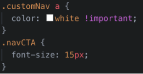

# Custom Webpage Navbar

Every website needs an intuitive and well-crafted navigation layout so that users can quickly get to the content they’re seeking. Bootstrap’s default navigation component offers a pretty good solution, but what if it doesn’t match your design’s layout and mood? 

In this activity, you’ll customize your site’s navbar to better reflect the site’s layout and overall brand identity.

  

## Instructions

### Part 1: Update the HTML

1. Open the `starter` folder and navigate to `index.html`. 
- You will build on this file for all of today’s activities.

2. Add the `customNav` class to the `<nav>` element.
- You will use this new class to style your navbar later.

3. Update the first `<a>` tag by replacing the Navbar text with the following:
- An ` tag`.
- Add the text `Rock Nation`.

4. Make the following text changes to the list items in the navbar:
- Change `Home` to `Venues`, `Link` to `Artist`, and `Dropdown` to `Near You`.

5. Change the three `dropdown` options to `Venues`, `Artists`, and `Upcoming Acts`.
- **Hint:** You can find these dropdown items in the dropdown menu `
`.

6. Next, delete the `<form>` element from the template navbar.

7. Lastly, you will add a new navigation list item with a button inside:
- Add a `<li>` tag after the dropdown `<li>`.
- Give it the same class name as the other `<li>` elements in the navbar.
- Add a `<a>` tag with the following properties:
  - `btn btn-primary btn-lg navCTA classes`
  - `href="#"`
  - `role="button"`
  - `Buy Tickets` text

8. You can view your changes in your browser, but there won’t be much to see yet!

### Part 2: Update the CSS

1. Open `index.css`.
- You will notice three selectors already created. Add your custom CSS above these prewritten selectors.

2. Create a selector that targets all the heading tags (`<h1>` through `<h6>`).

- You can target multiple elements, classes, or IDs with the following syntax:

 `element1, element2, ... {
   .example-class
}`

3. Add the property `font-family` and set its value to `'Anton', sans-serif;`.

4. Add a selector that targets the `
` element and sets its `font-family` to `'Jura', sans-serif;`.

5. Add the following selectors, properties, and values to begin styling your navbar:

> Note the use of `!important` to force some CSS rules to apply.

- [What does `!important` mean?](https://www.lifewire.com/what-does-important-mean-in-css-3466876)

  

6. Setting the `z-index value` for the `customNav` class ensures that the navbar is above other content on the page.

7. Next, customize the drop-down menu with the following CSS:
	
  

- The `:focus` and `:hover` pseudo-classes allow us to apply particular styling when a user interacts with an element.

8. Lastly, customize the button and links in the navigation with the following:

  

Now you have a fully customized navbar for your site!

Great work!

---

© 2022 edX Boot Camps LLC. Confidential and Proprietary. All Rights Reserved.
