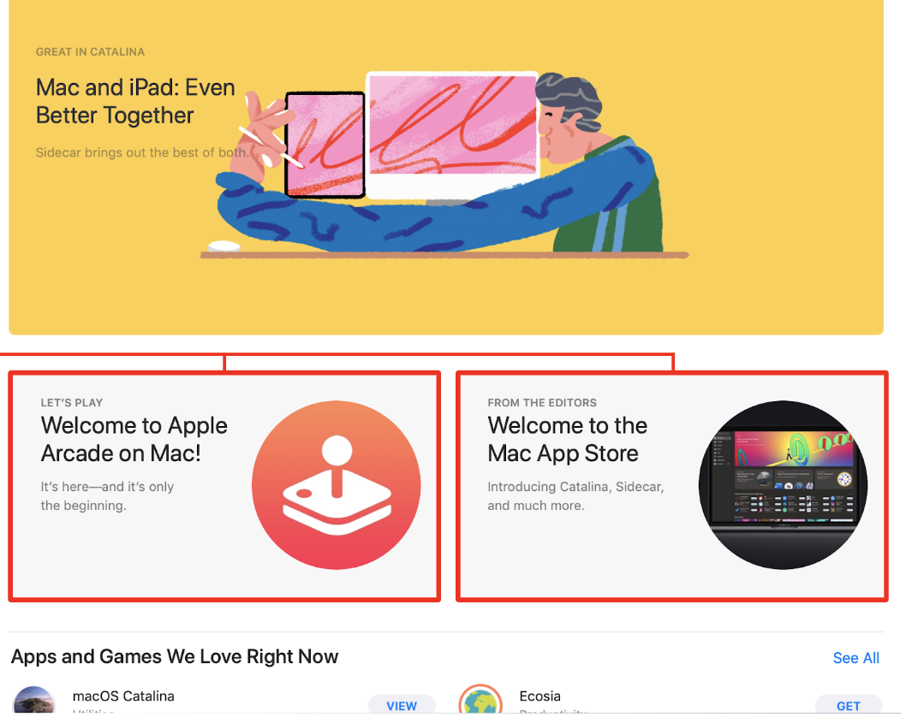
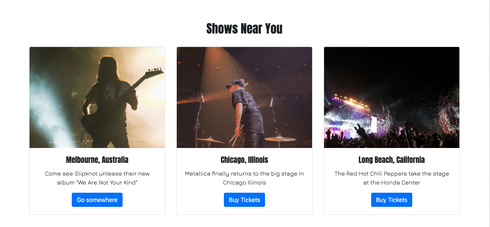

# 3.3 Lesson Plan: Custom Webpages

## Overview

Today, students will continue to learn how to customize Bootstrap content. Then they will follow a creative prompt to code a one-page website. They will get real-world experience by being asked to take a design then use assets to code the design using HTML and CSS.

## Learning Objectives

By the end of class today, students will:

1. Customize Bootstrap Components

2. Code a one-page website based on a prompt.

## Preparing for Class

**Review the slides beforehand.**

* [3.3 Slides: Freelance Tools and Web-Ready Images](https://docs.google.com/presentation/d/1O8ckkG6rNpgM0XBH6OWI57u9eXSXtYTiBcpOYUfyl_4/edit?usp=sharing)

* Make any teaching notes you'll need.

* As you lecture, relate your own on-the-job experience whenever possible to bring what students are learning to life and connect it to their future goals.

* Come ready with Bootstrap 4 knowledge. Students will attempt to build a whole layout using Bootstrap alone. Review the following, so you can support them:
  * [Bootstrap 4 components](https://getbootstrap.com/docs/4.4/components/alerts/)
  * [Bootstrap's responsive column system](https://getbootstrap.com/docs/4.4/layout/overview/)

* Students will have a lot of questions today. As stated above, students will build a layout without any directions or assistance. They might ask the following:
  * "How do I customize a component to fit the design file given to me?"
  * "How do I make my layout responsive using the Bootstrap 4 column system?"
  * "Which component do I select to build the layout?"

* Since part of today will be a hands-on practice day, prepare yourself for the time needed to help students, one on one.
  * Give extra support to students who are struggling during the activities.

* Make sure that you're well aware of the one-page layout and key takeaways for all activities before class.
  * **Tip:** If you have time, practice building this layout yourself using Bootstrap 4 components and the four-column system. That way, you'll share the same experience as your students and be prepared to empathize and answer their questions.

## Time Tracker

| Start  | #   | Activity Name                     | Duration |
| ------ | --- | --------------------------------- | -------- |
| 5:30PM | 0  | Office Hours                        | 0:30 |
| 6:00PM | 1  | Customizing Bootstrap Continued     | 1:15 |
| 7:15PM | 2  | BREAK                               | 0:10 |
| 7:25PM | 3  | Webpage from Scratch                | 1:35 |
| 9:00PM | 4  | Office Hours                        | 0:30 |
| 9:30PM | 5  | END                                 | 0:00 |

### Tips for Class

**Help students program.**

* Many students will be nervous about getting into programming. Some might even have impostor syndrome. Reassure students that these feelings are normal and will pass. After all, they're learning a new language.

  * Be sure to mention that the best way to feel more comfortable working with code is to *code*! Every coder working today had to begin somewhere. Your students are no different today than coders were when they started. Practice makes perfect; the best way to get rid of impostor syndrome is to practice.

**Share anecdotes about your journey.**

* Don't be afraid to talk about the difficulties you experienced when you first started learning how to program. Knowing that you also struggled will help students feel better about not completely understanding the material yet.

## Office Hours (30 minutes)

Encourage students to come early, use the time provided, and not to be afraid to ask questions.

> Do your part by engaging students who come early and participate in office hours.

---

## 1. Customizing Bootstrap Continued (75 mins)

### 1.1 Instructor Do: Welcome and Bootstrap Review (5 minutes)

Welcome the students!

Open  today's slides. [3.3 Slides: Freelance Tools and Web-Ready Images](https://docs.google.com/presentation/d/1O8ckkG6rNpgM0XBH6OWI57u9eXSXtYTiBcpOYUfyl_4/edit?usp=sharing).

**Review Bootstrap concepts.**

* Begin class with a quick recap of what they have learned so far about Bootstrap components, responsive classes, and how to customize Bootstrap. Review these key points:
  * Components are used to quickly construct a layout. The elements can then be customized to fit your design, speeding your workflow.
  * The responsive column system always adds up to 12 for a row of content.
  * You can use multiple Bootstrap column classes to control how and when your content responds to different viewport widths.
  * Any CSS Flex property you learned can be applied to Bootstrap 4 because Bootstrap 4 was written using CSS Flex.

**Review today's objectives.**

In order to successfully complete the project later, we need to finish covering how to customize different Bootstrap components.

### 1.2 Instructor Do: UI Elements: Cards (20 minutes)

> 📌 **Important point:** Your goal in this section is to introduce students to the UI card element and give students some best practices when it comes to designing cards for the web.

> :briefcase: **Employer competitive note:** Cards are a common UI component on the web and can be designed in many different ways. As a UX designer, by customizing Bootstrap cards, you can create designs and prototypes that use cards in unique and eye-catching ways.

Begin by introducing the problem that cards solve.

**Ask:**

1. "Can anyone think of a container that holds a few related things?"

    *All responses are welcome and don't have to be UX/UI-specific (e.g., jewelry box, a Ziplock bag, or a silverware drawer).*

2. "What about a container that holds related things *connecting* to a container with more related things?"

    *This one's harder. Responses might include a post office box, a window display at a department store, or a car sales lot.)*

**Cards** are UI elements used to separate similar content visually with a literal box. The purpose of cards is to make your content more digestible by grouping elements together that have related content.

**Connect cards to UX/UI.**

Cards are a design pattern we discussed during an earlier section of the Boot Camp. You'll see cards in both Google's material design toolkit and on popular websites like Facebook or Twitter.

Students have seen cards if they've used the internet. Websites like Facebook, Twitter, and Pinterest are places where cards as a design trend became popular.



Point out how each card contains only information that relates to everything else in the card. Cards take your content and break it into bite-size chunks for our users.

#### Card Design Best Practices

1. **Keep it simple.** Cards are used to focus our users on specific information. Everything in the card should be relevant.
2. **Direct your user to the desired action.** Users will automatically want to click on cards when they see them. Give them clear CTAs and ways to convert on your content.
3. **Use images strategically.** Use eye-catching imagery that relates to the topic of the card. If the images and headline don’t match, there will be confusion.
4. **Support micro-interactions.** Even simple interactions add life to your cards (like, share, favorite button, etc.).

#### Customize Bootstrap 4 Cards Demo

> :pushpin: **Important point:** Your goal is to reintroduce students to Bootstrap's grid system and show them how to add Bootstrap 4's col classes to the layout to make it respond correctly. Reinforce how Bootstrap's col system works by customizing how your cards respond to your template.

In this demo, you'll demonstrate how to alter card components using Bootstrap 4's col system to respond based on your layout's needs. First, we'll cover some basic information on cards.

> Open the starter file found in `activities/01-Ins-Demo-Files/1_Custom-Cards`

We need to update our containers to fit a three-column layout.

In your cards, update the col classes to look like this:

```html
<div class="cardContainer col-lg-4 col-md-4 col-sm-12">
```

* Do this to the cards on lines 66, 79, and 92.
* Explain to the class the math behind the col classes.
  * col-lg-4 will create a three-column responsive layout for screen sizes greater than or equal to 992px.
  * col-md-4 will create a three-column responsive layout for screen sizes greater than or equal to 74px.
  * col-sm-12 will create a one-column layout for screen sizes up to 576px.

> **Instructor note:** Pause here to take questions.

> **Recommendation:** Take a moment to check in with the class and see how comfortable they feel about the material covered.
>
> * Stop sharing your screen for a moment and switch to gallery view in Zoom to see your class on one screen.
>
> * Ask the class to use the Zoom meeting reactions found in the "Meeting Controls" panel at the bottom of the Zoom window to use the thumbs-up 👍 or clap 👏 emojis if they're feeling comfortable and confident with the material you've covered so far.

Students should now have a good understanding of how to customize Bootstrap. They will now customize the rest of their template using what they have learned.

### 1.3 Student Do: Webpage Funnel Customization: Part 3 - Cards to Footer (30 minutes)

> **Recommendation:** This activity should be done individually, so you don’t need to create breakout rooms. Instead, make sure that the whole class is muted and switch to Zoom gallery view, so you can monitor students as they work. Tell them that, if they have a question, they should share it on the #ClassActivities Slack channel and a member of the instructional staff will respond. If a student has a question that is relevant to the whole class, you or one of the TAs should unmute and share your answer with everyone.

Direct students to the first activity, found in [activities/02-Stu-Custom-Webpage](./activities/02-Stu-Custom-Webpage/README.md).

#### Summary

Students will customize the cards, content, and footer on their template site to practice their HTML and CSS skills.

#### Instructions

Students will follow the instructions in the activity document:

Part 1: Update the HTML and CSS of the cards.

Part 2: Update the HTML and CSS of the content.

Part 3: Update the HTML and CSS of the footer.

*If students struggle:* Double-check the placement of the student's style sheet; it must be second to Bootstrap 4's CDN link tag. If that doesn't work, play with the student's code in the Web Inspector and use the `!important` tag to override difficult CSS properties.

*If students complete the activity early:* Share the following resources with them:

* [Card Based User Interfaces](https://www.smashingmagazine.com/2016/10/designing-card-based-user-interfaces/)
* [Bootstrap Grid System](https://www.tutorialrepublic.com/twitter-bootstrap-tutorial/bootstrap-grid-system.php)
* [Website Footer Design Best-Practices](https://www.orbitmedia.com/blog/website-footer-design-best-practices/)

#### Instructors and TAs

*If you're a skilled front-end developer:* Support students who have problems with Bootstrap 4. Answer their questions and help them understand why they ran into their problem.

*If you aren't a skilled front-end developer:* If a student asks you for help and you don't know how to solve the problem, direct them toward the solved file.

Students might encounter the following common problems:

1. A student's link tag for their own custom style sheet might not be placed below Bootstrap 4's style sheet.
2. Students might need to use the `!important` tag and not realize it.
3. Students might place the footer in the incorrect location—double-check the placement of the student's HTML.

With the instructional staff, help students who are stuck and give design tips for how to make the copy visually pleasing.

#### Deliverable

Students will have customized cards that resemble the following:


Students will have customized content that look like the following:


Students will have a customized footer that looks like the following:


Let's review each other's work before moving onto the next activity.

### 1.4 Instructor Do: Webpage Funnel Customization: Part 3 - Cards to Footer Review (20 minutes)

> **Recommendation:** If you’ve made one of the TAs a co-host of the webinar, they should create breakout rooms for the groups of students to review the activity. Follow [these instructions](https://docs.google.com/document/d/1LxiakaFMQ7FlnhcbgnZvW7bCqGBeDx1SJgZ8qMWVLAg/edit?usp=sharing) to pre-assign breakout rooms for this review.

To recap what students just learned, have them review each other's work.

**Ask the class to take a screenshot of their work and share via Slack.**

Students should discuss in their groups:

1. "Do you like the images used here?"
2. "How would you tweak this design?"
3. "Did you have any trouble getting your cards to respond correctly?"
4. "Do you like how the content is laid out here? What would do you differently?"
5. "Did you have any trouble getting your containers to work properly?"

Offer students actionable feedback that they can apply to their work. For example:

1. Bootstrap 4 is built using CSS Flex. When customizing components, keep in mind that any CSS Flex property will work on any Bootstrap 4 components.
2. Bootstrap 4 components' responsiveness can be altered by using different column classes. Try to alter the responsiveness of your template by using the different classes.
3. You can have your layout display as either columns or rows—just apply flex direction to alter the behavior of your columns.
4. Use multiple rows in your layout. Rows are used to separate content and can also be customized to suit your design.
5. For professional websites, footers often contain legal information on the use of the particular site. Make sure that you have all the relevant information in your footer for users exploring your site.
6. You can custom build elements in a Bootstrap template. Just because you installed Bootstrap doesn't mean you have to adhere strictly to using it.

> **Instructor note:** Pause to take questions before moving on to the next student activity.

Share some common misconceptions or FAQs about customizing Bootstrap 4 components. For example:

1. Cards can be filled with text, a CTA, or just an image. The way your card displays is up to you as a designer.
2. Bootstrap components can be hidden and shown depending on what device your user views your website on. Use `display: none;` and `display: block;` to control what content displays on mobile versus desktop.
3. Bootstrap might not seem flexible at first, but with CSS Flex knowledge, you can achieve any layout you can design.

**Review Webpage Funnel Best Practices**

1. Identify three main CTAs that are important for your business (e.g., sign up for the mailing
list, become a member, etc.).
2. Each section needs to be focused on one topic, and everything in that section must relate to that topic.
3. Each section should relate to a specific user demographic.
   * Is this section for the run-of-the-mill user or is it for a team lead/decision maker?

After break, students are going to continue using CSS and HTML to customize Bootstrap during an activity meant to mimic real-life work scenario

---

## 2. BREAK (10 min)

---

## 3. Webpage from Scratch (95 mins)

### 3.1 Instructor Do: A Day in the Life of a Front-End Developer (15 min)

Today's lesson mimics a real-life work scenario in which the students have been hired to provide a facelift to a client's website, called "Travel California." Today, we'll build our website, step by step, similar to the manner in which you would develop a real website as a front-end developer.

Get excited! Students are going to be practicing skills that they can utilize in design and development work!

**How Bootstrap fits in:**

Bootstrap is used to build prototypes quickly. Today, students will apply everything they learned in previous lessons. For example, now that they know how to use Bootstrap, its benefits, and how to customize it, they can perform the following tasks:

1. Use components to construct the basic structure of today's website.
2. Customize those components to fit the design file provided.
3. Use Bootstrap 4's column system to make this layout responsive.

**A front-end engineer starts their day reviewing technical documentation.**

A project manager will assign you tasks in the form of a requirements document. This document will be composed of goals, a user persona or a user story, some wireframes, and functional and nonfunctional requirements.

**Technical documentation**

Technical docs—in software engineering—is the term that encompasses all written documents and materials dealing with software product development.

The main goal of effective documentation is to ensure that developers and stakeholders are headed in the same direction to accomplish the objectives of the project.

**What is redlining?**

Redlining is a type of documentation that designers should provide during document handoff to developers to ensure that designs are made according to specifications.

“Redline” refers to the literal guides, which are often red lines, within a document that communicate exact spacing, margins, etc.

Tools like Figma and Zeplin make this an easy process.

For our in-class project toady, the project has already been redlined for you.

#### Front-End Developer First Steps

> 📌 **Important point:** Your goal in this section is to introduce the first steps of building a site for a client. Students will use Figma to export web-ready images to be used in their work and create an appropriate folder structure for their web projects.

**Say:** "Understanding how to compress images is a skill that is needed in ANY kind of design work. Knowing how to export pixel-perfect content will help you create clean, beautiful layouts."

> **Instructor note:** As a class, students are using Figma to export web-ready images to be used in their work.
>
> Students will also create the appropriate folder structure for their web projects.

Believe it or not, knowing how to compress an image is a handy skill in the real world. Take a moment to connect this skill to working with design teams in the professional world.

> :briefcase: **Employer competitive note:** Compressing images for use on a website is a standard procedure for a UX designer. Uncompressed images slow down an app or website, causing a bad UX. Professionally, designers are expected to be able to compress web-ready images.

#### First Steps: Folder Structure

**Say:** "OK, so you just reviewed, discussed, and signed a Statement of Work (SoW) and are ready to start your freelance project. What do you do first?"

Generally, freelance work will come with a design brief and working files (an Illustrator, Adobe XD, Figma, or Photoshop file) for the designer to generate the assets they'll need.

Sometimes the client provides the pre-exported assets, but this is rare, so the designer should expect to create all the assets.

1. Create the project folder structure.

2. Give the project a name, followed by an image folder and a CSS folder.

3. Import images into the images folder in preparation for coding the front end.

#### Preparing Assets for the Web

Setting up web assets is a key step in preparing to code a project. It interrupts the workflow when writing code to stop and export a file. You'll want to have all assets available and organized to focus on the code of the site.

Before beginning to code, there are three things that should take place:

1. Agree on the scope and design of the project.
2. Have all the assets named, compressed, and ready to go to avoid having to stop and search for the correct image in the design.
3. Have the file and folder structure set up, so you can focus on the job at hand, coding the layout of the design.

> **Instructor note:** Take any questions that students have about getting their assets ready and organized.

The assets for this project have been prepared for you.

### 3.2 Student Do: Travel California, Part 1 Activity (40 minutes)

> **Recommendation:** This activity should be done individually, so you don’t need to create breakout rooms. Instead, make sure that the whole class is muted and switch to Zoom gallery view, so you can monitor students as they work. Tell them that, if they have a question, they should share it on the #ClassActivities Slack channel and a member of the instructional staff will respond. If a student has a question that is relevant to the whole class, you or one of the TAs should unmute and share your answer with everyone.

Direct students to the activity, found in [activities/03-Stu-Travel-California](./activities/03-Stu-Travel-California/README.md).

Developers build the structure at the beginning for a simple reason: *Once you have the structure of your website built, styling it is easy (and fun).*

> **Instructor note:** Students may move on to Part 2 of the activity document after the review of Part 1.

#### Summary

During this section of our activity, students will build the HTML for our webpage and execute their designs.

#### Instructions

At the end of this activity, students should have the proper folder structure for building a webpage.

*If students struggle:* Problems can vary from student to student. Some students might not be able to finish during the time in class. If students do not finish, encourage them to continue to code this design from home.

*If students complete the activity early:* Engage them in a conversation about their portfolios.

#### Instructors and TAs

During this activity, help students who are struggling to build the structure and containers for their content.

This is typically the most challenging stage of development, and students will most likely have questions.

* Make sure to point out to students where they can use prebuilt components to speed their development process:

Students might encounter the following common problems:

1. Students might have trouble placing a Bootstrap 4 component in the correct location.
2. Students might have trouble working with Bootstrap 4's column system when making a site responsive. Be sure to remind students that different classes target different breakpoints.
3. Students might have general web development questions about how to construct a webpage.

#### Deliverable

By the end of this activity, students will have completed a website structure.

### 3.3 Instructor Do: Build the Website Structure, Part 1 Activity Review (15 minutes)

> **Recommendation:** Instead of switching to Zoom gallery view, have students share their answers in the Zoom chat or Slack, so they can refer to your shared screen to answer the questions.

Now that students have finished their website's structure, let's review and discuss.

Tell students to take a break from working on their websites.

* Ask a student to share their progress.

* Have them walk through their code and explain their design decisions.

**Ask:**

1. "What components did you use to help speed your development process?"

2. "Do you feel like using a component helped you develop this site faster?"

3. "Does anyone have any questions about how to use the col classes to build containers?"

Take any additional layout questions.

Offer students actionable feedback that they can apply to their work. For example:

* Using a framework does not limit you as a developer. Everything you learned up to this point applies. You can use custom-built HTML and CSS in a Bootstrap 4 project.

Share some common misconceptions or FAQs about coding Bootstrap webpages. For example:

1. Always make a plan before you start to code. Jumping into a coding project (even sped up by using Bootstrap 4) will generally have poor results.
2. Students who haven't finished should attempt to finish it at home. Nice-looking front-end projects can greatly enhance students' prospects of being hired.

Now it's time for the "fun" part: styling pages with CSS.

### 3.4 Student Do: Build the CSS, Part 2 Activity (15 minutes)

> **Recommendation:** This activity should be done individually, so you don’t need to create breakout rooms. Instead, make sure that the whole class is muted and switch to Zoom gallery view, so you can monitor students as they work. Tell them that, if they have a question, they should share it on the #ClassActivities Slack channel and a member of the instructional staff will respond. If a student has a question that is relevant to the whole class, you or one of the TAs should unmute and share your answer with everyone.

> **Instructor note:** Students now move on to Part 2 of the previous activity document, found in [activities/03-Stu-Travel-California](./activities/03-Stu-Travel-California/README.md).

Students will most likely not have time to completely style the page. That's ok! this activity is meant to give them practice. Encourage students to complete the activity at home.

#### Summary

In the real world, students must think creatively to implement the designs they're given. This activity provides practice for creative thinking.

#### Instructions

In this activity, students will apply the CSS properties they've learned to make their designs look cool!

*If students struggle:* Help them customize their Bootstrap components or columns.

*If students complete the activity early:* Engage them in a conversation about their protfolios.

#### Instructors and TAs

Remind students to develop their "Google fu" by looking up questions on Google and trying to solve issues on their own first.

> **Instructor note:** If students are still building the structure and haven't completed all the work yet, that's OK.
>
> **Say:** "Spend this time to style the containers that you were able to build. The rest you can work on at home."

Students might encounter the following common problems:

* Students might forget to use the `!important` tag when rewriting Bootstrap 4 CSS properties.

#### Deliverable

By the end of this activity, students will have completed a website for Travel California.

Address students' CSS-related questions.

### 3.5 Instructor Do: Build the CSS Review (10 minutes)

> **Recommendation:** Since students can’t physically come to the front of the class to demonstrate, stop sharing your screen and ask a student to share their screen instead. Once they are finished, ask them to stop sharing, so you can reshare your screen.

Tell students to take a break from working on their websites.

* Ask a student to share their progress.

* Have them walk through their code and explain their design decisions.

**Ask:** "Does anyone want to share their layout?"

* If students are interested, tell them to share a zip of their work in Slack.
* Aim to review the work of three to four students to get a group discussion going as well as to provide ample feedback.
* Open the file for the class, review it, and point out the things that students did well.

**Ask:** "Does anyone have any questions about how the layout build went today?"

Offer students actionable feedback that they can apply to their work. For example:

1. Bootstrap does not limit you as a developer. Everything we have learned up to this point can be applied to a Bootstrap project—especially CSS Flex (Bootstrap 4 was built using CSS Flex).
2. You can drastically alter the layout of a component—the only limit is your CSS ability.

Share some common misconceptions or FAQs about coding Bootstrap webpages. For example:

* Failure to complete the website today won't be uncommon. Encourage your students to continue to practice at home to get even better.

That's it! By now, students should have a cool-looking template built with Bootstrap and created in record time!

## 4. Office Hours (30 minutes)

## 5. END (0 min)

Remind students that you're holding office hours after class. Tell them that you're available to help with whatever challenges they may have.

Say goodnight and dismiss the class.

---

© 2022 edX Boot Camps LLC. Confidential and Proprietary. All Rights Reserved.
