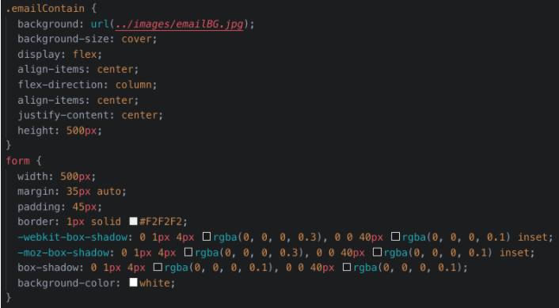

# Custom Webpage

In this activity, you will customize the default Bootstrap 4 cards, content, and footer components to better reflect your site’s content.

## Instructions

### Custom Cards

1. Find the `container-fluid 
` and add the class `content`.

2. Within the `container-fluid 
`, but before the `row 
`, add an `<h2>` tag.
- Add the class `sectionHeading`.
- Add the text `Shows Near You`.

3. Next, add the `showsNear` class to the `row 
`.

4. Update the column sizing for each `cardContainer 
` to `col-lg-4 col-md-4 col-sm-12`.
- What do you think the size will be for each card on a small screen? What about a large screen?

5. Update each `` tag to use pictures in the images folder.

6. Update the copy for each card and button to match the design, or get creative and add your own.

7. Add the following selectors and properties to style the cards section:
  
  

Now that you have finished the steps for this activity, your cards should be fully responsive with custom imagery.

  

### Custom Webpage Content Section

Next up, you will add to and style the content section of your website. Feel free to follow the design we specify below or add your own spin.

#### Part 1: Update the HTML

1. Add the content class to the `container-fluid 
`.

2. Next, add a title to this `
` by adding an `<h2>` tag with the text `Why we're better`.

3. Give the `<h2>` tag the `sectionHeading` class.

4. Add the `valueProp` class to the `row 
`.

5. Within the `row 
`, add the `imageContainer` class to the `
` that contains an image.

> Note that the design has two more rows in this section. Duplicate the first row twice. Update the images and copy for each duplicated row.

#### Part 2: Update the CSS

1. Add the following CSS to style the `valueProp` and `sideAccent` classes:

  

2. Next, add the following to style the `imageContainer` class and images inside that element:

  

3. Congrats! You should now have three rows of content on your template.

  

### Custom Webpage Footer

In this activity, you will customize your site’s footer with a call to action (CTA).

  

#### Part 1: Update the HTML

1. Add the `emailContain` class to the `<footer>` tag.

2. Next, add an `<h3>` tag within the `<form>` tag but above the `form-group 
`.

3. Type `Join Our Mailing List` within the `<h3>` tag.

#### Part 2: Update the CSS

1. Add the following selectors, properties, and values to spruce up the footer and the form contained within:

  

- That’s it! Your design is complete! Refresh your browser to see all the changes you’ve made and how far your template has come.

- You have completed your Bootstrap template. 

- That’s it for our template; you now have a fully responsive Bootstrap 4 template ready for you to customize and use professionally.

- Feel free to modify it further if you’d like. You could create a different style or, alternatively, add more content to your Bootstrap template (this could be more sections, redoing of some sections, etc.).

Great work!
---

© 2022 edX Boot Camps LLC. Confidential and Proprietary. All Rights Reserved.
