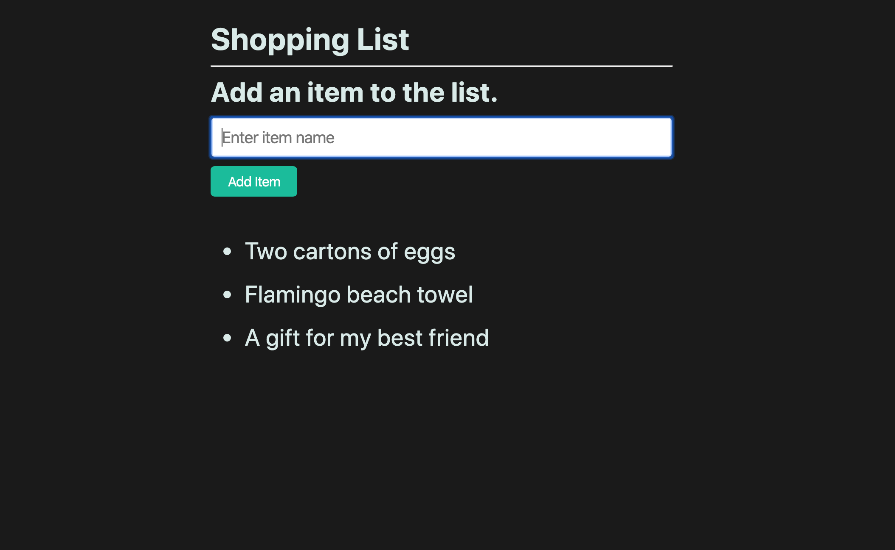

# 📖 Implement a Shopping List Form

Implement the following user storys:

* As an online shopper, I want to be able to add items to my shopping list so that I can view them all in one place.

* As an online shopper, I want to be able to quickly add another item to my list.

## Acceptance Criteria

* It's done when the form can be submitted and the value in the input field is captured and printed to the page as a list item.

* It's done when the form's input field is cleared upon a successful submission.

## 📝 Notes

Refer to the following documentation:

[jQuery documentation on forms](https://api.jquery.com/category/forms/)

## Assets

The following image demonstrates the web application's appearance and functionality:

---

## 💡 Hints

* Prevent the default behavior of the `submit()` event.

* What jQuery form method can you use to retrieve the input field's data?

## 🏆 Bonus

If you have completed the activity and want to further your knowledge, work through the following challenge:

* How can we reset form elements using plain JavaScript?

Use [Google](https://www.google.com) or another search engine to research this.

---

© 2022 edX Boot Camps LLC. Confidential and Proprietary. All Rights Reserved.
