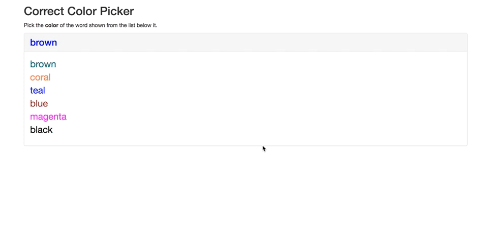

# Color Correcter Game

### Instructions

* For this activity, you'll be creating a "correct color" game.

* The game should generate a random color string (i.e., "green" or "blue") that is displayed in a random color. We'll cause this the current color.

* It should also generate a list of random color strings that are also displayed in random colors. We'll call this the color list.

* The user must click the *name* of the color in the color list that matches the *color* of the current color.

* Make an alert telling the user whether they chose correctly or incorrectly.

* After the alert, the game should reset.

* Check out the below GIFS to see how the game should work.

* **BONUS:** Make sure that none of the colors appear in the same color as their name.

---

© 2022 edX Boot Camps LLC. Confidential and Proprietary. All Rights Reserved.
