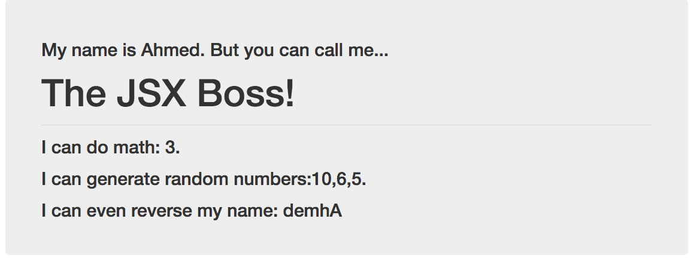

# 13.1 Lesson Plan - Introduction to React, Components and JSX

## Overview

In this class, we will be introducing students to the basic concepts of ReactJS, JSX, and building layouts through a component-based mindset.

## Instructor Notes

* It is recommended that you arrange for students to globally install `Create React App` before today's class. If students have problems running `create-react-app`, direct them to remove their global install and use `npx` to run `create-react-app` instead:

  * `npm uninstall -g create-react-app npx create-react-app <appname>`

* Let students know that today's class is meant to be a **gentle** introduction to React. Few, if any, of your students will have even the faintest knowledge of React—so this class is all about an initial exposure.

* Let students know that we won't be able to teach them **all** of React in the amount of time we have. In order to achieve mastery they are going to have to do their own work outside of class. Our role is essentially to give them the highlights so they understand the terms and know how to proceed.

* Students may feel a little overwhelmed with the new unusual syntax. Remind them that, at the end of the day, we're still just working with JavaScript. Prioritize making sure they understand concepts, rather than worrying about them perfectly memorizing syntax. Memorization will come with practice and repetition, so work on instilling concepts early on.

* Review any familiar ES6 syntax as you go along, and explain any unfamiliar syntax as necessary. Students will have plenty of time to practice ES6 as we go through the material over the next two weeks.

* **Important:** In order to avoid continuous NPM installs, all of today's activities' solved and starter versions include only an `src` folder. Both you and your students should scaffold out a React app once with Create React App, and then swap out the `src` folder for each activity. It's recommended that you completely restart the dev server between activities.

### Learning Objectives

By the end of this lesson, you will:

* Begin to feel comfortable building static UIs with JSX.

* Gain an initial understanding of the component-based paradigm in ReactJS.

* Dissect and build a few simple examples using ReactJS.

## Slides

[13.1: Introduction to React, Components, and JSX Slide Deck](https://docs.google.com/presentation/d/1t0a39yWVH8ztSsjTkPzqJFBE-wqT-4kTIEI1aZto8dE/edit?usp=sharing)

## Time Tracker

| Start  | #   | Activity Name                         | Duration |
| ------ | --- | ------------------------------------- | -------- |
| 5:30PM | 0   | Office Hours                          | 0:30     |
| 6:00PM | 1   | Intro to React                        | 1:15     |
| 7:15PM | 2   | BREAK                                 | 0:15     |
| 7:30PM | 3   | Components                            | 0:35     |
| 8:05PM | 4   | JSX Variables                         | 0:25     |
| 8:30PM | 5   | React CSS                             | 0:35     |
| 9:05PM | 6   | Office Hours                          | 0:30     |
| 9:35PM | 7   | END                                   | 0:00     |

---

## 1. Intro to React (75 mins)

### 1.1 Instructor Do: Intro to React (15 minutes)

* Go through the [13.1: Introduction to React, Components, and JSX](https://docs.google.com/presentation/d/1t0a39yWVH8ztSsjTkPzqJFBE-wqT-4kTIEI1aZto8dE/edit?usp=sharing) slide deck.

  * **What Is React?**

    * React is one of the most powerful, in-demand front-end JavaScript libraries available today.

    * React is a library that helps you create complex and responsive single-page applications.

    * React is widely popular and well supported by the developer community.

    * Created by the developers at Facebook.

    * Makes code reusable and divides things into components.

  * **What Problem Does React Solve?**

    * DOM operations are quite expensive in terms of performance, so React creates a **virtual DOM (VDOM)**.

    * The VDOM is a representation of the page structure in memory. It tracks what needs to be updated and only updates those specific things.

    * React is not opinionated like many other frameworks. It gives the developer the freedom to use Javascript the way they want to use it.

  * **Can You Give Me an Example?**

    * Facebook’s UI is a great example of React in action.

    * Each section of the page is a component that has tons of real-time updates happening every second.

    * The component design pattern allows Facebook to add a search bar and messenger to nearly every page that the user visits.

  * **Facebook's UI Complexities**

    * Facebook buzzes with interactive options, live-updating data, and tightly interacting elements. This poses a challenge to simple DOM.

  * **Why Separate UI Components?**

    * Logically decompose a UI into unique parts.

    * Easily reuse these parts without rewriting code.

    * Separate components are easier to test.

    * Helps isolate bugs, saving time.
  
  * **What Are the Pros and Cons?**

    * **Pros**

      * Reusable components.

      * UI updates in response to state change, reducing DOM manipulation code needed.

      * Can build applications on web, server, and native applications.

      * Easier to learn and more popular than other front-end JavaScript libraries and frameworks.

    * **Cons**

      * React is a view library concerned with rendering user interfaces. You have to pull in other libraries to accomplish things like HTTP requests.

      * Can require more configuration than other libraries.
  
* The most important point to get across today is the concept of components—self-contained modules that are responsible for producing part of an application's UI and functionality (e.g., all the layout and functionality code for a "chat box" or "like button" might be in the same file or folder). This is radically different from the concept of separating the view and logic layers. When we split up our application into components, we're still separating its concerns but we aren't necessarily separating its technologies.

* Remember to emphasize that today's class is meant to be a primer, not comprehensive coverage. Don't let students get intimidated.

### 1.2 Instructor Do: Demonstrate Create React App (15 minutes)

* Demonstrate for students how we can quickly create a React application using Create React App. Run the following command in the terminal and have students follow along if they wish:

  * `npx create-react-app reactpractice`

    * Explain that to scaffold out a React app with Create React App, we run `npx create-react-app` followed by a name for our application.

* Once everything has been installed, cd into your application's directory and start the app by running `npm start` in your terminal and navigating to `localhost:3000`. Explain that this command starts our app in development mode (i.e., this "mode" is meant for development, as our application will auto-reload as we make changes to it).

  

* Show off the resulting webpage, then go back to your code and walk the class through the generated boilerplate. In particular, point out the following key aspects:

  * An `src` folder is generated, and we'll mostly be working out of here. Anything inside this folder gets processed by Babel and then combined into a single `bundle.js` file by webpack. You can see what the combined `bundle.js` file looks like if you were to navigate to [localhost:3000/static/js/bundle.js](http://localhost:3000/static/js/bundle.js) in your browser.

  * We have an `index.js` file in the `src` directory. This is where execution of our React application begins. In this way, it is similar to the `server.js` file with which we've been starting all of our node applications. In order to run any code in our React app, it needs to be directly written here, or else required/imported here.

    

  * The `src` folder is where our React components will live. For now, we just have an `App` component. Don't go too deep into the specifics of the `App.js` file yet but point out that this file is producing some JSX, which corresponds to the webpage we have rendered in the browser.

  * The `src` folder is also where we'd put any tests we'd like to associate with our components. Create React App ships with [Jest](https://facebook.github.io/jest/), a library for running JavaScript tests that work with React out of the box. For our purposes of learning to use React to build applications, we won't dive into writing tests for React apps, but it's nice to know that we **can** without any extra overhead.

  * Point out the `registerServiceWorker.js` file. At the time of writing, this is a fairly new addition to Create React App. We don't need to understand the contents of this file, and most of the activities we'll go over will have it removed for brevity, but it helps cache API responses to help make our app perform better for users with poor internet connections.

  * We have a `public` folder. This is primarily for containing the `index.html` that will eventually be served to users visiting our application. Point out the `#root` element—explain that this will contain our entire rendered React application. Explain that when we build our React application for production, a `bundle.js` file containing all our application's JavaScript is generated and added inside of the `index.html` file. We can also store files in this folder that we don't want to be processed by webpack and Babel. For example, we can place static CSS files here or link to external CDNs in the `head` tag of the `index.html`.

  * Assure the class that we're going to see this setup over and over again and that there isn't a need to completely memorize every aspect of the Create React App boilerplate right now. The most important takeaways are:

    * We're going to be writing most of our code inside of the `src` folder.

    * The "entry" file to our React application will be the `index.js` file.

    * We start our React app in development mode with the command `npm start`. This means that our app will live update as we change it, which is why we're running our app on a server.

### 1.3 Student Do: Hello World Example (15 minutes)

* Inform the class that now that they have a high-level understanding of Create React App, they're going to work in groups to dissect a simpler example and answer some questions.

* Introduce students to [HelloReact](activities/01-Stu-HelloReact/README.md).

```md
# HelloReact

In this activity, we will dissect a simple React application.

## Instructions

* If you haven't already, generate a starter React app using Create React App. You can do this by running `npx create-react-app reactpractice`. We will run all of the activity code today inside of this boilerplate, as to avoid constantly reinstalling the same node modules.

* Once you have a `reactpractice` React app generated, delete the `src` folder inside of your starter app and replace it with the [src](starter/src) provided with this activity.

* Start the app by running `npm start` in your terminal and then take a moment to study the HTML code being rendered in the browser at [http://localhost:3000](http://localhost:3000).

### HelloReact.js

* Then go into the `src` folder and, with your partner, try to answer the following questions:

  * What's happening inside of `src/components/HelloReact.js`? How does it relate to the content being rendered to the browser?

### App.js

* Open the `src/App.js` file. What's going on in this file? Try to answer the following questions:

  * What does the `App` function return?

  * Why do we import the React library? We aren't using the React keyword anywhere. Is it possible to remove this and still have our code work?

### index.js

* Open the `src/index.js` file and go over the code. Notice that we're importing the `ReactDOM` library. Try to answer the following questions:

  * Do you remember what the purpose of `ReactDOM.render` is? What is it doing?

  * Is this where our components are rendered to the DOM?

  * Instead of splitting our files up into `App`, `components/HelloReact`, and `index`, is it possible to just write our entire Hello World app in the `index.js` file?
```

### 1.4 Instructor Review: Hello World Example (10 minutes)

* Open the [solved](activities/01-Stu-HelloReact/solved/README.md) version of the activity in your IDE and go over the answers with the class. Use the solution as a guide to walk the class through the code.

* Point out how JSX can either represent primitive HTML tags or React components.

* Demonstrate how we can alternatively write all of our component's code inside of `index.js`. Inform them that this is fine for very small examples, but we'll want something closer to the original setup as our projects grow.

* If necessary, take a few extra minutes here to briefly discuss any confusing ES6 syntax. This portion of the lesson utilizes the `const` identifier and ES2015 modules.

* 🗒Note the following takeaways:

  * `const` works like var, but it's meant for values that aren't going to be reassigned, otherwise `let` is preferred.

  * `ES2015 modules` are part of a new module system introduced with ES6. So far, we've been working with CommonJS modules (`module.exports` and `require` syntax)—which for our purposes today will work similarly.

  * As we'll see a bit later, ES2015 modules allow for finer-tuned control over what is exported and imported from a module. For now, just compare the new syntax to what they're used to.

* Take a moment to answer any lingering questions.

### 1.5 Students Do: HelloDiv (10 minutes)

* In this activity, students will write a React component that displays their name and some information about themselves.

* **Instructions:** [README](activities/02-Stu-HelloDiv/README.md)

```md
# HelloDiv

In this activity, we will render a list of JSX elements inside of a div.

## Instructions

* Replace the `src` folder of your React app with [src](starter/src). Stop the dev server if it is already running. Start the app in dev mode by running `npm start`.

* Using the code in the [HelloDiv.js](starter/src/components/HelloDiv.js) file as a starting point, update the `HelloDiv` function so that it returns the following JSX:

  * A heading tag introducing yourself (e.g., `<h1>Hello! My name is <insert name here></h1>`).

  * An unordered list containing at least three things you like (these can be anything).

### Hints

* You will need to import the React library.

* Reference the previous `HelloReact` activity if you get stuck with any syntax.

* If you're trying to render multiple JSX tags from a single component, you should enclose all of the JSX tags within a single parent tag, such as a `div`.
```

### 1.6 Instructor Do: Review HelloDiv (10 minutes)

* Once time is up, go over the [solved](activities/02-Stu-HelloDiv/solved) version of the activity as a class.

* Make sure that everyone understands the following concepts:

  * `HelloDiv` is exported and rendered inside of `App`.

  * `App` is exported and then rendered inside of `index.js` as the first argument to the `ReactDOM.render` method.

  * The second argument to the `ReactDOM.render` method is the real DOM element inside of which our React application should be rendered.

  * `HelloDiv`, like most components we'll write, is a JavaScript function; it returns some JSX.

    

    * Some students may have an error when they try to render multiple JSX elements. Explain  _normally_, we aren't able to render multiple JSX elements from a component without an enclosing parent tag.

      * This may seem strange at first, but if we think about our component in the same way we think about any other JavaScript function, it makes perfect sense: a JavaScript function can only return one value. To have separate groups of JSX being returned outside of a parent element would be like trying to write a JavaScript function that returns multiple different variables at once.

  * **Note:** With the release of React 16, we _do_ have another option for returning multiple JSX elements from a component: we can return an array.

    * Based on your students' level of understanding and comfort so far, you may want to skip over explaining this, as there aren't any activities or use cases we'll run into where understanding this pattern is required.

    * If you choose to proceed, the `HelloDiv` component can also be written as follows:

    ```js
      function HelloDiv() {
        return (
          <h1>Hey guys! I'm a header!</h1>,
          <h2>Things I like!</h2>,
          <ul>
            <li>Peas</li>
            <li>Carrots</li>
            <li>Love</li>
          </ul>
        );
      }
    ```

---

## 2. BREAK (15 minutes)

---

## 3. Components (35 mins)

### 3.1 Instructor Do: HelloBootstrap (15 minutes)

* Welcome the class back from break!

* So far, we've only just begun to work with React but we've still managed to learn a few key things:

  * In React, we structure our code into components.

  * A component is a JavaScript function that describes some part of our application's UI.

  * Inside of our components, we describe our application's UI using JSX: a markup syntax that resembles HTML.

* Explain that we're now going to go over how we can add Bootstrap to a React project.

* Replace your React application's src folder with [03-Ins-HelloBootstrap/src](activities/03-Ins-HelloBootstrap/src) and start the dev server by running `npm start`. See the rendered application at [localhost:3000](http://localhost:3000).

  

* Explain to the class that the rendered elements in this example are using Bootstrap classes.

  * Without going into the component code yet, assure everyone that all of the React code is correct. Ask the class: "Why then isn't my page rendering Bootstrap elements? What did I forget?"

    * We need to include Bootstrap into our project somehow.

    * Open up the example in your code editor and ask the class: "What should I do if I want to add Bootstrap using a CDN?"

      * So you don't have to go looking for it, here it is: `<link rel="stylesheet" href="https://cdnjs.cloudflare.com/ajax/libs/twitter-bootstrap/4.0.0/css/bootstrap.min.css"/>`.

      * Try to get the class to lead you to the `index.html` file inside of the `public` folder. Ask them: "Where should I put this link?" Remind them that earlier, we mentioned that there was a folder where we keep static assets that we don't want to be processed.

      * We can add our Bootstrap CDN to `public/index.html` in the Create React App generated code in order to include Bootstrap for all our components. After adding the CDN, go back to your web browser and demonstrate the updated page.

    

* Now open up the `components/HelloBootstrap.js` file and demonstrate the code. The JSX code being rendered is close to the HTML we'd use to render the same Bootstrap elements without React.

  

* Ask the class: "Can anyone spot the key difference between this JSX and the HTML we'd normally write?"

  * `className` is used instead of `class`. Explain that this is because, in JavaScript, `class` is a reserved word, similar to `var` or `for` or `function`.

    * Explain that there are other differences between HTML and JSX that we'll run into soon.

  * Remind students that JSX isn't HTML, so there are a few caveats. JSX is sugar syntax for calls to the `React.createElement` method, and according to [Facebook's React Docs](https://facebook.github.io/react/docs/introducing-jsx.html#specifying-children-with-jsx): "JSX is closer to JavaScript than HTML."

### 3.2 Students Do: HelloBootstrap (10 minutes)

* In this activity, students will be given slightly less starter code and tasked with creating a React application that renders Bootstrap components to the page.

* **Instructions:** [README](activities/04-Stu-HelloBootstrap/README.md)

```md
# HelloBootstrap

In this activity, we will utilize Bootstrap CSS and render components utilizing Bootstrap classes.

## Instructions

* Replace your application's `src` folder with [starter/src](starter/src). Stop the dev server if it is already running. 

* Run `npm install --save bootstrap` in your command line to install Bootstrap.

* Add `import 'bootstrap/dist/css/bootstrap.min.css';` to the `index.js` file.

* Start the app in dev mode by running `npm start`.

* Create a `components` folder and inside it create a brand new file named `HelloBootstrap.js`. Add code to this file to accomplish the following:

  * It should render a [Bootstrap navbar](https://getbootstrap.com/docs/4.0/components/navbar/), followed by a [Bootstrap jumbotron](https://getbootstrap.com/docs/4.0/components/jumbotron/), and lastly a [Bootstrap card](https://getbootstrap.com/docs/4.0/components/card/).

  * Set the default export of this file to be your `HelloBootstrap` component.

* Update the `src/App.js` file so that it imports the `src/components/HelloBootstrap.js` file. Render the `HelloBootstrap` component instead of the text that is currently being rendered.

### Hints

* In order to return separate JSX elements from a function, all of the higher-level elements need a single parent (e.g., usually a `div`).

* All JSX tags must either have an adjacent tag or else have a self-closing forward slash.

* `className` must be used to describe an element's `class` property since `class` is a reserved word in JavaScript.

* Remember to import the `react` library in any file where JSX is utilized. Inspect some of the other files provided with the starter code if you're having difficulty remembering the syntax for this.

### BONUS

* Instead of having all of your Bootstrap code inside of a single component, create three separate components for the navbar, jumbotron, and card. Render these components inside of the App component.

```

### 3.3 Instructor Do: Review HelloBootstrap (10 minutes)

* Briefly go over the [basic solved](activities/04-Stu-HelloBootstrap/solved/Basic) version of the previous activity.

  

* The most important takeaways are:

  * If we want to render multiple JSX elements, they should be contained within a single parent element, such as a `div`.

  * Void elements, such as `input` tags, are represented by JSX tags with a self-closing forward slash (i.e., `<input />`).

  * We need to import the `react` library anywhere that we are utilizing JSX.

  * We use `className` instead of `class` because `class` is a reserved word in JavaScript.

* Take a few moments to demonstrate the [bonus solution](activities/04-Stu-HelloBootstrap/solved/Bonus). The rendered page should be the same, so you only need to demonstrate the code in your editor.

  * The main takeaway here is that we can define our components in different files and compose multiple components inside of another component (`Navbar`, `Jumbotron`, and `Card` are rendered inside of `App`).

    

  * This is powerful because it begins to demonstrate the potential for code reuse. Instead of having to rewrite every UI element from scratch using individual HTML tags, we could write a component once and reuse it across our entire application.

## 4. JSX Variables (25 mins)

### 4.1 Instructor Do: JSX Variables (10 minutes)

* Replace your React app's `src` folder with [05-Ins-JSXVariables/src](activities/05-Ins-JSXVariables/src). Stop the dev server if it is already running. Start the app in dev mode by running `npm start`.

* Once the app starts, open [localhost:3000](http://localhost:3000) in your web browser.

  

* Point out that the HTML code being rendered to the browser isn't much different from the code we've already worked with. At first glance, it doesn't appear as though we're doing anything new.

* Open `src/components/JSXVariables.js` and walk the class through the code.

  

* Point out the following key points:

  * We can write comments inside of our JSX using JavaScript's multiline comment syntax inside of curly braces. If we were to try to write regular JavaScript comments inside of our JSX, the code would break.

  * In addition to being able to write comments inside of the curly braces, we can also embed JavaScript expressions. This works similarly to the `{{ }}` double curly braces that we've worked with in Handlebars.

    * We use the `name`, `num1`, and `num2` variables inside of our JSX code. Try updating the `name` variable and demonstrating to the class how, when the page refreshes, we have the updated name being rendered.

    * Rendering `name` is a fairly simple example, but we can also evaluate entire expressions inside of JSX curly braces. Point out how we're producing random numbers and reversing `name` further down below.

      * Explain that an expression is any valid set of literals, variables, operators, and expressions that evaluates to a single value. In other words, anything we can assign to a variable or pass as a function argument is an expression. This doesn't include loops or conditionals, which we have various ways to deal with that we'll go over later.

    * Explain that these curly braces are how we get data from our JavaScript code into the views React renders.

      * Point out that this is different from jQuery or vanilla JavaScript where we have to call methods to explicitly set the inner text of an element.

    * Remind everyone that when we were working with Handlebars, we couldn't write raw JavaScript code inside of the `{{}}` double curly braces. Instead, we had to use the Handlebars templating language, which only exposed certain functionality. Since what we're writing inside of the JSX curly braces is just regular JavaScript, we have access to the full power of JavaScript inside of our views.

* Take a moment to answer any questions but avoid getting too off track.

### 4.2 Students Do: JSX Variables (10 minutes)

* In this activity, students will render JavaScript expressions inside of JSX curly braces.

* **Instructions:** [README.md](activities/06-Stu-JSXVariables/README.md)

```md
## Instructions

* Replace your React application's `src` folder with [starter/src](starter/src). Stop the dev server if it is already running. Start the app in dev mode by running `npm start`.

* This activity uses Bootstrap, so make sure that you `import 'bootstrap/dist/css/bootstrap.min.css';` in `index.js`.

* Open `src/components/JSXVariables.js` and notice the values being requested inside of the component:

  * Your name

  * The number of letters in your name

  * What you think about React

* Render each value inside of JSX curly braces. You will need to create JavaScript variables in order to accomplish this.

## BONUS

* Add another heading that says "My name without any vowels is: <insert name without vowels here>". Create a function that takes a string as a parameter and returns the string with the vowels removed. Run this function inside of JSX curly braces to complete the statement.
```

### 4.3 Instructor Do: Review JSX Variables (5 minutes)

* Go over the [solved](activities/06-Stu-JSXVariables/solved) version of the activity.

  

* Make sure everyone understands that when we use JSX curly braces, it means that we want to evaluate a JavaScript expression inside. The final value of the expression will be rendered to the page.

## 5. React CSS (35 mins)

### 5.1 Instructor Do: CSS Demo (15 minutes)

* Inform the class that now we're going to talk about some new built-in options for styling our components.

* Replace your React app's `src` folder with [07-Ins-CSSDemo/src](activities/07-Ins-CSSDemo/src). Stop the dev server if it is already running. Start the app in dev mode by running `npm start`.

* Open your browser to [localhost:3000](http://localhost:3000) and demonstrate the rendered application.

  

* Explain that Create React App allows us to import CSS into our components. Open the `Header` component to demonstrate this.

  

* Point out that we aren't saving the style sheet to a variable. Instead, whenever we import a style sheet, an internal style tag is created and added to the document.

* Demonstrate how the `Header` is using the classes defined in the `Header.css` style sheet that it's importing.

  

* This approach may be a good idea if we want to keep our component more closely coupled to its styles. Ask the class: "How many times have you been working on a project or Challenge and had a CSS issue because the CSS you were using was a little messy?"

* By separating our CSS files by component, we'll generally have smaller, more manageable style sheets. Adding new styles or changing existing ones should be easier as our applications grow larger.

* Explain that we are also able to add inline styles to JSX elements. Open the `Card` component to demonstrate this.

  

* Point out that we can set a `style` similarly to how we can when writing regular HTML code but with two key differences. Ask the class: "What's happening inside of our JSX that we wouldn't do with regular HTML?"

  * React expects the `style` property to be an object, rather than a string.

  * We're using JSX curly braces to embed the style object.

* Point out that the object properties are camelCased and non-numerical values are strings. Numerical values will default to pixels if a unit of measurement is expected.

* Explain that writing inline styles with JavaScript objects may feel a little strange, but this has some advantages over using actual style sheets:

  * Using a `style` property, our styles are scoped to the components they're attached to, meaning that we won't have any issues with CSS scoping or naming collisions.

  * Because our styles are defined using JavaScript, we can write JavaScript logic to determine what our styles should be at any given point. This will be useful as we begin to build more dynamic apps.

* Explain that we could define our component's styles inside of a CSS style sheet, we could use inline styles, or we could use some mixture of the two.

  * It's up to us to decide how we want to organize our component styles, but there is value in being consistent in whichever approach or hybrid approach we take.

### 5.2 Students Do: CSS Props (10 minutes)

* In this activity, students will change the appearance of an application's components using inline styles.

* **Instructions:** [README.md](activities/08-Stu-StyleProp/README.md)

```md
# Style Prop

In this activity, we will explore some built-in options for styling React components.

## Instructions

* Replace your React application's `src` folder with [starter/src](starter/src). Stop the dev server if it is already running. Start the app in dev mode by running `npm start`.

* Open [localhost:3000](http://localhost:3000) in your web browser and take a moment to study the rendered application.

  

* This application consists of three main components:

  * `Header`

  * `Navbar`

  * `Section`

* Each component is styled using imported external style sheets.

* Using only inline styles, and without altering any of the CSS files, update each component, so the rendered page looks like this:

  

### Hints

* Check out the [React documentation for the style attribute](https://facebook.github.io/react/docs/dom-elements.html#style).

* Check out the [Inline CSS section of the React Enlightenment Book](https://www.reactenlightenment.com/react-jsx/5.6.html).
```

### 5.3 Instructor Do: Wrap Class (10 minutes)

* Go over the [solution](activities/08-Stu-StyleProp/solved) to the previous activity.

* Listed below are sections of the React documentation that pertain to today's lesson. All are short reads. Encourage students to browse through these resources to help reinforce the concepts covered today.

  * [Hello World](https://facebook.github.io/react/docs/hello-world.html)

  * [Introducing JSX](https://facebook.github.io/react/docs/introducing-jsx.html)

  * [Rendering Elements](https://facebook.github.io/react/docs/rendering-elements.html)

  * [Components and Props](https://facebook.github.io/react/docs/components-and-props.html)

* Review Today's Objectives and answer any lingering questions.

## 6. Office Hours (30 minutes)

## 7. END (0 min)

How did today’s lesson go? Your feedback is important. Please take 5 minutes to complete this anonymous survey.

[Class Survey](https://forms.gle/nYLbt6NZUNJMJ1h38)

---

© 2023 edX Boot Camps LLC. Confidential and Proprietary. All Rights Reserved.
