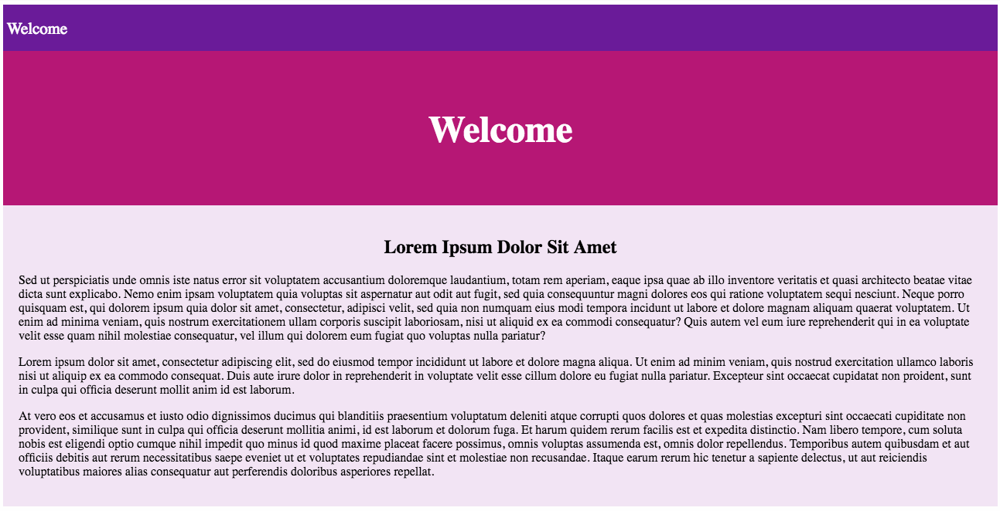

# Style Prop

In this activity, we will explore some built-in options for styling React components.

## Instructions

* Replace your React application's `src` folder with [starter/src](starter/src). Stop the dev server if it is already running. Start the app in dev mode by running `npm start`.

* Open [localhost:3000](http://localhost:3000) in your web browser and take a moment to study the rendered application.

  

* This application consists of three main components:

  * `Header`

  * `Navbar`

  * `Section`

* Each component is styled using imported external style sheets.

* Using only inline styles, and without altering any of the CSS files, update each component, so the rendered page looks like this:

  

### Hints

* Check out the [React documentation for the style attribute](https://facebook.github.io/react/docs/dom-elements.html#style).

* Check out the [Inline CSS section of the React Enlightenment Book](https://www.reactenlightenment.com/react-jsx/5.6.html).

---

© 2023 edX Boot Camps LLC. Confidential and Proprietary. All Rights Reserved.
