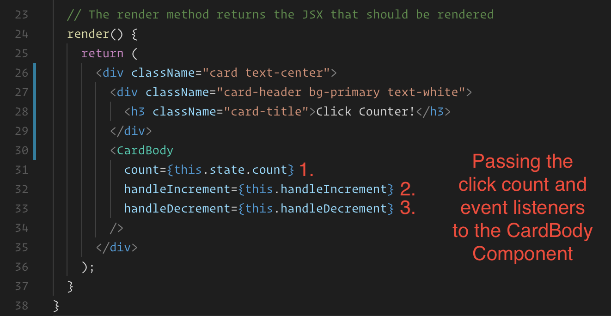

# 13.2 Lesson Plan - Props, Lists, and Stateful Components

## Overview

In this lesson, we will be deepening students' understanding of ReactJS. Students will further expand their understanding of props, learn how to programmatically render components from a list of data, and be introduced to the concepts of class components and component state.

## Instructor Notes

* Today's class will be more challenging than the last class for many students. Syntax errors will abound as students confusedly mix states and props and forget to pass attributes to their child components. Explain that memorizing syntax will come with time and practice. It's far more important to understand the concepts covered, as exact syntax can always be looked up.

* All of the solved/starter activities contain only the application's `src` folder. At the start of class, scaffold out a React application using Create React App and swap out the `src` folder for each activity to avoid repetitive npm installs. It's recommended that you completely restart the dev server between activities.

## Learning Objectives

By the end of class, you will:

* Deepen your understanding of passing props between React components.

* Gain a firm understanding of the concept of child–parent relationships in React.

* Programmatically render components from an array of data.

* Understand the concepts of class components and component state.

## Slides

[13.2: Props, Lists, and Stateful Components Slide Deck](https://docs.google.com/presentation/d/1pjIiIS29HCd0uFziX0LufDtl1d_s2Ar3rm6_wOce5P4/edit?usp=sharing)

## Time Tracker

| Start  | #   | Activity Name                         | Duration |
| ------ | --- | ------------------------------------- | -------- |
| 5:30PM | 0   | Office Hours                          | 0:30     |
| 6:00PM | 1   | Props                                 | 1:35     |
| 7:35PM | 2   | BREAK                                 | 0:15     |
| 7:50PM | 3   | State                                 | 1:15     |
| 9:05PM | 4   | Office Hours                          | 0:30     |
| 9:35PM | 5   | END                                   | 0:00     |

---

## 1. Props (95 mins)

### 1.1 Instructor Do: Go Through Slides (15 minutes)

* Using the slide deck found here: [13.2: Props, Lists, and Stateful Components](https://docs.google.com/presentation/d/1pjIiIS29HCd0uFziX0LufDtl1d_s2Ar3rm6_wOce5P4/edit?usp=sharing) guide students through a deeper dive into Props.

### 1.2 Instructor Do: Props Demo (15 minutes)

* Inform the class that we can conceptualize React components as JavaScript functions.

* It's a component's job to describe and _return_ some part of our application's UI.

* Ask the class: "If a component is a function that _returns_ some data, what else might a component be able to do?"

  * Since it's a function, a component can also receive arguments.

* This allows us to write components that behave differently based on the arguments that they receive.

* We call the arguments that we pass into React components `props`.

* If you haven't already done so, scaffold out a React application by running the following command in your terminal: `create-react-app demoapp`.

* This example uses Bootstrap. Add the following link tag to your React app's `public/index.html` file:

  ```html
   <link rel="stylesheet" href="https://cdnjs.cloudflare.com/ajax/libs/twitter-bootstrap/4.0.0/css/bootstrap.min.css"/>
  ```

* Replace your React app's `src` folder with [01-Ins-PropsDemo/src](activities/01-Ins-PropsDemo/src). Stop the dev server if it is already running. Start the app in dev mode by running `npm start`.

* Demonstrate the rendered page in your web browser:

  

* This example is rendering a simple Bootstrap alert element. Open `src/components/Alert.js` and demonstrate the code:

  

* Explain that every component has access to a `props` argument. Props is always an object containing all of the values passed into the component.

* We're using `props.type` to determine what the evaluated `className` of the `div` element is.

* This component renders `props.children` between its `div` tags.

* Compare this to the value of `props` as it is logged to the console:

  

* Point out that since `props.type` is equal to "danger," then the computed `className` of the `div` in the `Alert` component is "alert alert-danger." This Bootstrap class is providing our component its styles.

* The `Alert` component is also receiving a `children` prop with a value set to "Invalid id or password"—the same message being displayed inside of the rendered Bootstrap alert element.

* Open `src/App.js` in your editor and explain to the class how these props are being passed into the `Alert` component.

  

* We have two ways of passing props into a component:

* First, we can set an attribute to the rendered component's tag.

  * We're passing a `type` prop equal to `danger`.

* Second, we can give a component a sibling tag and pass an expression between the tags.

  * We don't name this prop; it is automatically set to a `children` key.

  * We're passing a `children` prop equal to "Invalid user id or password."

* Demonstrate how you can change what is rendered by the `Alert` component by passing it a different `type` and `children` prop.

  * For example, setting `type` to "success" and `children` to "Welcome Back!" would render the following in the browser:

    

* Explain that having this familiar syntax for passing props to our components is another way for JSX to be similar to HTML. We don't need to explicitly call any functions or modify any object properties ourselves.

* Explain that props allow us to customize our components so that we can reuse them in different situations.

  * For example, we might use this `Alert` component on a sign-in page and render a different alert depending on whether or not a user has successfully logged in to their account.

* Inform the class that we can pass any type of data as a prop, including strings, numbers, arrays, functions, even entire components.

* Props are the primary means by which we pass data around our React apps. React utilizes a unidirectional data flow, meaning that data only flow in one direction: from the top down, parent to child.

  * This unidirectional data flow makes changes in React apps more predictable and easier to debug.

* Ask the class: "If a prop inside of our component isn't what we expect it to be, where could we look to find out why?"

  * We could look at the component's parent.

  * In this example, `App` and `Alert` have a parent–child relationship. `Alert` is being rendered inside of `App`, and `App` is passing props to `Alert`.

* Take a moment to answer any questions before the first activity.

### 1.3 Student Do: Calculator Props (10 minutes)

* In this activity, students will work with a partner to write a component that accepts props, performs arithmetic, and renders the result.

```md
In this activity, we will write a component that can perform some arithmetic using passed props and render an element containing the result.

## Instructions

* Replace your React application's `src` folder with [starter/src](starter/src). Stop the dev server if it is already running. Start the app in dev mode by running `npm start`.

* This activity uses Bootstrap, so make sure you `import 'bootstrap/dist/css/bootstrap.min.css';` in `index.js`.

* Open your web browser to [localhost:3000](http://localhost:3000). Take a moment to observe the rendered app.

* Open `src/components/Calculator.js` in your editor and take a moment to study the application's code.

* Write a component named "Math" and render one Math component in the place of each "?" mark.

* The Math component should perform some arithmetic using three props:

  * `num1` - a number

  * `operator` -  a string representing an arithmetic operator (e.g., "+", "-", "*", "/")

  * `num2` - a number

* The Math component should render the result of problem in a `span` tag (e.g., 19 + 341 = 360).

## Hint

* Check out [React's documentation for props](https://facebook.github.io/react/docs/components-and-props.html).

## BONUS

* Using the [style tag](https://facebook.github.io/react/docs/dom-elements.html#style), set the font-size of the `span` rendered by the `Math` component to be the result of the arithmetic problem in pixels (e.g., the font-size of the `span` rendering the result of "19 + 341 = 360" should be 360 pixels).
```

### 1.4 Instructor Do: Review Calculator Props (10 minutes)

* Open [PropsCalculator solved](activities/02-Stu-PropsCalculator/solved) in your IDE.

* Demonstrate how the completed example renders the result of each problem in the browser:

  

* Demonstrate the code inside of the `Calculator` component:

  

* Point out how we're passing each `Math` component three props:

  * `num1`

  * `operator`

  * `num2`

* Point out how the numbers are wrapped in JSX curly braces but the operator is in quotes.

* Ask the class: "Why do you think this is?"

  * The operator is a string literal, and we can express that shorthand just using quotes without curly braces. The following are equivalent:

  ```js
  <Math num1={19} operator={"+"} num2={341} />
  ```

  * This shorthand only works for string literals. All other values we pass as props need to be in JSX curly braces.

  ```js
  <Math num1={19} operator="+" num2={341} />
  ```

* Open the `Math` component and go through the code:

  

* Point out that the `props` argument should be an object containing all of the values passed to the rendered `Math` component in the `Calculator.js` file.

* We're running a switch case over `props.operator`. Depending on the operator, a different operator is performed with `props.num1` and `props.num2`. The result is stored in the `value` variable.

* Point out how, at the bottom of the function, we're returning `<span>{value}</span>`.

* Explain that a function component only renders what is returned from it. With arrow functions, we have to explicitly write the `return` keyword when the function contains more than one statement.

* Explain that we must either return JSX from a component or nothing at all. This is why we had to wrap the `value` inside of the span tags.

* Take another few minutes to answer any remaining questions.

### 1.5 Student Do: Props Review (15 minutes)

* Introduce students to [Props review](activities/03-Stu-PropsReview/).

* In this activity, students will work with partners to make an existing React application more DRY through the use of reusable components and props.

```md
In this activity, we will modify a React application to make it more DRY through the use of props.

## Instructions

* Replace your Create React App's `src` folder with the provided [src](starter/src) folder.

* Stop the dev server if it is already running. Start the app in dev mode by running `npm start`. Open [localhost:3000](http://localhost:3000) in your web browser and take a moment to study the rendered app.

  

  * This application is the start of a friends list for a social network.

* Open `src/App.js` in your editor and notice how the `SpongebobCard`, `MrKrabsCard`, and `SquidwardCard` are being rendered inside of `Wrapper`, which is in turn being rendered inside of the `App` component.

* Open up each component's files in turn and briefly study the JSX being returned by each. Most importantly, notice how all of the card components render very similar JSX. This isn't very DRY code. **We'll fix this by creating a brand new `FriendCard` component and rendering it once for each friend. We'll pass down the differentiating content in the form of props.** 

  

* Take a moment to study the `src/friends.json` file. This file contains the data that make each friend card unique from one another. We'll use this file to pass props down to our new `FriendCard` component.

* Import the `src/friends.json` file into `src/App.js`. This can be achieved with the following syntax: 
```

  ```js
  import friends from "./friends.json";
  ```

```md
* Inside of `src/App.js`, remove the imports for each friend's card and remove the JSX rendering each card inside of this file.

* Create a brand new component named `FriendCard`.

  * The `FriendCard` component can initially contain the same code as `SpongebobCard` with the same CSS file.

  * Import the `FriendCard` component inside of `src/App.js` and render it inside of the `Wrapper` component. Before going any further, check your browser. If successful, you should only see one card being rendered.

* Still inside of `src/App.js`, use the first friend object in the `friends` JSON file to pass the following props down to your rendered `FriendCard` component.

  * `name`

  * `image`

  * `occupation`

  * `location`

* Modify the `FriendCard` component so that it accepts and renders all of the passed props in place of the currently hard-coded values. Once complete, check your browser to make sure that the first `FriendCard` is still being properly rendered.

* Inside of `src/App.js`, render another `FriendCard` component for the second and third piece of friend data. Pass down the appropriate JSON data for each as props. If successful, you should see each friend being rendered to the browser, utilizing the same `FriendCard` component three times.

### Hint

* Check out [React's documentation on components and props](https://facebook.github.io/react/docs/components-and-props.html).
```

* Instructional staff should monitor breakout rooms during this activity, making themselves available for assistance.

### 1.6 Instructor Do: Review Props Review (10 minutes)

* Review the [solution](activities/03-Stu-PropsReview/solved) to the previous activity. Go through the code as a class.

  

* Point out how the application being rendered to the browser doesn't look any different from the unsolved version, but now we've made our code more DRY by creating a reusable component, `FriendCard`, to render each friend with the appropriate prop inside of the `App` component.

  

* Open the `src/components/FriendCard/index.js` file and go through the code.

  

* Point out that we use the `props` argument to access all of the values passed into the `FriendCard` component.

  * Since props is an expression that we want to embed inside of our JSX, we use JSX curly braces to do so.

* Ask the class: "In a real application, where might all of the friend JSON data come from?"

  * Normally, we might receive the friend JSON from an AJAX request and probably won't know ahead of time which friends will need to be rendered.

* In your editor's sidebar, point out how each component is contained inside of its own folder containing a CSS file and an `index.js` file.

  

* Ask the class: "Why are we using `index.js` to hold the component instead of `FriendCard.js`?"

  * Whenever we require/import a folder instead of a file, the folder's `index.js` file is required/imported by default (if it exists).

  * This allows us to keep our paths for importing these components short. For example, we can do:

  ```js
  import FriendCard from "./components/FriendCard";
  ```

  * instead of:

  ```js
  import FriendCard from "./components/FriendCard/FriendCard";
  ```

  * Giving all of our components their own folder is another option for organizing our React apps. Each folder could contain any CSS or other dependencies that the component will need.

* Spend another moment making sure that the class understands the overall concept of passing and receiving props. Go back and forth between the `friends.json` file, the `FriendCard` component, and your web browser to visually demonstrate how the data are being used.

* Point out that while this code is more DRY than it was, we're still manually rendering a `FriendCard` for each piece of data—we'll come back and solve this problem in a later activity!

### 1.7 Students Do: Component Map (10 minutes)

* In this activity, students will utilize the map method in order to render JSX from an array of objects.

```md
In this activity, we will map over a list of data and render components from each piece of data.

## Instructions

* Replace your React application's `src` folder with [src](starter/src). Stop the dev server if it is already running. Start the app in dev mode by running `npm start`.

* This activity uses Bootstrap, so make sure you `import 'bootstrap/dist/css/bootstrap.min.css';` in `index.js`.

* Open the application in your web browser and study the rendered application. Then take a minute to study the included components:

  * **App**: Our application's root component.

  * **List**: Responsible for rendering an unordered list from `props.data`.

* Modify the `List` component so that, inside of its `ul` tags, it renders one `li` tag for each item in an array of grocery objects being passed via props. Each `li` tag should display the `text` property of each grocery object. The array map method should be used for this.

* For styling purposes, give each `li` tag a class of `list-group-item`.

### Hints

* You should definitely look at [React's documentation for lists and keys](https://facebook.github.io/react/docs/lists-and-keys.html).

* See MDN documentation for [Array.prototype.map](https://developer.mozilla.org/en-US/docs/Web/JavaScript/Reference/Global_Objects/Array/map).

* You will only need to modify the `List` component.

### BONUS

* Inside of the `List` component, render a list of **only** the groceries that **have not** been purchased. Use the [Array.prototype.filter](https://developer.mozilla.org/en-US/docs/Web/JavaScript/Reference/Global_Objects/Array/filter) to filter the array before mapping.
```

* Instructional staff should monitor breakout rooms during this activity, making themselves available for assistance.

### 1.8 Instructor Do: Review Component Map (10 minutes)

* Review the [solutions](activities/04-Stu-ComponentMap/solved) to the previous activity and go over the code as a class.

* For the basic solution:

  

  * Point out how the array of grocery objects is passed into the `List` component from inside of `App`, making it available inside of the `List` component as `props.groceries`.

  * Inside of the `List` component, we insert JSX curly braces inside of the `ul` element. We map over `props.groceries` and return one `li` tag for every element in `props.groceries`.

  * Ask the class: "What type of value is returned by the map method here?"

    * Explain that the map method will always return an array—in this example, it's returning an array of JSX elements.

    * React is smart enough to know that whenever we're rendering an array containing JSX, it should deconstruct the array and render each element inside of its parent.

  * Point out the `key` property attached to the `li` tag inside of the map. Ask the class: "Was anyone able to read about what this is for?"

    * The application will still run if we were to remove the `key` prop, but we'd get a very specific warning telling us that we should include it.

    * Whenever an array of JSX is being rendered, React expects each rendered parent JSX tag to have a unique `key` prop. This is a special type of prop that helps React efficiently re-render the list of JSX if it should ever need to change.

      * The `key` prop should be unique and specific to the data being rendered. Often, this comes in the form of an `id` from a database. But it can be anything that we can guarantee to be unique.

      * Using the index of the element in the array is not a good idea since an element's index could change if the data were modified. This could potentially cause strange bugs.

  * Assure the class that they don't need to stress out too much about the `key` prop since they'll get a very specific warning about it should they forget to include it. Their code will still work.

  * The most important takeaway from this activity is that we can use the map method to loop over an array and return a new array of elements inside of JSX curly braces. React will then render each element in the resulting array.

  * Take a moment to answer any additional questions.

* For the bonus solution:

  

  * Demonstrate how we can create a `notPurchased` array by filtering `props.groceries` for groceries that have a `purchased` property set to false.

  * Remind everyone that while the map method returns a new array that is the same length as the original, the filter method returns a new array containing only the elements whose callback functions return truthy values.

  * Explain that we still need to use the map method to actually render the `li` elements. But we first filter for groceries that haven't been purchased and then map over the new array, rather than `props.groceries`.

* Answer any questions before the break.

---

## 2. BREAK (15 minutes)

---

## 3. State (75 mins)

### 3.1 Instructor Do: Introduce Stateful Components (20 mins)

* Explain to the class that what we've been working with so far are known as stateless, functional components.

* These components can render JSX, receive props, and embed JavaScript expressions inside of themselves.

* In a React application, **most** components should be stateless components. These are easy to test and debug, and they tend to be more reusable—even across applications—because they usually don't depend on how the rest of the application works.

* So far, we've been using stateless components to create static, unchanging UIs. In a real application, we'd want to give some of our components more complex dynamic behaviors.

* Now we're going to introduce **stateful** components. These special components aren't created using plain JavaScript functions, but with ES6 classes (which, if we want to get technical, are still JavaScript constructor functions once compiled).

* Explain that `state` is a special type of property attached to a class component that can contain data that we want to associate with that component.

* Explain that values stored on a component's state are different from regular variables because, unlike regular variables, when a component updates its `state`, the React application will update itself in the browser to reflect the change wherever necessary.

  * Explain that a component can set and update its own state, whereas its props are always received from up above and considered immutable (can't/shouldn't be changed).

* Replace your Create React App's `src` folder with [05-Ins-BasicState](activities/05-Ins-BasicState/src). Stop the dev server if it is already running. Start the app in dev mode by running `npm start`.

* Open your browser to [localhost:3000](http://localhost:3000) and demonstrate the rendered app.

  

* Whenever we click the "Increment" button, the click counter goes up by 1. Point out that this is the first time we've built in any kind of dynamic behavior, such as event listeners and UI updates, into our React apps.

* Open `src/components/Counter.js` in your editor and walk the class through the code:

  

  * We create a new class named `Counter`, which _extends_ the `React.Component` class.

    * Explain that `React.Component` is a class built into React that has special features that we don't get with stateless functional components. By extending the `React.Component` class, `Counter` now inherits this extra functionality.

  * Then we set a `state` property on the component. We set its value to an object with a `count` property set to `0`. This is the initial counter value displayed when the component first loads.

    * Our component's `state` property must always be set to an object.

    * Because this component contains its own state, we call this a **stateful component**.

    * Create React App allows us to use [ES7 property initializer](https://babeljs.io/docs/plugins/transform-class-properties/) syntax. This allows us to attach properties to the class instance without writing out a constructor method.

  * Scroll down to the `render` method. Explain to the class that this method is built into React, and as the name implies, its job is to return the JSX that the component should render. Every class component needs to have this method defined.

  * Scroll down further to the "Increment" button and point out how the button has an `onClick` prop set to `this.handleIncrement`.

    * Explain that this is how a click event listener is defined in React. When the button is clicked, this component's `handleIncrement` method is called.

    * Explain that event names in React are similar to vanilla JavaScript or jQuery (e.g., `onClick`, `onSubmit`, `onChange`, etc.).

  * Scroll back up to the `handleIncrement` method definition. Point out that unlike `render`, this method is using arrow function syntax.

    * Due to the nature of how props are passed to React elements, `this` inside of any method passed as a prop will be `undefined`, rather than the intended component. This is a common source of frustration and bugs for developers who are new to React. But thanks to the new class property initializer syntax, we can simply write all of our custom methods using arrow functions and never have to worry about this issue.

  * Point out how, inside of `handleIncrement`, we're calling `this.setState` and passing in an object as an argument.

  * Explain that `setState` is built into all class components. We use this method to update our component's `state` by passing it an object containing parts of the component's state that we want to update and their new values.

    * Explain that whenever we want to update our component's state, we **ALWAYS** use `this.setState` to do so. Updating our state with this method tells our component that it should re-render itself and all of its children to account for the new state.

    * Explain  if we just updated `this.state.count` directly without using `setState`, we'd never see the click count go up in the view since there'd be no re-render.

      * Example:

      ```js
      // This wouldn't work as expected
      this.state.count = this.state.count + 1;
      ```

* Take a moment to answer any high-level questions that the class may have. Most importantly, make sure that they understand the following:

  * We can use `state` to associate data with our components and keep track of any values that we want to update the UI when changed.

  * We can define methods on a class component and pass them as props.

  * The `onClick` prop can be used to set a click event listener to an element.

### 3.2 Student Do: Decrement Counter (10 minutes)

* In this activity, students will add a "Decrement" button and event handler to the previous click counter example.

```md
In this activity, we will add a "Decrement" button and click handler to the click counter application.

## Instructions

* Copy the [src](starter/src) folder into your Create React App boilerplate. Stop the dev server if it is already running. Start the app in dev mode by running `npm start`.

* This activity uses Bootstrap, so make sure you `import 'bootstrap/dist/css/bootstrap.min.css';` in `index.js`.

* Open [localhost:3000](http://localhost:3000) in your web browser. This application's starter code is identical to the last example.

* Add code to the `Counter` component to add a `Decrement` button that _decreases_ the value of `this.state.count` by one each time it is clicked.

### Hint

* Use the `Increment` button and event handler as a reference for creating the new button.

### BONUS

* Inside of `Counter.js`, separate the `card-body` element and its children into a new component named `cardBody`. Render `cardBody` inside of the `Counter` component and pass the `count` state and click handlers to the new component as props. The completed bonus should still increment or decrement the counter when the buttons are clicked.
```

* Instructional staff should monitor breakout rooms during this activity, making themselves available for assistance.

### 3.3 Instructor Do: Review Decrement Counter (10 minutes)

* Review the [solved](activities/06-Stu-DecrementCounter/solved) versions of the previous activity and go over both solutions.

  

* First, go over the code in the basic solution:

  

  * Point out how we've defined a `handleDecrement` method that decreases the counter by 1.

  * Explain that like all event handlers, `onClick` expects a callback, which is why we write `onClick={this.handleDecrement}` instead of `onClick={this.handleDecrement()}`.

* Then go over the bonus solution:

  * 

  * Point out that we've replaced the `.card-body` div with a `CardBody` component that renders its contents.

  * We pass the click count and the event listeners to the `CardBody` component.

* Demonstrate the code inside of the `CardBody` component:

  * 

  * This component renders the same JSX that was removed from the `Counter` component. The only difference is that we're accessing the click counter and event handlers on the props argument.

  * Explain that even though the buttons are inside of a child component, the `Counter` component's `count` state is still updated when the buttons are clicked.

  * When the `count` state is updated, The `Counter` component and any of its child components re-render themselves. This is what allows the view to be updated in the browser when the buttons are clicked.

  * Explain that even though data still technically only flow one way (from the top down) in React, we can allow child components to update their parents' state by passing them a method created in the parent.

* Assure the class that they'll get more practice working with class components.

* Take a moment to answer any additional questions.

### 3.4 Students Do: Friend Refactor (20 minutes)

* In this activity, students will further refactor the friends list application from earlier to use class components, events, and programmatically render the `FriendCard` components.

```md
In this activity, we will use our new React skills to further refactor the friends list application from earlier.

## Instructions

* Replace your React App's `src` folder with [starter/src](starter/src). Stop the dev server if it is already running. Start the app in dev mode by running `npm start`.

* Open [localhost:3000](http://localhost:3000) in your browser and take a moment to study the rendered app.

* Refactor the `App` component so that it's a class component. 

  * Set the component's initial state to the `friends` JSON array. 
  
  * Inside of the `render` method, map over `this.state.friends` to render each `FriendCard` component passing in the appropriate props.

* Add functionality to the application so that when the red X icon on a `FriendCard` is clicked, that `FriendCard` is removed from the page. 
  
  * To accomplish this, you should define a method inside of `App` that accepts an `id` parameter, and then utilize a filter to create a new array of friends without the passed `id`. 
  
  * Then set `this.state.friends` to this new filtered array. 
  
  * You'll want to pass this method into each `FriendCard` component and attach an `onClick` listener to the "remove" span.

## Hints

* Test your application after each step!

* Refer back to the previous in-class activities if you get stuck anywhere.

* If you get stuck working with the event handler, spend a few minutes reading [React's documentation](https://facebook.github.io/react/docs/handling-events.html) on handling events. 
```

### 3.5 Instructor Do: Review Friend Refactor (15 minutes)

* Go over the [solution](activities/07-Stu-FriendRefactor/solved) to the previous activity.

* Demonstrate the completed application in the browser. Point out how we can remove friends by clicking the red X icon.

  

* Briefly go over the syntax for writing a class component. Be sure to point out the constructor method—how we set the application's initial state. Explain that when defining object properties with ES6, if the object's key and value have the same name, we can omit the colon—this is just an optional shorthand syntax.

* Point out how we bind the `removeFriend` method inside of the constructor. Ask the class: "How does this method remove a friend?"

* Point out how, inside of the `removeFriend` method, we use the filter method to create a new `friends` array from `this.state.friends`. We include only friends with an `id` property **not** equal to the `id` being received into this method. Then we use the `setState` method in order to set `this.state.friends` equal to the new filtered friends array.

  

* Explain that when we update our component's state by removing one of the friend objects, our component re-renders itself. On the new render, `FriendCard` components are created for each object in `this.state.friends`, which no longer includes the deleted friend. This then triggers our component to re-render, now minus one friend.

  * Remind students that in React, we never modify the state directly, but we create a new state instead. If the state we're modifying is an array, we'll often use the filter or map method.

* Scroll down to the code where we map over `this.state.friends` and render a `FriendCard` component for each element.

  * Point out the props being passed: in particular, the `id` and the `key` prop. Remind the class that whenever we map over a list of data and return JSX, React wants us to give each element a unique `key` prop. React uses this value internally to help it efficiently render and re-render components from arrays of data.

    * Explain that the `key` prop is unusual because it's used by React but isn't actually available for us to use inside of the component we pass it to. We pass the friend `id` in as a separate prop because we'll need it inside of the `FriendCard` component.

* Open up the `FriendCard` component.

  

* Point out how we've attached the `onClick` handler to the "remove" span. When clicked, it calls the `removeFriend` method and passes in `props.id`.

* Ask the class: "Why do we have the `removeFriend` handler wrapped inside of another function?"

  * Explain that since our event handlers need to be callbacks, we normally can't pass in arguments without invoking them right away. But by wrapping the `removeFriend` method in another function, we can pass the `id` prop into the inner `removeFriend` method. When the span is clicked, it calls the anonymous callback function, which then calls the `removeFriend` method with the friend's `id` as an argument.

## 4. Office Hours (30 minutes)

* Recommend that students do their best to go through the following sections of the React documentation before the next class:

  * [Forms](https://facebook.github.io/react/docs/forms.html)

  * [Lifting State Up](https://facebook.github.io/react/docs/lifting-state-up.html)

  * [State and Lifecycle](https://facebook.github.io/react/docs/state-and-lifecycle.html)
  
## 5. END (0 min)

How did today’s lesson go? Your feedback is important. Please take 5 minutes to complete this anonymous survey.

[Class Survey](https://forms.gle/nYLbt6NZUNJMJ1h38)

---

© 2023 edX Boot Camps LLC. Confidential and Proprietary. All Rights Reserved.
