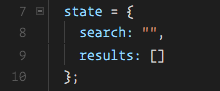
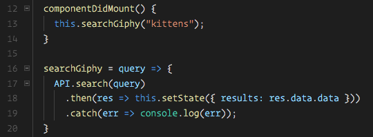
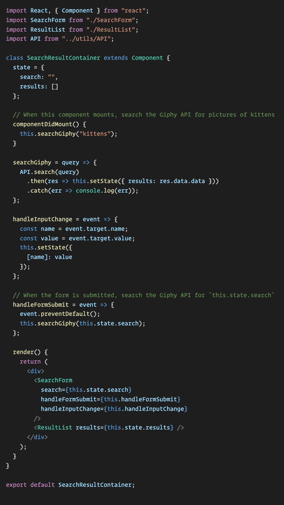
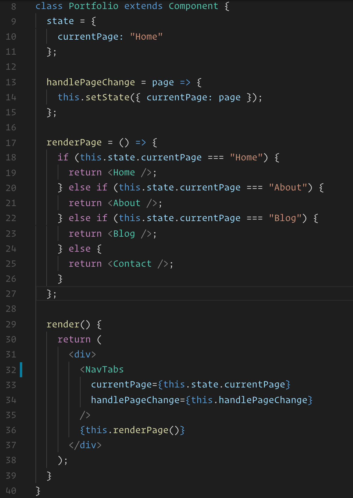

# 13.3 Lesson Plan - Forms, Conditional Rendering, and React Router

## Overview

In this class, we will be deepening students' understanding of ReactJS. We will further expand on their introduction to managing component state and cover performing AJAX requests, using forms, and conditionally rendering components.

## Instructor Notes

* In today's class, we'll introduce some new class component syntax, cover using forms with React, perform AJAX requests with `axios`, and go over conditionally rendering components before introducing students to the React Router library.

* You should scaffold out a React application with Create React App at the beginning of class and suggest that students do the same. The activities we go over today will only include the application's `src` folder, which you should replace in your React app's boilerplate to avoid repetitive installs. It's recommended that you completely restart the dev server between activities.

* Today's lesson will feature more instructor-led demonstrations than the previous class, so be sure to spend some time before class reviewing the examples.

* **Important:** In order to avoid continuous npm installs, all of today's activities' solved and starter versions include only a `src` folder. Both you and your students should scaffold out a React app once with Create React App and then swap out the `src` folder for each activity.

## Learning Objectives

By the end of today's class, students will:

* Deepen their understanding of managing state with React components.

* Understand conditionally rendering React components.

* Understand the axios library and the concept of the component lifecycle.

* Understand routing with React Router.

## Slides

[13.3 React Router - Career Services](https://docs.google.com/presentation/d/15_ge-hmsPJ33zxoImfskUH3xow-6mvyU4Q1ezcAxhoU/edit?usp=sharing)

## Time Tracker

| Start  | #   | Activity Name                         | Duration |
| ------ | --- | ------------------------------------- | -------- |
| 5:30PM | 0   | Office Hours                          | 0:30     |
| 6:00PM | 1   | Forms                                 | 0:45     |
| 6:45PM | 3   | AJAX                                  | 0:45     |
| 7:30PM | 2   | BREAK                                 | 0:10     |
| 7:40PM | 4   | Conditional Rendering                 | 0:35     |
| 8:15PM | 5   | React Router                          | 0:55     |
| 9:10PM | 6   | Office Hours                          | 0:30     |
| 9:40PM | 7   | END                                   | 0:00     |

---

## 1. Forms (45 mins)

### 1.1 Instructor Do: Demonstrate Forms (20 minutes)

In this example, we will demonstrate how to handle simple forms with React.

* Swap out your application's `src` folder with [src](activities/01-Ins-FormsDemo/src). Stop the dev server if it is already running. Start the app in dev mode by running `npm start`.

* Open [localhost:3000](http://localhost:3000) in your web browser and demonstrate the rendered application.

  * 

  * Whenever we type into the input fields, we see the input appended to the "Hello" statement.

  * When we click the "Submit" button, we get an alert with the provided first and last name.

    

* Now open `src/Form.js` and demonstrate the underlying code. It may be easier to begin with this component's `render` method.

  

  * Point out the following props attached to the `input` elements:

    * `value`: set to `this.state.firstName` or `this.state.lastName`

    * `name`: set to `firstName` or `lastName`

    * `onChange`: both set to `this.handleInputChange`

* Then go up to the component's `constructor` method. Point out how `this.state.firstName` and `this.state.lastName` are both initially set to an empty string.

  * To make sure that everyone is following along so far, ask the class: "Where is this state object coming from? Why do we use it?"

    * A component's "state" is a property that is defined on a class component instance and used for storing values that we want to associate with it. This property is recognized by React and can be used to embed data inside of a component's UI, which we want to update over time. Whenever a component's state is updated, its `render` method is fired along with the `render` methods of all of its children. This updates the application's UI to display the new data without having to refresh the browser.

* Then scroll back down to the `render` method and point out how each input has a `value` prop set to the value of one of these state properties.

  

* Ask the class: "What would happen if I preset the first and last name states to values other than empty strings?"

  * The text inside of each input field is determined by their `value` prop. By changing this component's initial state, we're also changing the initial values of the input fields. Demonstrate this live for the class.

* Then scroll down to the `handleInputChange` method. Ask the class: "What do you think this method's job is?"

  * This method is responsible for updating our state as the user types into the input fields.

* Then ask: "What do you think would happen if I removed the `onChange` props from the input fields?"

  * Proceed to remove the `onChange` props from both input elements. You should now be unable to type any new characters into the input fields after doing to.

  * Explain that `onChange`, like `onClick` or `onSubmit`, is a built-in event that we can listen for by attaching a prop to a primitive JSX tag (a JSX tag that represents a basic HTML element).

  * Explain that by removing the `onChange` prop, we are no longer responding to the input's "change" event and thus are no longer updating our `Form` component's state. The `value` prop on each input field continues to point to the same unchanging state value.

  * Explain that if we were to also remove the `value` prop from an input field altogether, then we could update it, but it wouldn't update our state and we wouldn't have access to its value if we needed it. Explain that we use the `value` and `onChange` props on the input element to sync its value with our component's state.

* Go back to the `handleInputChange` method and walk through its logic.

  * `handleInputChange`, like all event handlers, is passed an `event` object that describes the event that took place. We pull off the `name` and `value` properties from the `event.target` object. These correspond to the `name` and `value` properties attached to the element from which the event was triggered.

    * Since each input field has a `name` prop set to the name of the state property holding its value, we can run the following code to update the appropriate state:

      ```js
      this.setState({
        [name]: value
      });
      ```

    * Starting with ECMAScript 2015, the object initializer syntax also supports computed property names. That allows you to put an expression in brackets [] that will be computed and used as the property name. Refer to the [MDN documentation](https://developer.mozilla.org/en-US/docs/Web/JavaScript/Reference/Operators/Object_initializer#Computed_property_names).

    * If students have questions regarding this syntax, demonstrate the same approach in ES5:

      ```js
      const newState = {};
      newState[name] = value;
      this.setState(newState);
      ```

* Scroll down to the `handleFormSubmit` method. Ask the class: "Why are we running `event.preventDefault()`?"

  * The default behavior of an HTML form submission is to refresh the entire webpage. We want to prevent the form's default behavior in lieu of our own. Remind the class that we also had to deal with this back when working with jQuery.

* Be sure to point out the code where we throw an alert with the user's first and last name before resetting our `firstName` and `lastName` state to empty strings to clear our input fields. Take a moment to make sure that everyone understands how the string template literal syntax is working.

  * String template literals can be used to write multiline strings and embed expressions without breaking the string. Instead, we'd use the ${<expression>} token to embed expressions inside of our string.

* Take another few minutes to make sure that everyone understands the code at least well enough to be able to refer back to this example as a starting point as they're building their own React forms.

### 1.2 Students Do: Fun with Forms (15 minutes)

* In this activity, students will add some new functionality to the previous form example.

```md
In this activity, we will add some new functionality to the previous form example.

## Instructions

* Replace your React application's `src` folder with [starter/src](starter/src). Stop the dev server if it is already running. Start the app in dev mode by running `npm start`.

* Update the `Form` component to add the following:

  1. A new input field that updates `this.state.password`. 
  
     * Set the initial value of `this.state.password` to an empty string.

  2. Whenever a user clicks the "Submit" button, add code to accomplish the following:

     1. If the user hasn't provided a first and last name, throw an alert saying, "Fill out your first and last name, please!"

     2. If the user has provided a first and last name but their password is fewer than 6 characters, throw an alert saying, "Choose a more secure password!" followed by the full name (e.g., "Choose a more secure password, John Smith!").

     3. Otherwise, throw an alert to greet the user (e.g., "Hello, John Smith!").
  
  3. Do not allow the user to type in a password that is longer than 15 characters (i.e., the length of the password state should never go beyond 15 characters).

### Hint 

* You may want to look into using [String.prototype.substring](https://developer.mozilla.org/en-US/docs/Web/JavaScript/Reference/Global_Objects/String/substring) to prevent the password field from going beyond 15 characters.
```

### 1.3 Instructor Do: Review Fun With Forms (10 minutes)

* Open [solved/components/Form/index.js](activities/02-Stu-FunWithForms/solved/components/Form/index.js) in your browser and demonstrate the application:

  * Changing text in the `first name` and `last name` input fields causes the `hello` text to change after every key press.

  * Submitting the form causes validation alerts if the first and last name inputs are left empty or the password length isn't greater than 6.

* Open [Solved/components/Form/index.js](activities/02-Stu-FunWithForms/solved/components/Form/index.js) in your IDE and point out the following:

  * The `input` element has an `onChange` attribute that is set to be a method declared earlier in the component.

  * `value` is set to `this.state.firstName`.

  * The paragraph above the form displays different properties from the state.
  
```js
<p>
  Hello {this.state.firstName} {this.state.lastName}
</p>
<form className="form">
  <input
    value={this.state.firstName}
    name="firstName"
    onChange={this.handleInputChange}
    type="text"
    placeholder="First Name"
  />
```

* Now scroll up to the spot where `handleInputChange()` is declared and point out the following:

  * The `event` object is a built-in parameter of callback functions of the `onChange()` event, just as with `onClick()`.

  * If the name of the field is `password`, its value is set to be a substring (the first 15 characters) of the input field. Note that there are many other ways of doing password validation, like adding a `minLength` attribute to the `input` element.

  * `this.setState()` is used to dynamically add an input field and its value to the state.

```js
handleInputChange = event => {
    // Getting the value and name of the input which triggered the change
    let value = event.target.value;
    const name = event.target.name;

    if (name === "password") {
      value = value.substring(0, 15);
    }
    // Updating the input's state
    this.setState({
      [name]: value
    });
  };

```

* Now direct students to the `handleFormSubmit()` method and point out the following:

  * `event.preventDefault()` prevents the form from attempting to POST.

  * If the `firstName` or `lastName` properties don't exist, the user is alerted.

  * If the `password` is fewer than 6 characters long, the user is alerted.

  * If we were to spend more time on a form that we expect to use in an app, we would want to handle validation errors a little more elegantly.

  * After the form is submitted, the fields are all set to empty strings.

```js
handleFormSubmit = event => {
  // Preventing the default behavior of the form submit (which is to refresh the page)
  event.preventDefault();
  if (!this.state.firstName || !this.state.lastName) {
    alert("Fill out your first and last name please!");
  } else if (this.state.password.length < 6) {
    alert(
      `Choose a more secure password ${this.state.firstName} ${this.state
        .lastName}`
    );
  } else {
    alert(`Hello ${this.state.firstName} ${this.state.lastName}`);
  }

  this.setState({
    firstName: "",
    lastName: "",
    password: ""
  });
};
```

* Ask the class the following question and call on students for the corresponding answer:

  * ☝️ "Think back to forms that you've created in the past. Is there anything else that we should do with our data after setting the application state?"

  * 🙋 We could add a POST request to `handleFormSubmit` so that the user's input can be sent to a server and saved in a database.

## 2. AJAX (45 mins)

### 2.1 Instructor Do: AJAX Demo (15 minutes)

In this example, we will demonstrate AJAX requests with React.

* Replace your application's `src` folder with [03-Ins-AJAX/src](activities/03-Ins-AJAX/src). Paste the Bootstrap CDN into `public/index.html`. You may use the snippet provided below:

  ```html
  <link rel="stylesheet" href="https://cdnjs.cloudflare.com/ajax/libs/twitter-bootstrap/4.0.0/css/bootstrap.min.css"/>
  ```

* Install the `axios` library by running the following command:

   ```bash
   npm install axios
   ```

* Stop the dev server if it is already running. Start the app in dev mode by running `npm start`.

* Navigate to [localhost:3000](http://localhost:3000) and demonstrate the application's functionality.

  

  * This app searches the Giphy API for whatever is typed into the input field and then displays the results below.

  * When we first load the app, we should see kitten-related results.

* Open the `src/components` folder and point out the three files inside:

  * `ResultList.js`

  * `SearchForm.js`

  * `SearchResultContainer.js`

* Explain to the class that `SearchResultContainer` contains and renders the `ResultList` and `SearchForm` components. This is our application's only stateful component.

* Briefly demonstrate this without digging into each component's exact functionality in your editor just yet.

  

* Ask the class: "Why do you think `SearchResultContainer` is a stateful component but `SearchForm` and `ResultList` aren't?"

  * It's possible to make every component in our React application stateful. But it's usually cleaner and less error-prone to have some kind of parent component that contains all of the data and functionality its children will need and then pass those down as props.

  * Quick aside: Slack out this [article written by Dan Abramov](https://medium.com/@dan_abramov/smart-and-dumb-components-7ca2f9a7c7d0) (Redux Author, React Core Contributor, Create React App Core Contributor) for students to read through on their own time. He describes the pattern of separating components into "container" and "presentational" components. In a nutshell, this can be explained as follows:

    * Container components are primarily concerned with how things _work_ and render very little, if any, of their own markup. Instead, they mostly render other components and pass down the logic and data they need to work.

    * Presentational components are concerned with how things _look_ and typically don't contain any logic that doesn't have to do with their own individual UI.

    * This pattern helps us build components with little to no coupling that can more easily be reused in different parts of app or even across applications. It also lets us stub out our application's appearance by writing presentational components first and then writing container components once we're ready to make things work.

  * This isn't important for students to totally understand now, but slack out the article for them to check out later. The most important takeaway should be that there should be a few of these "container" components that act as the "brain" for their children. In our case, this is `SearchResultContainer`.

* Now open `src/components/SearchResultContainer.js` and walk through the code.

  * Our initial state has a `search` property set to an empty string and a `results` property set to an empty array.

    

  * We have a new unfamiliar method defined called `componentDidMount`. Explain that, like the `render` method, this method is built into React and automatically run **after the component is rendered for the first time.**

    

  * Inside of this method, we run the `searchGiphy` method and pass in "kittens" as an argument. Before getting into exactly how the `searchGiphy` method works, explain that this code searches the Giphy API and updates our application's `result` state by using the results from the AJAX request. By writing this code inside of the `componentDidMount` method, we're saying that we want it to run after the initial component render before state updates take place.

  * Explain that when working with class components in React, we are able to hook into to a few different **component lifecycle events** that allow us to automatically execute logic at certain times.

    * Explain that these component lifecycle events are similar to some of the DOM lifecycle events that we've worked with in vanilla JavaScript or jQuery. For example, in jQuery, `$(document).ready` runs when the entire webpage is loaded.

    * In React, `componentDidMount` runs after a component and all of its children have been initially rendered and mounted to the DOM and have no further expected initialization steps.

    * Explain that there are a few different React component lifecycle events that we can hook into, but `componentDidMount` is probably the one we'll use most frequently, as this is the best place to run any async code we need to populate our component's state after the component mounts.

    * Ask the class: "Why wouldn't we just run our `searchGiphy` method inside of our component's constructor and populate our initial state there (i.e., assuming we went back to explicitly using the constructor method)?

      * Constructor functions run synchronously, and AJAX requests are asynchronous. So we might not have the async data available by the time the component is instantiated.

      * Additionally, running our async code inside of the constructor could cause extra re-renders of our component—making our application feel slow or glitchy on startup—or introduce bugs that are difficult to track down.

      * By the time `componentDidMount` is run, there's no more work for our component needs to do. Even if the AJAX request fails or takes a long time to complete, we'd still have our component and its children rendered to some degree.

      * Explain that `componentDidMount` is called automatically once per component instance.

      * Explain that, technically, `render` is another component lifecycle event, but rather than only running once, the `render` method is called every time our component's state is updated or anytime our component receives new props.

      * Slack out this [article on the React component lifecycle](https://engineering.musefind.com/react-lifecycle-methods-how-and-when-to-use-them-2111a1b692b1) for students to read on their own time.

  * Go to the `searchGiphy` method and ask the class: "What do you think this method is doing? Without even knowing what this `API` object is, what does it look like this method is doing?"

    * This method is searching the Giphy API, passing in `this.state.search` as a query. It's then setting `this.state.results` to the JSON array that comes back from the AJAX request.

  * Open `src/utils/API.js` and go through the code inside of our API helper.

     

    * This file exports an object with a `search` method. Go back to the `SearchResultContainer` and point out how this `search` method corresponds to `API.search`.

    * This `search` method accepts a `query` parameter and returns the following:

      ```js
      axios.get(BASEURL + query + APIKEY);
      ```

    * Explain that axios is a third-party library that we've installed for the purpose of making AJAX requests. React itself doesn't ship with any functionality for making AJAX requests. Instead, we can use whatever library we'd like for this.

    * Axios functions _very_ similarly to `$.ajax` in jQuery.

    * By running `axios.get`, we're saying we want to perform a GET request.

    * At the very least, the `axios.get` method requires one argument: the URL we want to send the request to. We construct the full Giphy API URL using the `BASEURL`, `query`, and `APIKEY` strings. This should remind students of a few weeks ago, when we initially worked with the Giphy API using jQuery.

    * Explain that, like `$.ajax`, all of axios's methods return a promise object. By returning this method call, we can deal with what happens _after_ the request in our code that imports this module. Point out how we run the `.then` and `.catch` inside of `SearchResultContainer`.

  * Explain that there are other libraries available for making AJAX requests. We even have a `fetch` method that is built into modern browsers that is similar but tends to require more configuration to perform simple requests. We could have even imported jQuery and used `$.ajax` if we wanted to. But it's a better idea to use a smaller, single-purpose library for making our AJAX requests.

  * Explain that by writing our logic for performing AJAX requests inside of this `API.js` helper file, we no longer need to care about exactly how the AJAX request is implemented in our components. We'd simply require the file and declaratively make a request using a minimum amount of information instead.

  * Go back to the `searchGiphy` method inside of the `SearchResultContainer` component and briefly go over its code once more now that we've explained the `API` object.

    

  * Point out that the `handleInputChange` method should look familiar to the previous examples but re-explain how it works if necessary. Demonstrate how we pass this method to the `SearchForm` component as a prop and set the `onChange` prop of its input field to this method.

  * Inside of the `SearchResultContainer`, the `handleFormSubmit` method is a _little_ different compared with the previous example. Point out how, when the form is submitted, we first prevent its default behavior with `event.preventDefault()`. Then we call `this.searchGiphy`, which searches the Giphy API for the value of `this.state.search`.

  * Finally, open the `ResultList` component and demonstrate how this component renders a list of images that it receives on its `results` prop.

* Take another few minutes to explain any parts of this code that may still not be entirely clear. The major takeaways for this example should be:

  * Most of our application's components should be stateless components that are primarily concerned with some part of our application's presentation.

  * A smaller number of components should be stateful class components that contain part of our application's business logic and state. Generally, these "container" components render our stateless "presentational" components and pass down data and functionality on a need-to-know basis.

  * `componentDidMount` is a component lifecycle event. This event is triggered once after the component has initially rendered for the first time. This is the best place to perform any initial AJAX requests. There are a few others lifecycle events available, but `componentDidMount` is the one they'll probably end up using the most frequently.

  * We're using the `axios` library to perform our AJAX requests. React itself is primarily concerned with our application's view layer and doesn't include any kind of method for creating AJAX requests. We are free to use whatever library we'd like to perform AJAX requests in React.

  * We're putting our logic for creating AJAX requests into our `API.js` helper file. This way, we don't have to worry about exactly how requests to the Giphy API are performed inside of the components that need to make them.

### 2.2 Students Do: AJAX (15 minutes)

* In this activity, students will create a simple React application with which users can query the OMDb API and display information about the movie that is searched for.

```md
In this activity, we will create a simple React application with which users can query the OMDb API and display information about the movie that is searched for.

## Instructions

* Replace your React application's `src` folder with [starter/src](starter/src). 

* This activity uses Bootstrap, so make sure you `import 'bootstrap/dist/css/bootstrap.min.css';` in `index.js`.

* Be sure to install the axios library by running `npm install axios` in your terminal.

* Stop the dev server if it is already running. Start the app in dev mode by running `npm start`.

* Open your browser to [localhost:3000](http://localhost:3000) and study the rendered application.

* This application is supposed to allow users to search for the name of a movie via the form on the right of the page and display information from the OMDb API on the left side. Currently the application isn't fully functional.

* Open the `src/OmdbContainer.js` and add the following code:

  * Add a `componentDidMount` method that should utilize the `API.js` module to query the OMDb API for the movie _The Matrix_ when the component mounts. Then update this component's `result` state with the result of the AJAX request. You can verify that you completed this step correctly by refreshing the page in your web browser. If successful, the application should display information about _The Matrix_ when the page first loads.

  * Add a `handleInputChange` method that should be called whenever the user types into the input field. Inside of this method, set `this.state.search` equal to the new value of the input field. You can verify that you've completed this step correctly if you can now type into the input field.

  * Add a `handleFormSubmit` method that should be called when the form is submitted. Inside of this method, utilize the `API` module to search the OMDb API for the value of `this.state.search`. Then update this component's `result` state with the result. You can verify that you completed this step correctly by searching for the name of a movie. If successful, you should see the movie poster and some information about the movie appear in the left card.

### BONUS

* After you get the rest of the application code working, add code so that if no movie results are found, a message is displayed indicating this in place of the `MovieDetail` component. Otherwise, display the `MovieDetail` component. You can verify that you completed this step correctly by searching for an empty string. If successful, you should see your message being displayed instead of any movie information.

### Hints

* Don't forget to call `event.preventDefault()` inside of any event handlers called in response to an HTML form being submitted.

* The only code you need to modify is inside of `OmdbContainer.js`.

* If you make it to the bonus, check out [React's documentation on Conditional Rendering](https://facebook.github.io/react/docs/conditional-rendering.html). Use any of the techniques described to complete the bonus.
```

### 2.3 Instructor Do: Review AJAX (15 minutes)

* Once time's up, slack out the [04-Stu-AJAX/solved](activities/04-Stu-AJAX/solved) folder and demonstrate the activity solution in your web browser. Be sure to point out the following:

  

  * When we search for a movie using the form on the right side, some information about the movie is displayed in the left card.

  * When the component first "mounts," some information about the movie _The Matrix_ is displayed.

  * Ask the class: "In what part of our application would we be performing this initial AJAX request to the OMDb API?"

    * Inside of the `componentDidMount` lifecycle method of `OmdbContainer`. As mentioned before, this method is where we want to perform any initial async logic for our components.

      

  * Point out the `handleInputChange` method inside of the `OmdbContainer` component. Have a volunteer explain to you how this code works.

    

    * This method pulls the `value` and `name` properties off the input element from which the event was triggered and uses those values to set the appropriate state.

  * Ask the class: "Since we definitely only have one input field under the control of this `handleInputChange` method, could we decrease the amount of code being used inside of this method?"

    * Yes, the current setup accounts for the possibility of adding new input fields. But if we were positive we'd only have one input field, we could use the following code instead:

      ```js
      handleInputChange = event => {
        this.setState({
          search: event.target.value,
        });
      };
      ```

  * Go through the code inside of the `handleFormSubmit` method. Have a volunteer explain what the code is doing and when it's called.

    

    * Whenever the form is submitted, we first prevent the event's default behavior. By default, whenever we submit an HTML form, it tries to reload the webpage. Then we run the `searchMovies` method and pass in `this.state.search` as a query.

  * Now scroll down to the `render` method and point out the section of code where the `MovieDetail` component is being rendered.

  * Point out the ternary expression inside of the JSX curly braces. Explain that while we can't use an `if` statement inside of JSX curly braces, we _can_ use a ternary expression or short-circuit evaluation.

    * If necessary, take a few moments to explain the syntax of a ternary expression.

  * Explain that if we didn't want to write this much logic inside of our `render` method, we could also extract this code into a new method and call that inside of the `render` instead. For example, we could define the following method on the `OmdbContainer` component:

  ```js
  renderMovie = () => {
    if (this.state.result.Title) {
      return (
        <MovieDetail
          src={this.state.result.Poster}
          director={this.state.result.Director}
          genre={this.state.result.Genre}
          released={this.state.result.Released}
        />
      );
    } else {
      return <h3>No Results to Display</h3>;
    }
  };
  ```

  * And then use it in our `render` method like so:

    ```js
      {this.renderMovie()}
    ```

* Explain that any technique they used to get this part to work is probably okay and encourage them to revisit the [React documentation on Conditional Rendering](https://facebook.github.io/react/docs/conditional-rendering.html) to learn more about what Facebook has to say on the topic.

* Take another few minutes to answer any remaining questions.

---

## 3. BREAK (10 minutes)

---

## 4. Conditional Rendering (35 mins)

### 4.1 Students Do: Conditional Render (20 minutes)

* In this activity, students will render one of four different components based on a component's state. This example is meant to further practice conditional rendering with React and demonstrate the need for a component router.

```md
In this activity, we will render one of four different components based on our component's state.

## Instructions

* Replace your application's `src` folder with [starter/src](starter/src). Stop the dev server if it is already running. Start the app in dev mode by running `npm start`.

* This activity uses Bootstrap, so make sure you `import 'bootstrap/dist/css/bootstrap.min.css';` in `index.js`.

* Navigate to [localhost:3000](http://localhost:3000) in your web browser and take a moment to study the rendered application.

  * At the top of the page, there's a Bootstrap NavTabs component. Whenever a nav element is clicked, the nav element goes into an "active" state. Whenever a nav item is clicked, it sets `this.state.currentPage` inside of `PortfolioContainer` to the selected navigation item.

* Now add code to `PortfolioContainer` so that, depending on the currently selected page, a different component is rendered underneath the `NavTabs` component. Example:

  * Render the `About` component when `this.state.currentPage === "About"`.
  
  * Render the `Blog` component when `this.state.currentPage === "Blog"`.

  * Render the `Contact` component when `this.state.currentPage === "Contact"`.

  * Render the `Home` component when `this.state.currentPage === "Home"`.

### BONUS

* Inside of `src/components/NavTabs.js`, add code so that the `a` tag for the `currentPage` has the "active" class. This component receives the `currentPage` via props.

### Hints

* Refer to [React's documentation on Conditional Rendering](https://facebook.github.io/react/docs/conditional-rendering.html) if you get stuck.

* Consider defining a method that returns a different component based on the value of `this.state.currentPage`.
```

### 4.2 Instructor Do: Review Conditional Render (15 minutes)

* Once time's up, slack out the [05-Stu-ConditionalRender/solved](activities/05-Stu-ConditionalRender/solved) version of the activity and go through it as a class. Be sure to demonstrate the solution in your web browser before going into the JavaScript code in your editor.

  

* Point out how, when we click the different navigation items, a different component is rendered. Point out that the address bar doesn't _actually_ change when we do this, but we are still rendering different content depending on our application state.

* Explain that `PortfolioContainer` maintains the state for the currently active page and passes this down to `NavTabs`, along with a method for changing the currently active page.

  

* Demonstrate the `PortfolioContainer` code and point out how we're using a method to return the appropriate JSX depending on `this.state.currentPage` inside of this component.

  

* Explain that we could have also used a series of ternary operators or short-circuit evaluations to accomplish this, but since we have more than a few conditionals, doing it this way can help keep some excess component logic out of the `render` method.

* Take a few moments to answer any lingering questions.

## 5. React Router (55 mins)

### 5.1 Instructor Do: Introduce React Router (25 minutes)

* Explain that so far, we've been working with React applications with only one page of content, but in the real world, web applications have multiple, often complex, pages and routes.

* For example, what if we deployed the previous activity's portfolio website and we wanted to share a URL with someone that they could use to visit the `About` "page"? Currently, we don't have a way to do that. The user would still have to navigate to the `About` "page" on their own from scratch every time since the URL in our address bar doesn't actually change as we click through the tabs.

* This may seem trivial now, but what if our application were as large as Amazon.com? What if we wanted to share the URL to a page containing one of millions of different products with someone? How would we get users where we intend for them to go?

* Explain that, thankfully, we don't have to code out our own solution to this problem. One of the most popular React companion libraries out today is [React Router](https://reacttraining.com/react-router/).

* Slack out the [link](https://reacttraining.com/react-router/) to the React Router homepage and give the class the following overview:

  * React Router is a library made up of special components for conditionally rendering other components based on the current URL path.

  * How React Router works under the hood isn't fundamentally different from the previous example we coded out where we conditionally rendered certain components based on our component state using `if-else` statements.

  * React Router has modules for routing React applications on the web, in native applications, and on the server. In our case, we're going to be working with React Router on the web.

  * While a little intimidating at first, the [React Router documentation](https://reactrouter.com/en/6.4.1) is some of the best for any library we've covered so far, full of concise and helpful examples.

  * We won't have enough time to teach _all_ of React Router, nor will students need to know all of the library. Instead, we'll be going over the fundamental 20% or so of syntax that they're likely going to be using 80% of the time. After that, students should feel more comfortable going through the official documentation for answers.

* Replace your React application's `src` folder with [06-Ins-IntroReactRouter/src](activities/06-Ins-IntroReactRouter/src).

* This example uses Bootstrap, so if you haven't already, add the Bootstrap CDN to your `index.html` file.

  ```html
  <link rel="stylesheet" href="https://cdnjs.cloudflare.com/ajax/libs/twitter-bootstrap/4.0.0/css/bootstrap.min.css"/>
  ```

* Run the following command in your terminal to install React Router:

  ```bash
  npm install react-router-dom
  ```

  * Point out that, as mentioned earlier, React Router can be used in a variety of different environments. Since we're going to be routing our application on the web, more specifically, to the HTML DOM, we need to install the `react-router-dom` library.

* Stop the dev server if it is already running. Start the app in dev mode by running `npm start`.

* Open your browser to [localhost:3000](http://localhost:3000) and demonstrate the rendered application.

  * At first, it may not seem different from the previous example, but point out how the URL in the address bar changes as we click through the navigation items.

  * Also point out how we have a `/contact` and `/contact/learn` page. Point out how `/contact/learn` displays all of the same content as the `/contact` route but also displays another nested component.

    

  * To demonstrate that we can get back to a particular page via a specific URL, navigate to the `/contact/learn` route and copy the entire URL into your address bar. Close this application's tab and paste the URL into a brand new tab; you should be taken back to the expected page.

* Now open up `src/App.js` and begin walking the class through the new code.

  

  * Point out how we're importing three components from the `react-router-dom` library: `BrowserRouter`, `Routes`, and `Route`. Explain that by importing `BrowserRouter` _as_ `Router`, we're renaming this component to be `Router` inside of this file. Renaming this component is totally optional but a convention used in the React Router documentation.

  * Explain that the `BrowserRouter` (`Router`) component is like the brain of our application's router. We wrap our entire application with this component—without it, none of the routes that we define will work. On its own, `Router` doesn't do anything to our application's styles or functionality. It's primarily for setting up any additional configuration that we want to give our React Router via props that we attach. The default configuration it provides is fine for our purposes, so we don't need to do anything other than include it.

  * Inside of the `Router` component, we have a `div` element wrapping our other components. Explain that the `Router` component can only have a single child element, so we wrap the rest of our application's code inside of a `div`.

    * Feel free to demonstrate the code breaking if you were to remove this `div`. Let students know that if they forget this rule, they'll receive a helpful error message reminding them that `Router` can only have one child element.

  * Point out the following:

    * We no longer need a `PortfolioContainer` component. In the previous example, the `PortfolioContainer` component was responsible for keeping track of our application's `currentPage` state. Now that we have React Router handling this, we no longer need to do so ourselves.

    * We're importing the `Routes` component from `react-router-dom`. Explain that this component holds all of our routes. Whenever the location changes within the app this component will search through all of its child routes to find the best matching route and render that part of the UI.
  
    * We're importing the `Route` component from `react-router-dom`. Explain that at a minimum, this component expects a `path` prop and an `element` prop. When the pathname in the browser's address bar matches the `Route` component's `path` prop, the specified component will be rendered.

    * Every path except for the contact path looks the same. The `contact/*` path is written this way to indicate that it will have descendant routes that begin with `contact`. This route **must** be written this way or else the child routes will not work properly.

    * We're specifying that the `NavTabs` component should always be rendered, regardless of the application's current route.

    * Below the `NavTabs`, we render a `Route` component within a `Routes` component. When the `path` is set to "/", render the `Home` component.

    * Go into the `NavTabs.js` file and walk through this component's new code.

      ```jsx
        function NavTabs() {
          return (
            <ul className="nav nav-tabs">
              <li className="nav-item">
                <NavLink
                  to="/"
                  end
                  className={({ isActive }) =>
                    isActive ? 'nav-link active' : 'nav-link'
                  }
                >
                  Home
                </NavLink>
              </li>
              <li className="nav-item">
                <NavLink
                  to="about"
                  className={({ isActive }) =>
                    isActive ? 'nav-link active' : 'nav-link'
                  }
                >
                  About
                </NavLink>
              </li>
              <li className="nav-item">
                <NavLink
                  to="blog"
                  className={({ isActive }) =>
                    isActive ? 'nav-link active' : 'nav-link'
                  }
                >
                  Blog
                </NavLink>
              </li>
              <li className="nav-item">
                <NavLink
                  to="contact"
                  end
                  className={({ isActive }) =>
                    isActive ? 'nav-link active' : 'nav-link'
                  }
                >
                  Contact
                </NavLink>
              </li>
              <li className="nav-item">
                <NavLink
                  to="contact/learn"
                  className={({ isActive }) =>
                    isActive ? 'nav-link active' : 'nav-link'
                  }
                >
                  Learn
                </NavLink>
              </li>
            </ul>
          );
        }
      ```

      * We're importing a `NavLink` component from the `react-router-dom` library and using that in place of regular anchor tag elements.

      * Explain that the `NavLink` component navigates our application to another route when clicked, just like an anchor tag. But the `NavLink` component prevents our entire React application from reloading when we go to different URLs. Instead, only the components that need to change will change.

      * The `NavLink` component also has some additional functionality, such as allowing us to pass props into the component rendered at the specified route if we wanted to.

      * We can treat this component exactly the same as we would a regular anchor tag, except that we'd use the `to` prop, rather than `href`, to specify the path to which we want to navigate.

      * Explain that students may see a `Link` component while doing their own research. This component is similar, however, the `NavLink` component knows whether it is "active" or not. This allows us to visually show where the user is located on our NavBar. To show this we simply call add a function that checks if the link is active. If it is then we add the `nav-link active` classes to the component, which will style the tab for us using Bootstrap. If not, then the class is not added. Point out to students that `isActive` is built into React Router, and this is simply the syntax to use when using it.

        * When utilizing `isActive` we must also include `end` within our `NavLink` component for the `/` and `contacts` paths, so that the component will consider these paths as active for every location that might contain them.

  * Go back to the `App` component and once more explain how each `Route` component is rendering its component. Inform students that the major takeaway here is that when the path in the address bar matches the path specified on a `Route` component's `path` prop, the component passed in is rendered.

  * Explain that now we're going to go over the code that renders the nested `/contact/learn` route.

  * Open up the `src/components/pages/Contact.js` and go through the code.

    ```jsx
      import React from "react";
      import { Link, Route, Routes } from "react-router-dom";
      import Learn from "./Learn";

      function Contact(props) {
        return (
          <div>
            <h1>Contact Page</h1>
            <p>
              Integer cursus bibendum sem non pretium. Vestibulum in aliquet sem, quis molestie urna.
              Aliquam semper ultrices varius. Aliquam faucibus sit amet magna a ultrices. Aenean
              pellentesque placerat lacus imperdiet efficitur. In felis nisl, luctus non ante euismod,
              tincidunt bibendum mi. In a molestie nisl, eu sodales diam. Nam tincidunt lacus quis magna
              posuere, eget tristique dui dapibus. Maecenas fermentum elementum faucibus. Quisque nec
              metus vestibulum, egestas massa eu, sollicitudin ipsum. Nulla facilisi. Sed ut erat ligula.
              Nam tincidunt nunc in nibh dictum ullamcorper. Class aptent taciti sociosqu ad litora
              torquent per conubia nostra, per inceptos himenaeos. Etiam ornare rutrum felis at rhoncus.
              Etiam vel condimentum magna, quis tempor nulla.
            </p>
            <Link to='learn' role="button" className="btn btn-link">
              Learn More
            </Link>
            <Link to="contact" role="button" className="btn btn-link">
              Learn Less
            </Link>
            <Routes>
              <Route path='learn' element={<Learn/>} />
            </Routes>
          </div>
        );
      }

      export default Contact;
    ```

    * Point out that the start of the component is nothing out of the ordinary—we're just rendering some lorem ipsum.

    * Farther down below, we're utilizing another `Route` component that only renders the `Learn` component if the route contains `learn`.

    * Explain that as of React Router v6 all router paths are relative, and because we created the `contacts/*` route with the asterisk, `learn` will be added to the end of the path after `contacts`. This allows us to create nested routes with ease.

### 5.2 Student Do: Pupster App (20 minutes)

* In this activity, students will work with partners to create a full React application from scratch, complete with routing and AJAX requests to the [Dog Ceo API](https://dog.ceo/dog-api/).

```md
## Instructions

* Start by scaffolding out a new starter React app by running the following command in your terminal: `npx create-react-app pupster`.

* cd into the `pupster` directory and run the following command to install React Router, axios, and Bootstrap:

  `npm install axios react-router-dom bootstrap`

* This activity uses Bootstrap, so make sure you `import 'bootstrap/dist/css/bootstrap.min.css';` in `index.js`.

* **Recommended:** Add the Font Awesome CDNs to your application's `index.html` file:

  `
  <link
    href="https://maxcdn.bootstrapcdn.com/font-awesome/4.7.0/css/font-awesome.min.css"
    rel="stylesheet"
  />
  `
  
* Open [https://pupster.netlify.com/](https://pupster.netlify.com/) in your web browser and take a few moments to study the example application. You will be basing your Pupster app on this example.

  * This example contains three routes:

    1. `/about`: A static welcome screen for visitors to the application.

    2. `/discover`: This page displays a photo of a random dog retrieved from the [Dog Ceo API](https://dog.ceo/dog-api/). This page contains two clickable buttons: one for passing or "thumbs-downing" a dog, and one for picking or "thumbs-upping" a dog. When either button is clicked, a new dog image is loaded from the API. If you "thumbs-up" a dog, there is a 1 in 5 chance that the dog likes you too, and the friends count goes up by 1.

    3. `/search`: This page allows you to search the [Dog Ceo API](https://dog.ceo/dog-api/) for all dogs by breed. After a search is made, a list of all the results appears underneath.

* Your Pupster app should implement each of these three pages and their basic functionality. **Don't spend much time styling your app until you have completed everything else.**

* Your Pupster app should display a navigation bar that is present on every route.

* Begin with routing. For each route, render a different component for each page without worrying about building in any behaviors yet. Then work on implementing the most basic functionality for each page, one piece at a time.

### BONUS

* Once you complete all of the basic functionality for this activity, work on adding more styles and making it look great.

### Hints

* Don't worry about styling or making things fancy at first. Just use Bootstrap classes and get the basic functionality for each page working. Get the app to work first, then come back and make it awesome.

* Use the <https://dog.ceo/api/breeds/image/random> endpoint to get a random dog image.

* Use the <https://dog.ceo/api/breed/hound/images> endpoint (replace "hound" with your breed of choice) to get an array of all available dog images of the selected breed.

* See <https://dog.ceo/api/breeds/list> for a list of all available dog breeds. You can test the `/search` page by searching for any of the breeds returned by this endpoint.

* Don't hesitate to refer back to the earlier examples from today.

* Utilize documentation if you're still unsure about how anything works: 

  * [Axios](https://github.com/mzabriskie/axios)
  
  * [React Router](https://reactrouter.com/en/6.4.1)

  * [React](https://facebook.github.io/react/docs/hello-world.html)

  * [Dog Ceo](https://dog.ceo/dog-api/)

* Ask for help if you get stuck!
```

### 5.3 Instructor Do: Review Pupster (10 minutes)

* As a class, go over the [07-Stu-PupsterApp/solved](activities/07-Stu-PupsterApp/solved) version of the previous activity. The most important points to cover are:

  * How each route is rendering each component.

  * How we used axios to create an API helper file.

  * Our use of `componentDidMount` to make the initial call to the dog.ceo API for the `Discover` component.

* Take a few moments to answer any lingering questions.

* Congratulate the class on making it halfway through React! Remind them that this is a difficult subject, but they've already come a long way.

## 6. Office Hours (30 minutes)

* Recommend that students go through the following material at home before the next class if possible. These articles will help them better understand the material covered today in class.

* [Lifting State Up](https://facebook.github.io/react/docs/lifting-state-up.html)

* [Uncontrolled Components](https://facebook.github.io/react/docs/uncontrolled-components.html)

* [Smart and Dumb Components](https://medium.com/@dan_abramov/smart-and-dumb-components-7ca2f9a7c7d0)

* [React Lifecycle Methods and When to Use Them](https://engineering.musefind.com/react-lifecycle-methods-how-and-when-to-use-them-2111a1b692b1)
  
## 7. END (0 min)

How did today’s lesson go? Your feedback is important. Please take 5 minutes to complete this anonymous survey.

[Class Survey](https://forms.gle/nYLbt6NZUNJMJ1h38)

---

© 2023 edX Boot Camps LLC. Confidential and Proprietary. All Rights Reserved.
