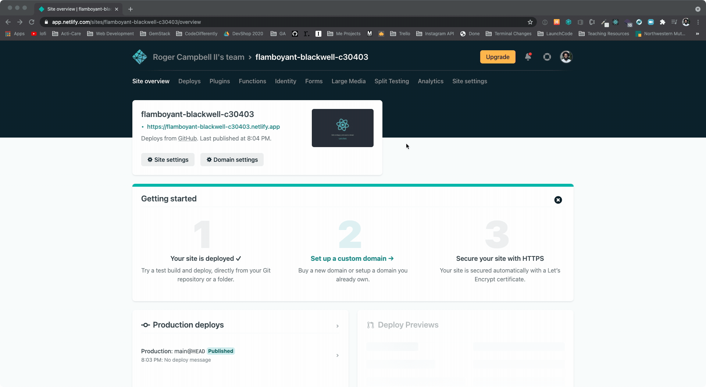
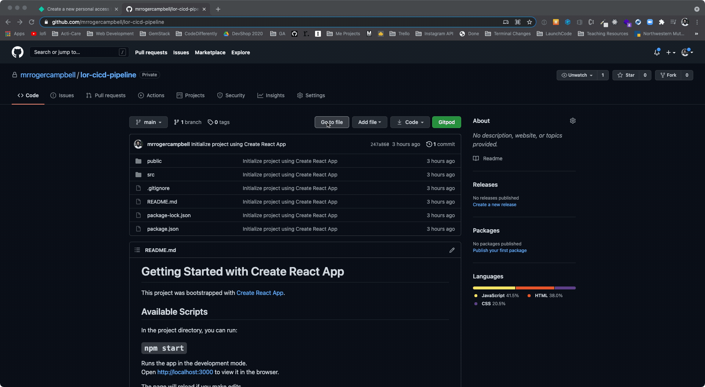
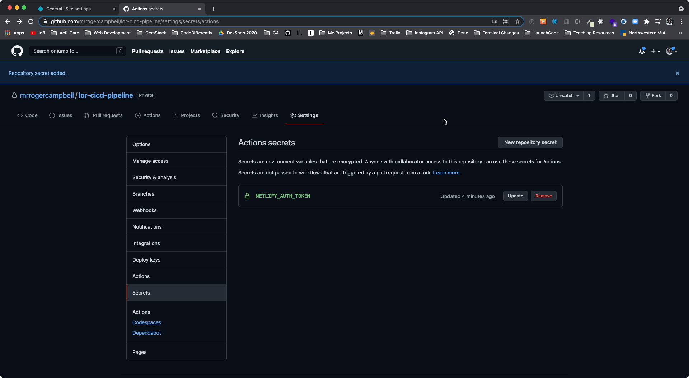

# Configure GitHub and Netlify

In this activity, the instructor will demonstrate how to configure your GitHub repo to be able to securely run actions via the CD pipeline.

## Instructions
1. Generate a `NETLIFY_AUTH_TOKEN` by clicking your avatar icon in the top right corner and navigating to:
   * User Settings > Applications > New Access Token
  
2. Add the `NETLIFY_AUTH_TOKEN` to the *GitHub* repo.
   * Settings > Secrets
   * *Important*: You must name it `NETLIFY_AUTH_TOKEN`.
  
3. Go back to Netlify and navigate to your `lor-cicd-pipeline` deployed site and copy its `Site ID`.
   *  Settings > Site Information > App ID
4. Add the App ID to GitHub with the name of `NETLIFY_SITE_ID`.
  
  
  ---

© 2023 edX Boot Camps LLC. Confidential and Proprietary. All Rights Reserved.
