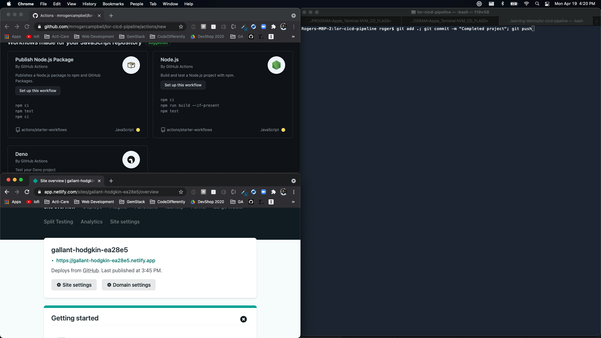
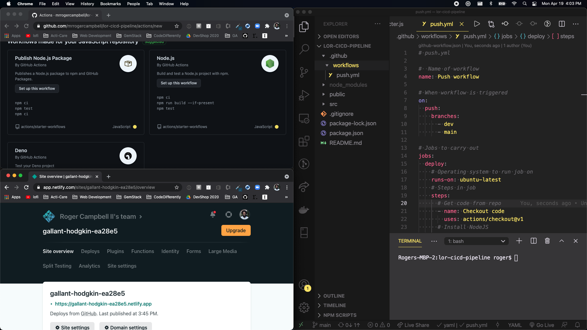
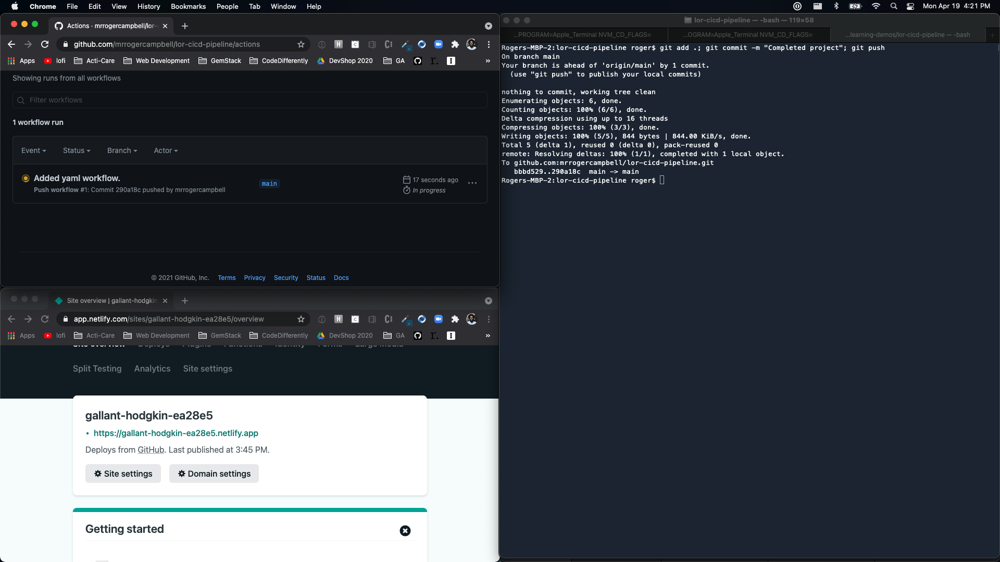

# Push It!

In this activity, the instructor will demonstrate how to push up the configured `YAML` file, which was created in the previous activity, and walk you through confirming if the `GitHub Actions` successfully trigger our unit test and deploy the project via the CI/CD pipeline.

## Instructions
1. Navigate to [GitHub](https://github.com/) and access the `lor-cicd-pipeline` repo created for this project and click the `Actions` tab.
   * The page will have the default content.

2. Navigate to `Netlify` and access the `lor-cicd-pipeline` project.

3. It's best if you put these screens `one on top of the other`.

4. In your local terminal, stage, commit, and push up all new code.
   * `git add .; git commit -m "Completed project"; git push`
     * It's recommended that you swap out VS code for your terminal in stacking order.
5. Once you push up code, look at the `Actions` tab on `GitHub` to see the actions start running.
6. Wait for the `Actions` to finish running.

7. Once the `yellow circle` turns `green`, look at the `Netlify` page, and you will see that the site has deployed **or** is deploying.
   * If the `yellow circle` turns `red`, it means that a unit test has failed.
      * Check the logs and see what caused the error -> fix the error -> push up changes -> watch the action again to see if it passes.

8. That's it! You did it!

---

© 2023 edX Boot Camps LLC. Confidential and Proprietary. All Rights Reserved.
